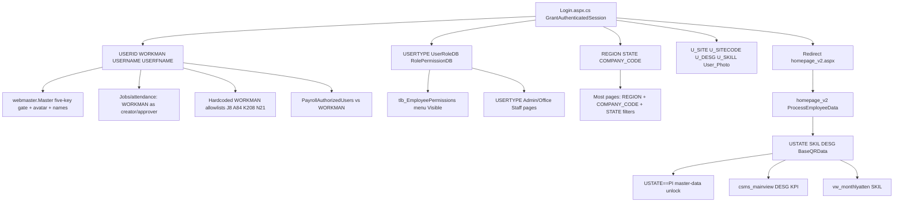

# Authentication & Session Architecture Audit

**Mode:** Architecture audit only. No impersonation code in this change.  
**Branch baseline:** `Jul_to_Sep_2026_Suport_N_Dev_Works`  
**Scope:** Entire workspace. Evidence is file + line. Names below are discovered, not invented.  
**Objective:** Prove how a user becomes authenticated after login, so a later Switch User page can rebuild that context without a password.  
**Phase 10 (do not execute in this CR):** `docs/SWITCH_USER_IMPLEMENTATION_PROMPT.md`

---

## Verdict (proven)

ERP authorization is **ASP.NET Session**, not Forms Authentication tickets.

`Web.config.example` declares `<authentication mode="Forms">` (`WebApplication1/Web.config.example` lines 43–45), but **no production login path calls `FormsAuthentication.SetAuthCookie`, creates an `AuthenticationTicket`, or sets `HttpContext.Current.User`**. The only `User.Identity` usage is a diagnostic page (`aminrup/adda.aspx.cs` lines 16–19).

A user is “logged in” when these Session keys are non-null:

| Key | Set by |
|-----|--------|
| `USERID` | `GrantAuthenticatedSession` |
| `WORKMAN` | `GrantAuthenticatedSession` |
| `USERNAME` | `GrantAuthenticatedSession` |
| `UserRoleDB` | `GrantAuthenticatedSession` |
| `RolePermissionDB` | `GrantAuthenticatedSession` |

Master page `webmaster.Master.cs` lines 24–26 redirects to `~/login.aspx` when any of those five is missing (GET only, `!IsPostBack`).

**Safest impersonation option (Phase 7):** rebuild Session from the same `tbl_Employee_Mustertable` row that login uses, by extracting the session-assignment block of `GrantAuthenticatedSession` (and the homepage-only keys `USTATE` / `SKIL` / `DESG`). Do **not** create a Forms cookie. Do **not** skip existing page checks. Do **not** duplicate the SQL column list.

---

## Phase 1 — Authentication entry points

### 1.1 Canonical ERP login (live)

| File | Role |
|------|------|
| `WebApplication1/Login.aspx` | Markup. `Inherits="WebApplication1.bussiness.production.login"` (line 1). |
| `WebApplication1/Login.aspx.cs` | Code-behind. Class `login`. Password, MFA, session grant, redirect. |
| `WebApplication1/Login.aspx.designer.cs` | Generated controls. |

`Login.aspx` line 1: `CodeBehind="login.aspx.cs"` (Windows case-insensitive; on-disk name is `Login.aspx.cs`).

Entry handlers:

- `btn_login_Click` → `PerformLogin` (`Login.aspx.cs` lines 99–108, 141–240)
- MFA: `btn_mfa_verify_Click` → `VerifyMfaAndCompleteLogin` / `VerifyTotpAndCompleteLogin` (lines 434–586)
- Forgot password: `btn_fetch_email_Click`, `btn_send_otp_Click`, `btn_verify_reset_Click` (lines 838–926) — resets password, does **not** grant a session

### 1.2 Dead / non-ERP login surfaces (do not use for Switch User)

| File | Evidence | What it does |
|------|----------|----------------|
| `WebApplication1/bussiness/production/login.aspx.cs` | lines 6–12 | Class `login_redirect`. `Response.Redirect("https://atswork.co.in/", true)`. |
| `WebApplication1/bussiness/production/login.aspx` | lines 1, 6 | Same redirect via meta refresh. |
| `WebApplication1/bussiness/production/login.html` | static HTML | Not wired to Session. |
| `WebApplication1/Loginold.aspx.cs` | lines 30–33 | Hardcoded `Admin` / `123` → `Session["admin"]` → `Admin/Dashboard.aspx`. Public-site CMS, not ERP. |
| `WebApplication1/bussiness/production/G_Auth.aspx.cs` | entire file | Standalone Google Authenticator demo. Hardcoded names. No Session. Not the live MFA path. |

### 1.3 Config and missing pipeline files

| Item | Evidence |
|------|----------|
| `Global.asax` / `Global.asax.cs` | **Not present in the repository.** No `Application_AuthenticateRequest` / `Session_Start` auth hook. |
| `Web.config` | Gitignored. Template is `WebApplication1/Web.config.example`. |
| Forms auth | `Web.config.example` lines 43–45: `mode="Forms"`, `loginUrl="~/login.aspx"`, `defaultUrl="~/bussiness/production/homepage_v2.aspx"`, timeout 2880 minutes. **Never consumed by login code.** |
| Session state | `Web.config.example` line 54: `<sessionState mode="InProc" timeout="20" />`. Cookie is the framework `ASP.NET_SessionId` cookie. |
| HTTP cookies | `Web.config.example` line 41: `httpOnlyCookies="true"`. |
| No `<authorization>` / `<location>` rules | Confirmed absent from `Web.config.example`. URL authorization is not used. |

### 1.4 Search hits that are not auth

| Pattern | Result |
|---------|--------|
| `FormsAuthentication` / `SetAuthCookie` / `AuthenticationTicket` | **Zero matches** in `*.cs`. |
| `HttpContext.Current.User` | **Zero matches**. |
| `User.Identity` | Only `aminrup/adda.aspx.cs` lines 16–18. |
| Application cookie | `ATS_SavedID` only (`Login.aspx.cs` lines 34–37, 764–765). Stores LoginID for the remember-me textbox. **Not an auth cookie.** |

### 1.5 Logout (session destruction)

| File | Lines | Action |
|------|-------|--------|
| `webmaster.Master.cs` | 170–221 | `btn_lgout_Click` → DB logout → `Session.Clear()` + `Session.Abandon()` → `~/login.aspx`. |
| `homepage_v2.aspx.cs` | 1498–1541, 1854 | Duplicate logout / abandon paths; updates `tbl_UserLoginAudit.LogoutTime` and `LoginStatus=0`. |
| `aminrup.Master.cs` | 54–57 | `UPDT_EmpMuster_LogoutInfo` then `Session.Abandon()`. |
| Idle timeout | `webmaster.Master` lines 60–71 + `webmaster.Master.cs` 17–18, 52–65 | Client JS redirects to `AutoLogoutRedirectUrl` (default `https://atswork.in/`) after `AutoLogoutTimeoutMinutes` (config, fallback 10). **Does not call server logout.** |

---

## Phase 2 / Deliverable A — Authentication sequence

### A. Happy path (MFA disabled)

```
Login.aspx (root)
  btn_login_Click                                Login.aspx.cs:99
    PerformLogin(id, pass)                       Login.aspx.cs:141
      HashPassword(pass) SHA256 Base64           Login.aspx.cs:145, 930-936
      FetchLoginUser(id)                         Login.aspx.cs:129-138
        SQL: SELECT TOP 1 ... FROM tbl_Employee_Mustertable WHERE LoginID=@LoginID
      validate hash OR legacy plaintext          Login.aspx.cs:164-165
      optional plaintext→hash migration          Login.aspx.cs:176-180
      WorkStatus == "Active"                     Login.aspx.cs:183-188
      TryReadMfaSettings                         Login.aspx.cs:190-193
      if MFA off:
        GrantAuthenticatedSession(row, remember, "SUCCESS", false)   Login.aspx.cs:238, 725-789
          INSERT tbl_UserLoginAudit              Login.aspx.cs:730-745
          UPDATE LastLogin, LoginStatus=1        Login.aspx.cs:733
          optional ATS_SavedID cookie            Login.aspx.cs:764-765
          populate Session keys                  Login.aspx.cs:767-785
          Redirect ~/bussiness/production/homepage_v2.aspx  Login.aspx.cs:787-788
homepage_v2.aspx
  Page_Load session gate                         homepage_v2.aspx.cs:33-36
  LoadAllHomepageData → SP GetEmployeeHomepageData  homepage_v2.aspx.cs:193-227
  ProcessEmployeeData sets USTATE, SKIL, DESG, BaseQRData  homepage_v2.aspx.cs:290-445
webmaster.Master
  Page_Load session gate + menu from tlb_EmployeePermissions  webmaster.Master.cs:24-47
```

### B. MFA path (email OTP / WhatsApp OTP / TOTP)

Password still succeeds first. `USERID` is **not** set until MFA completes (`SessionKeys.cs` lines 40–41).

1. `StartMfaChallenge` / `StartTotpChallenge` / `StartTotpEnroll` (`Login.aspx.cs` 306–432) writes `MFA_*` session keys only.
2. `VerifyMfaAndCompleteLogin` or `VerifyTotpAndCompleteLogin` re-loads `FetchLoginUser`, re-checks `WorkStatus == "Active"`, then `GrantAuthenticatedSession(..., "SUCCESS_MFA", true)` (lines 512, 585).
3. Same redirect to `homepage_v2.aspx`.

### C. Files that participate in becoming authenticated

| Step | File |
|------|------|
| UI | `WebApplication1/Login.aspx` |
| Pipeline | `WebApplication1/Login.aspx.cs` |
| Session key names | `WebApplication1/bussiness/production/SessionKeys.cs` |
| MFA helpers | `WebApplication1/bussiness/production/MfaAuthHelper.cs`, `MfaTotpHelper.cs` (referenced from login) |
| WhatsApp OTP | `Msg91WhatsAppHelper` (called `Login.aspx.cs` 800) |
| Email MFA skip flag | `NotificationTriggerHelper.IsEmailEnabled` (`Login.aspx.cs` 810) |
| DB access | `DB_Utility_OH4Y.SPreturn_dt` (inline SQL, not a stored procedure, despite the method name) |
| Config | `Web.config.example` session + forms + `EnableLoginTimingLog` |
| Landing | `homepage_v2.aspx` / `homepage_v2.aspx.cs` |
| Shell / menu | `webmaster.Master` / `webmaster.Master.cs` |
| Audit table | `tbl_UserLoginAudit` inserts at `Login.aspx.cs` 730–733 and 981–984 |

`homepage.aspx.cs` is a legacy landing (`WebForm1`) with the same five-key gate (lines 30–32) and the same `USTATE`/`SKIL`/`DESG` writes (lines 235, 248, 251). Live login does **not** redirect there.

---

## Phase 3 / Deliverable B — Session inventory

### B.1 Identity keys set at login (`GrantAuthenticatedSession`)

Source: `Login.aspx.cs` 767–785. Constants: `SessionKeys.cs` 14–33.

| Session key | Constant | Type (observed) | Column | Set in | Purpose |
|-------------|----------|-----------------|--------|--------|---------|
| `USERID` | `SessionKeys.UserID` | string | `LoginID` | Login.aspx.cs:767 | Login identifier. Primary “is logged in” flag. |
| `WORKMAN` | `SessionKeys.WorkmanSL` | string | `WorkmanSL` | Login.aspx.cs:768 | Employee number. Used in almost every business query. |
| `USERFNAME` | `SessionKeys.UserFirstName` | string | `FirstName` | Login.aspx.cs:769 | First name for master header. |
| `USERNAME` | `SessionKeys.UserName` | string | `FullName` | Login.aspx.cs:770 | Display name and “modified by” stamps. |
| `USERTYPE` | `SessionKeys.UserType` | string | `User_RoleType` | Login.aspx.cs:771 | Role text (`Admin`, `Office Staff`, `Site Staff`, …). |
| `UserRoleDB` | `SessionKeys.UserRoleDB` | string | `UserRoleDB` | Login.aspx.cs:772 | Role DB code. Session gate only (not used for SQL in master). |
| `RolePermissionDB` | `SessionKeys.RolePermissionDB` | string | `RolePermissionDB` | Login.aspx.cs:773 | Permission pack id → `tlb_EmployeePermissions`. |
| `REGION` | `SessionKeys.Region` | string | `WorkRegion` | Login.aspx.cs:774 | Plant/region scope. |
| `STATE` | `SessionKeys.UserState` | string | `WorkState` | Login.aspx.cs:775 | State code. |
| `COMPANY_CODE` | `SessionKeys.CompanyCode` | string | `WorkCompany` | Login.aspx.cs:776 | Company scope. |
| `U_SITE` | `SessionKeys.WorkSite` | string | `WorkSite` | Login.aspx.cs:777 | Site name (job create). |
| `U_SITECODE` | `SessionKeys.SiteCode` | string | `Worksite_Code` | Login.aspx.cs:778 | Site code (job create). |
| `U_DESG` | `SessionKeys.Designation` | string | `SkillDesignation` | Login.aspx.cs:779 | Designation at login. |
| `U_SKILL` | `SessionKeys.Skill` | string | `SkillCategory` | Login.aspx.cs:780 | Skill at login. **No downstream readers found.** |
| `User_Photo` | `SessionKeys.UserPhoto` | string | `PrfPicFile` or `"No_Image.jpg"` | Login.aspx.cs:782–785 | Avatar file name. |

`WorkmanSL`, `FirstName`, and `FullName` **are** in the login dataset (`FetchLoginUser` lines 133–134). They map to `WORKMAN`, `USERFNAME`, `USERNAME`. There is **no** `Session["WorkmanSL"]`, `Session["FirstName"]`, or `Session["FullName"]` written by login.

### B.2 Homepage-injected keys (required after landing)

Set in `homepage_v2.aspx.cs` `ProcessEmployeeData` (and duplicate `EmployeeDataLoader`):

| Session key | Type | Set in | Used in | Purpose |
|-------------|------|--------|---------|---------|
| `USTATE` | string (`WorkState`) | homepage_v2.aspx.cs:290, 655; homepage.aspx.cs:235 | Master-data and expense pages (PI = Pan India). See Phase 4. | **Not set at login.** Same source column as `STATE`. |
| `SKIL` | string (`SkillCategory`) | homepage_v2.aspx.cs:298, 665 | `vw_monthlyatten.aspx.cs`:279, 507 | Attendance skill filter. Distinct from unused `U_SKILL`. |
| `DESG` | string (`SkillDesignation`) | homepage_v2.aspx.cs:302, 668 | `csms_mainview.aspx.cs`:31 | CSM dashboard KPI visibility. Distinct from `U_DESG`. |
| `BaseQRData` | string | homepage_v2.aspx.cs:445, 893 | homepage_v2.aspx.cs:925 | QR payload for AJAX refresh. |

### B.3 MFA pending keys (pre-auth only; must be absent after grant)

All set/removed only in `Login.aspx.cs`. Cleared by `ClearMfaSession` lines 710–722 before `GrantAuthenticatedSession`.

`MFA_PENDING_LOGINID`, `MFA_OTP_HASH`, `MFA_OTP_EXP`, `MFA_OTP_TRY`, `MFA_OTP_EMAIL`, `MFA_OTP_MOBILE`, `MFA_REMEMBER`, `MFA_RESEND_AT`, `MFA_METHOD`, `MFA_TOTP_ENROLL`, `MFA_TOTP_SECRET`.

### B.4 Password-reset keys (login page, not authenticated)

`OTP`, `OTP_USER`, `OTP_EMAIL`, `OTP_EXP`, `OTP_TRY` — `Login.aspx.cs` 867–921.

### B.5 Transient UI / filter keys (not identity)

| Key | Set in (examples) | Purpose |
|-----|-------------------|---------|
| `Changer` | `pyrl_managedashbrd.aspx.cs` 56–78, 174–175, … (31 files) | `string[4]` filter binder: state, region, company, extra. Survives navigation between payroll screens. |
| `GeneratedOTP` / `RecipientEmail` | homepage_v2.aspx.cs:1831–1832 | Homepage email-change OTP. |
| `Grid_Year` / `Grid_Month` | manage_jobid_v2.aspx.cs:85–86 | Grid paging. |
| `ExceptionExportData` | manage_job_exceptions.aspx.cs:193 | Export buffer. |
| `AnomalyExportData` | analyze_attendance_anomalies.aspx.cs:305 | Export buffer. |
| `Events` | vw_emp_attencal2.aspx.cs:116, 142 | Calendar events. |
| `ExcelData` / `ColumnMapping` / `PreviewData` | bulk_employeeupdate.aspx.cs | Bulk upload wizard. |
| `DATE` | view_dailyjobs.aspx.cs:53 | Selected date. |
| `RESET_OTP` / `RESET_EMAIL` | view_emp_mastertbldata_v2.aspx.cs | Admin password reset of another employee. |

### B.6 Declared but never set/read as Session

| Constant / name | Evidence |
|-----------------|----------|
| `SessionKeys.Permission` = `"PERMISSION"` | `SessionKeys.cs`:25. **Zero `Session["PERMISSION"]` reads/writes.** |
| `Session["FullName"]` | Read in `usertoggle.aspx.cs` 316, 462, 694, 982. **Never set.** Login stores full name in `USERNAME`. |
| `Session["UserName"]` (mixed case) | Read in `helpdesk_ticketdetails.aspx.cs`:293. Login sets `USERNAME`. On default ASP.NET Session this is a **different key**. |

### B.7 Public-site Admin CMS (out of ERP scope)

`Session["admin"]`, `breadCrum`, `category`, `product`, `order`, `delivered`, `pending`, `user`, `soldAmount`, `contact` — `Loginold.aspx.cs` / `Admin/*.aspx.cs`.

### B.8 Unused type

`LoginUserData.cs` is serializable (`State`, `Value`, `CompValue`, `Datalock`). Live `Changer` is a `string[]`. Commented object usage remains in `pyrl_managedashbrd.aspx.cs` 85.

---

## Phase 4 / Deliverable C — Authorization matrix

There is no module-level `[Authorize]`, no `web.config` `<authorization>`, and no Forms principal. Protection is copy-pasted `Page_Load` session null-checks, almost always inside `if (!IsPostBack)`.

**Master gate limitation:** `webmaster.Master.cs` lines 22–26 run the five-key check only when `!IsPostBack`. Postbacks skip the master check. Pages that also check only on `!IsPostBack` have the same gap (already documented for JOB360 in `docs/CR-009_PHASE_C_SECURITY_AUDIT.md`).

**Menu visibility is not authorization.** `webmaster.Master.cs` 79–148 loads `tlb_EmployeePermissions` by `RolePermissionDB` and sets control `Visible`. Direct URL access still works if the page session check passes.

### C.1 Pattern: five identity keys (no REGION)

Check: `USERID`, `RolePermissionDB`, `UserRoleDB`, `USERNAME`, `WORKMAN` null → `~/login.aspx`.

| File | Line |
|------|------|
| `webmaster.Master.cs` | 24–26 |
| `aminrup.Master.cs` | 17–19 |
| `homepage_v2.aspx.cs` | 33–35 |
| `homepage.aspx.cs` | 30–32 |
| `manage_rollsaccess.aspx.cs` | 19–21 |
| `manage_rolls.aspx.cs` | 15–17 |
| `csm_reports.aspx.cs` | 20–22 |
| `emp_pwdchange.aspx.cs` | 22–24 |
| `job_create_summary.aspx.cs` | 29 |

### C.2 Pattern: six keys including REGION (dominant ERP gate)

Check adds `REGION`. Used by the bulk of production pages. Representative first-check lines:

`pyrl_deductionlist.aspx.cs:25`, `csm_approvals.aspx.cs:17`, `anlys_jobsdeta.aspx.cs:16`, `job_inpunch.aspx.cs:30`, `atsworksite_incharges.aspx.cs:23`, `pyrl_approvedeductions.aspx.cs:23`, `view_jobsforapproval.aspx.cs:21`, `emp_payroll_designation.aspx.cs:23`, `viewupdate_empmustertabledata.aspx.cs:27`, `emp_registration.aspx.cs:20`, `pyrl_managedashbrd.aspx.cs:37`, `add_nwhelpdsk.aspx.cs:25–30`, `generate_atdncsheet.aspx.cs:33`, `generate_banksheets.aspx.cs:31`, `gen_kpo_F17.aspx.cs:34`, `add_wo_skillcategory.aspx.cs:28`, `vw_sopapproval.aspx.cs:20`, `view_emp_mastertbldata.aspx.cs:25`, `emp_profilepic.aspx.cs:27`, `vw_lineitemjobs.aspx.cs:20`, `csm_toolboxtalk.aspx.cs:34`, `work_states.aspx.cs:19`, `create_jobid.aspx.cs:72`, `emp_payroll_wages.aspx.cs:27`, `add_workorders.aspx.cs:25`, `csm_soptraining.aspx.cs:29`, `jobapprovalpage.aspx.cs:32`, `anlys_musterdeta.aspx.cs:16`, `generate_trialform17.aspx.cs:56`, `generate_appvrsite_atdncsheet.aspx.cs:23`, `add_expenses.aspx.cs:31`, `csm_globaltraining.aspx.cs:22`, `jobs_and_manpower.aspx.cs:14`, `vw_emp_paymentbankdetails.aspx.cs:28`, `view_expensedetails.aspx.cs:28`, `vw_csm_toolboxtalkdetails.aspx.cs:30`, `ppe_request.aspx.cs:69`, `add_workorderdata.aspx.cs:25`, `vw_supplyjobs.aspx.cs:19`, `create_supplymemo.aspx.cs:56`, `job_permitupload.aspx.cs:33`, `view_approvedjobs.aspx.cs:16`, `view_monthlyjobs.aspx.cs:25`, `generate_pfsheets.aspx.cs:26`, `usertoggle.aspx.cs:21`, `searchemployee.aspx.cs:21`, `csms_mainview.aspx.cs:18`, plus F17 generators, TBT views, payroll controllers, and the remaining production pages classified `std6 + REGION` in the workspace scan (100+ files).

### C.3 Pattern: USERID + USERNAME + WORKMAN

| File | Line |
|------|------|
| `view_jobdetails_v2.aspx.cs` | 40–42 |
| `manage_jobid_v2.aspx.cs` | 19–21 |
| `job_360_view.aspx.cs` | 16–22 (then `IsAdmin()` separately) |

### C.4 Pattern: USERID + WORKMAN only

| File | Line |
|------|------|
| `job_permitupload_v2.aspx.cs` | 37–39 |
| `create_jobid_v2.aspx.cs` | 39–41 |
| `job_inpunch_v2.aspx.cs` | ~45 |
| `job_outpunch_v2.aspx.cs` | ~32 |
| `viewupdate_empmustertabledata_v2.aspx.cs` | 19–21 |

`create_jobid_v2.aspx.cs` still **reads** `Session["REGION"]` at line 53 after the gate.

### C.5 Pattern: USERID + USERNAME (weak)

| File | Line | Note |
|------|------|------|
| `db_controller.aspx.cs` | 49–52 | Comment says “Restrict to Admins”; code only checks two keys. |

### C.6 Pattern: USERTYPE null as part of identity

`USERID`, `USERTYPE`, `USERNAME`, `WORKMAN`, `REGION`:

| File | Line |
|------|------|
| `pyrl_gnrtdashbrd.aspx.cs` | 14 |
| `managejobs.aspx.cs` | 19 |
| `pyrl_deductionsview.aspx.cs` | 19 |
| `generate_f29sheet.aspx.cs` | 31 |

### C.7 Pattern: USERTYPE must be Admin or Office Staff

| File | Line | Check |
|------|------|-------|
| `manage_job_exceptions.aspx.cs` | 19 | `USERTYPE != "Admin" && != "Office Staff"` → login |
| `analyze_attendance_anomalies.aspx.cs` | 22 | same |
| `job_360_view.aspx.cs` | 51–53 | `IsAdmin()`: Admin **or** Office Staff (case-insensitive) |

### C.8 USERTYPE branches (behavior, not login redirect)

| File | Line | Behavior |
|------|------|----------|
| `create_jobid.aspx.cs` | 673–678 | Office Staff vs Site Staff job-create rules |
| `create_jobid_v2.aspx.cs` | 64, 873 | Site Staff query variant |

### C.9 Hardcoded WorkmanSL allowlists (not Session role)

| File | Line | Workmen |
|------|------|---------|
| `pyrl_managedashbrd.aspx.cs` | 126 | `J8` |
| `pyrl_gnrtdashbrd.aspx.cs` | 37 | `J8` |
| `viewupdate_emppayrolldata.aspx.cs` | 33 | `J8` |
| `view_jobdetails.aspx.cs` | 61 | `A84`, `K208`, `N21`, `J8` |
| `view_jobdetails_v2.aspx.cs` | 69 | same |
| `add_expense_heads.aspx.cs` | 42 | `J8`, `A84`, `K208` |
| `add_expense_subheads.aspx.cs` | 45 | same |
| `emp_registration.aspx.cs` | 542 | fallback registered-by `J8` if session null |

### C.10 AppSetting allowlist

`PayrollAuthorizedUsers` (`Web.config.example` line 16, value `"J8"`). Enforced in `viewupdate_empmustertabledata_v2.aspx.cs` 85–104 (`ShowAccessDenied` locks payroll tab). Compared to `Session["WORKMAN"]`.

### C.11 USTATE == "PI" (Pan India admin geography)

`USTATE` is **not** a login key. After homepage, it equals `WorkState`. `"PI"` unlocks unscoped dropdowns.

Files (representative): `work_states.aspx.cs:28`, `work_region.aspx.cs:27`, `work_company.aspx.cs:29`, `workcompany_dept.aspx.cs:29`, `workcomp_dept_locations.aspx.cs:48`, `add_expenses.aspx.cs:38`, `add_expense_heads.aspx.cs:26`, `add_expense_subheads.aspx.cs:29`, `emp_payroll_designation.aspx.cs:44`, `emp_payroll_wages.aspx.cs:126`, `emp_payrollcategory.aspx.cs:45`, `view_dailyjobs.aspx.cs:396`.

If Switch User skips homepage and omits `USTATE`, these pages throw on `.ToString()`.

### C.12 Pages with webmaster.Master but no page-level Session check

GET is still gated by the master. Postbacks are not. Includes: `BlankTabs`, `JobOverview`, `PayrollSummary`, `PassMonitoring`, `ViolationsOverview`, `RolesOverview`, `CSMDocShiftOverview`, `LiveJOB_pnl`, `Live_overall_pnl`, `Export_and_Import`, `G_Auth`, `navigater`, `overview`, `magician`, `blank_page`, `jobs_approverdash`, `view_createdjobs`, `csm_incidentreporting`, `emp_identity_data`, `emp_personal_details`, `work_country`, `workcomp_deptheads`, `upload_wrkordrlineitems`, `str/strdshbrd`.

### C.13 Pages with no Session and no master

`rpts/salaryslip.aspx.cs`, `rpts/tbttalk_rpt.aspx.cs`, `rpts/testing.aspx.cs` — not session-protected in code-behind.

### C.14 Public website (atsSite.Master)

`home.aspx`, `About.aspx`, `career.aspx`, `apply.aspx`, `contact_us.aspx`, etc. No ERP session.

---

## Phase 5 — User context construction

### 5.1 Login query (authoritative for session identity)

**Not a stored procedure.** Inline SQL via `dbcl.SPreturn_dt`:

```sql
SELECT TOP 1
    LoginID, LoginPassword, WorkStatus, DOR, PasswordExpiry, WorkmanSL, FirstName, FullName,
    User_RoleType, UserRoleDB, RolePermissionDB, WorkRegion, WorkState, WorkCompany,
    WorkSite, Worksite_Code, SkillDesignation, SkillCategory, PrfPicFile, Email, MobileNo
FROM tbl_Employee_Mustertable
WHERE LoginID = @LoginID
```

Evidence: `Login.aspx.cs` 129–138.

| Column | In login SELECT | Written to Session? |
|--------|-----------------|---------------------|
| `LoginID` | yes | `USERID` |
| `LoginPassword` | yes | no (compared only; homepage later caches in static `UserPass`) |
| `WorkStatus` | yes | no (must be `"Active"`) |
| `DOR` | yes | no |
| `PasswordExpiry` | yes | no at login; homepage may redirect to `emp_pwdchange.aspx` |
| `WorkmanSL` | **yes** | `WORKMAN` |
| `FirstName` | **yes** | `USERFNAME` |
| `FullName` | **yes** | `USERNAME` |
| `User_RoleType` | yes | `USERTYPE` |
| `UserRoleDB` | yes | `UserRoleDB` |
| `RolePermissionDB` | yes | `RolePermissionDB` |
| `WorkRegion` | yes | `REGION` |
| `WorkState` | yes | `STATE` (and later `USTATE` on homepage) |
| `WorkCompany` | yes | `COMPANY_CODE` |
| `WorkSite` | yes | `U_SITE` |
| `Worksite_Code` | yes | `U_SITECODE` |
| `SkillDesignation` | yes | `U_DESG` (and later `DESG`) |
| `SkillCategory` | yes | `U_SKILL` (and later `SKIL`) |
| `PrfPicFile` | yes | `User_Photo` |
| `Email` | yes | MFA destination only |
| `MobileNo` | yes | MFA destination only |

Second login query for MFA flags: `MFAEnabled`, `MFAMethod`, `MFATotpEnrolled` (`Login.aspx.cs` 249–253). Not stored in Session after grant.

### 5.2 Homepage context (UI + extra Session)

Stored procedure **`GetEmployeeHomepageData`** (`homepage_v2.aspx.cs` 216–222):

- `@WorkmanSL` = `Session[WORKMAN]`
- `@LoginID` = `Session[USERID]`
- `@SalaryYear`, `@SalaryMonth` = previous month

SP definition is **not in this repository**. Table[0] columns consumed in `ProcessEmployeeData` include: `WorkStatus`, `LoginPassword`, `LoginID`, `WorkmanSL`, `WorkRegion`, `WorkCompany`, `WorkState`, `FullName`, `WorkSite`, `SkillCategory`, `SkillDesignation`, `DOJ`, `MobileNo`, `GatePassNo`, `GatePassExpiry`, `SafetyPassNo`, `SafetyPassExpiry`, `PVExpiry`, `PasswordExpiry`, `Payment_Bank`, `Payment_Account`, `Payment_IFSC`, `BankBranch`, `BankUpdatedOn`, `BankUpdatedByName`, `UANNo`, `ESICNo`, `BloodGroup`, `Email`.

Legacy path `EmployeeDataLoader` (`homepage_v2.aspx.cs` 625):  
`select * from tbl_Employee_Mustertable where WorkmanSL=@WorkmanSL and LoginID=@LoginID`.

### 5.3 Permission context

`webmaster.Master.cs` 79–88:

```sql
SELECT ParentKey, ChildKey, IsVisible
FROM tlb_EmployeePermissions
WHERE Emp_PermissionValue = @Emp_PermissionValue
```

`@Emp_PermissionValue` = `Session["RolePermissionDB"]`.

### 5.4 Post-auth writes (side effects of GrantAuthenticatedSession)

`Login.aspx.cs` 730–733:

1. `INSERT INTO tbl_UserLoginAudit (LoginID, WorkmanSL, LoginTime, LoginResult, FailureReason, IPAddress, UserAgent, SessionID)`
2. `UPDATE tbl_Employee_Mustertable SET LastLogin = GETDATE(), LoginStatus = 1 WHERE LoginID = @LoginID`

Impersonation must **not** silently reuse `LoginResult = 'SUCCESS'` or flip the target’s `LoginStatus` as if they sat at the keyboard.

---

## Phase 6 / Deliverable D — Session dependency graph



Downstream identity consumers (not exhaustive; `WORKMAN` appears in 120 files, `REGION` in 106):

| Key | Downstream examples |
|-----|---------------------|
| `WORKMAN` | `job_inpunch.aspx.cs` 58–62, 1008–1009; `view_jobsforapproval.aspx.cs` 47; `jobapprovalpage.aspx.cs`; `csm_approvals.aspx.cs` 46; `create_jobid*.aspx.cs`; employee edit “Modified By” stamps |
| `USERNAME` | Submitter/modifier name parameters across punch, approval, muster edit |
| `REGION` / `COMPANY_CODE` / `STATE` | Dropdown scope; `Session["Changer"]` payroll binder |
| `RolePermissionDB` | Master menu only |
| `USERTYPE` | Exceptions, anomalies, JOB360 `IsAdmin`, job-create Site Staff |
| `U_SITE` / `U_SITECODE` | `create_jobid.aspx.cs`, `create_jobid_v2.aspx.cs` |
| `U_DESG` | `job_create_summary.aspx.cs` |
| `User_Photo` | `webmaster.Master.cs` 40–41, `homepage_v2.aspx.cs` 49 |

`searchemployee.aspx.cs` 67–82 searches `tbl_Employee_Mustertable` by `FullName` or `WorkmanSL` **within `Session["REGION"]`**. It does **not** switch Session. Do not copy its string-concatenated SQL.

---

## Phase 7 — Impersonation feasibility

| Approach | Feasible? | Evidence |
|----------|-----------|----------|
| Recreate Forms auth cookie | **No / useless** | `SetAuthCookie` never called. Pages do not read `User.Identity`. |
| Replay full login including password/MFA | Works but **violates the goal** | Password is required in `PerformLogin` 145–171; MFA blocks `GrantAuthenticatedSession` until OTP. |
| Rebuild Session from the same employee row | **Yes — safest** | All ERP gates read Session keys populated from `FetchLoginUser` + homepage extras. Same `ASP.NET_SessionId` InProc session can be overwritten in place. |
| Additional initialization | **Yes, required** | (1) `USTATE`/`SKIL`/`DESG` only appear after homepage. (2) `Changer` is a leftover filter — clear it on switch. (3) MFA keys must stay cleared. (4) Snapshot original admin keys for return. (5) Do not run target `LoginStatus=1` / `LastLogin` as a real login. (6) homepage password-expiry redirect (`homepage_v2.aspx.cs` 404–420) will fire if you land there as the target. |

**Safest option:** extract the Session-assignment block from `GrantAuthenticatedSession` into a shared method used by login and Switch User. Switch User loads the target with the same column list (lookup by `WorkmanSL`, not password). Require `WorkStatus='Active'`. Write a distinct audit row (`IMPERSONATE` / `RETURN`). Preserve original admin identity in dedicated Session keys. Redirect to `homepage_v2.aspx` so remaining UI initialization runs, with an impersonation flag so password-change and contact-modals do not trap or mutate the target account.

Not selected: duplicating Session assignments on SwitchUser.aspx.cs; wrapping login in a facade; calling `PerformLogin` with a dummy password.

---

## Phase 8 — Internal Switch User design (design only)

### 8.1 Who may open the page

Proven admin signals, strictest combination:

1. Already authenticated (same five-key master gate).
2. `Session["USERTYPE"] == "Admin"` — **not** Office Staff (`job_360_view` treats Office Staff as admin; Switch User must not).
3. `Session["WORKMAN"]` in an allowlist modeled on `PayrollAuthorizedUsers` (today `"J8"` in `Web.config.example` line 16). New key e.g. `SwitchUserAuthorizedUsers`. Do not hardcode `J8` in page code.

If already impersonating, only “Return to Original User” is allowed (no nested switch).

### 8.2 Search

Query `tbl_Employee_Mustertable` with parameterized SQL (not `searchemployee` concatenation):

- `WorkmanSL = @q` exact, and/or
- `FirstName LIKE @q`, and/or
- `FullName LIKE @q`

Return at least: `WorkmanSL`, `FirstName`, `FullName`, `LoginID`, `WorkStatus`, `User_RoleType`, `WorkRegion`, `WorkCompany`. Show matches. Block switch if `WorkStatus != 'Active'`.

### 8.3 Rebuild context

1. Snapshot original `USERID`, `WORKMAN`, `USERNAME`, `USERTYPE` into `ORIG_*` keys **once**.
2. `Fetch` target with the **same column list** as `FetchLoginUser` (add a `WorkmanSL` overload; do not fork columns).
3. Call extracted `ApplyAuthenticatedSession(row)` — Session keys only.
4. Also set `USTATE`, `SKIL`, `DESG` from that same row (`WorkState`, `SkillCategory`, `SkillDesignation`) so pages work even before homepage.
5. `Session["Changer"] = null`.
6. Insert `tbl_UserLoginAudit` with a distinct `LoginResult` (e.g. `IMPERSONATE`) recording **both** admin and target WorkmanSL (FailureReason or a dedicated comment field already used as `FailureReason`).
7. Redirect `~/bussiness/production/homepage_v2.aspx`.
8. Banner on master: original admin identity + “Return”.

### 8.4 Return

Reload original admin via `FetchLoginUser(ORIG_USERID)` + `ApplyAuthenticatedSession`. Clear `ORIG_*`. Audit `IMPERSONATE_RETURN`. Redirect homepage.

### 8.5 What not to do

- Do not set `ATS_SavedID` to the target (would change the admin’s remembered login id).
- Do not call MFA.
- Do not `Session.Abandon()` (would drop the InProc session and the ORIG snapshot).
- Do not update target `LoginStatus` / `LastLogin` as a real login.
- Do not hide Switch User in the menu via permissions only; enforce C# allowlist on the page **and** on every postback (not only `!IsPostBack`).

### 8.6 Homepage side effects to isolate

`homepage_v2.aspx.cs` 404–420: password expiry ≤ 15 days redirects to `emp_pwdchange.aspx`.  
Document-upload and contact-verification modals also run as the target.  
Impersonation flag must skip **mutating** target credentials/contact while still showing their dashboard.

---

## Phase 9 / Deliverable E — Session reconstruction checklist

Order for Switch User (after admin auth + allowlist):

1. `ORIG_USERID` / `ORIG_WORKMAN` / `ORIG_USERNAME` / `ORIG_USERTYPE` (snapshot if not already set)
2. Load target `DataRow` with login column list (`WorkStatus` must be `Active`)
3. `USERID`
4. `WORKMAN`
5. `USERFNAME`
6. `USERNAME`
7. `USERTYPE`
8. `UserRoleDB`
9. `RolePermissionDB`
10. `REGION`
11. `STATE`
12. `COMPANY_CODE`
13. `U_SITE`
14. `U_SITECODE`
15. `U_DESG`
16. `U_SKILL`
17. `User_Photo` (same file-exists rule as login)
18. `USTATE` (= `WorkState`)
19. `SKIL` (= `SkillCategory`)
20. `DESG` (= `SkillDesignation`)
21. Clear `Changer`, MFA keys, `BaseQRData`
22. Audit insert (`IMPERSONATE`) — **do not** `LoginStatus=1` on target
23. **Do not** write `ATS_SavedID`
24. **Do not** `FormsAuthentication.SetAuthCookie`
25. Redirect `~/bussiness/production/homepage_v2.aspx`
26. Master banner + Return

Cookie: keep existing `ASP.NET_SessionId` (InProc). No new auth cookie.

---

## Proven constraints for the implementation prompt

1. `GrantAuthenticatedSession` is `private` on class `login` (`Login.aspx.cs` 725). Login and Switch User must share one apply method; do not copy the 15 assignments.
2. Lookup today is `LoginID` only. Switch User needs the same SELECT with `WorkmanSL` / name filters.
3. `usertoggle.aspx` is document KYC, not user switch.
4. `production/login.aspx` is a public-site redirect, not ERP login.
5. No `Global.asax` to hook.
6. Implementation is a follow-on CR. This document does not change executable code.
