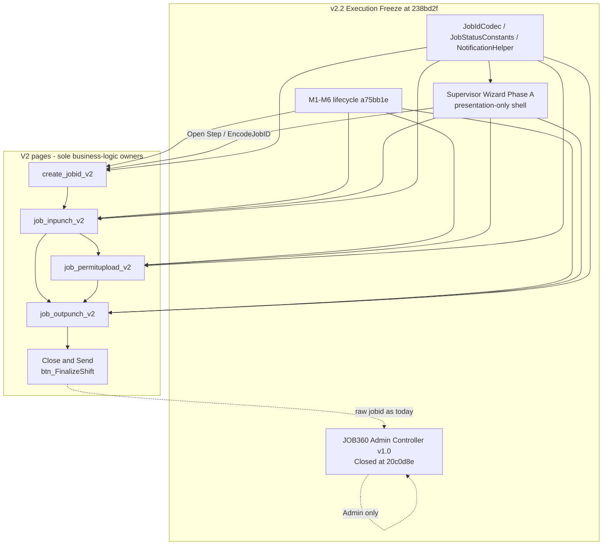

# CR-001 Execution Baseline — Supervisor Wizard Platform v2.2 Phase A

Status: Certified freeze (documentation)  
Date: September 2026  
Change type: Documentation  
Branch: `Jul_to_Sep_2026_Suport_N_Dev_Works`  
Certified executable SHA: **`238bd2f`**  
Parent: `88fc104` (CR-001 planning)  
Rollback SHA: `238bd2f` (revert this squash; application-only)

This document is the v2.2 Execution Freeze. It does **not** change executable code, SQL, schema, config, helpers, or frozen M1–M6 predicates.

Companion planning (do not rewrite): `docs/CR-001_UNIFIED_SUPERVISOR_WIZARD_SPEC.md`  
Companion infrastructure close-out: `docs/CR-010_CLOSEOUT.md`  
Companion JOB360 close-out: `docs/CR-009_CLOSEOUT.md`  
Protected production freeze: `v2.1.0-jobid-remediation` (`a75bb1e`)

---

## Formal declarations

> JOB360 Admin Controller v1.0 — Closed  
> Shared Infrastructure v1.0 — Closed  
> Supervisor Wizard Platform v2.2 Phase A — Certified

**Repository Baseline v2.2 Execution = `238bd2f`**

Every future executable change enters as a **new Change Request** against this SHA. Do not extend already-frozen platform components in place.

---

## 1. Why this freeze exists

M1–M6, CR-009, CR-010, and CR-001 Phase A completed three architecture streams without bleeding responsibilities:

| Stream | Role | Status | SHA |
|--------|------|--------|-----|
| M1–M6 Lifecycle | Frozen operational predicates | Frozen | `a75bb1e` |
| CR-009 Admin Cockpit | JOB360 Admin Controller | Closed | `60ad135` |
| CR-010 Infrastructure | Shared helpers + CSS extract | Closed | `20c0d8e` |
| CR-001 Planning | Wizard specification | Closed | `88fc104` |
| CR-001 Phase A | Supervisor wizard shell | Certified | `238bd2f` |

JOB360 Admin freeze files remain byte-identical to **`20c0d8e`** at this baseline. CR-010 docs close-out (`20c0d8e`) and CR-001 planning (`88fc104`) added markdown only.

Phase B (Create experience) and later wizard slices are **not** authorized by this document. They require a new CR, UAT, and a start from `238bd2f`.

---

## 2. Architecture ownership

These boundaries are the reference for every future CR.

| Surface | Owner | Allowed to | Must not |
|---------|-------|------------|----------|
| JOB360 (`job_360_view.aspx` / `.aspx.cs`) | Admin Controller v1.0 | Maintenance Mode hotfixes under a dedicated CR | Grow wizard chrome; host Close & Send; decode inbound `?jobid=` |
| Supervisor Wizard (`supervisor_wizard.aspx` + CSS) | Guided operational shell | Presentation, derived progress, encoded hops to existing V2 URLs | JOB-state writes; new status codes; duplicated lifecycle predicates |
| V2 pages (`create_jobid_v2`, `job_inpunch_v2`, `job_permitupload_v2`, `job_outpunch_v2`) | Sole owners of business logic | Create / IN / Permit / OUT / Close & Send writes and inbox SQL | Be replaced by wizard logic |
| Shared infrastructure | `JobIdCodec`, `JobStatusConstants`, `NotificationHelper` | Reuse from wizard and V2 | Algorithm / SQL interpolation / message-text changes without a CR |
| Hub (`jobs_and_manpower_v2`) | KPI + tile entry | Existing CASE meanings | New dashboard semantics without a CR |

---

## 3. Certified executable (Phase A)

| Field | Value |
|-------|--------|
| PR | #88 |
| Subject | `feat(wizard): Phase A supervisor shell with derived progress and V2 orchestration` |
| Squash SHA | `238bd2f2db276046e75f4a45d781f23916aba6fa` |
| Parent | `88fc104faa43d8bd69ab98ea9feda80646cc70d6` |
| Merged | `2026-09-06T18:28:08Z` |
| Post-merge Build | SUCCESS |
| Post-merge Security | SUCCESS |

Files introduced at `238bd2f` (`git diff --name-only 88fc104..238bd2f`):

- `WebApplication1/bussiness/production/supervisor_wizard.aspx`
- `WebApplication1/bussiness/production/supervisor_wizard.aspx.cs`
- `WebApplication1/bussiness/production/supervisor_wizard.aspx.designer.cs`
- `WebApplication1/Content/supervisor-wizard.css`
- `WebApplication1/WebApplication1.csproj` (registers the four new files only)

What Phase A actually does:

- Session gate: `USERID` + `WORKMAN`.
- Read-only `SELECT` from `tbl_jobs` (`JOBID` + `Creator_Workman`).
- Six visual stages: Create, IN, Permit, OUT, Close, Complete.
- Progress derived from `EntryExit`, `FileCount`, `JOB_Status`, `MasterStatusCode` using `JobStatusConstants` for C# compares only.
- Previous / Next change chrome only (`hf_visualStep` / `hf_progress` HiddenFields). Not a wizard-progress table.
- Open Step: Create → `create_jobid_v2.aspx`; IN / Permit / OUT / Close → existing V2 pages with `create_jobid_v2.EncodeJobID()`; Complete → `jobs_and_manpower_v2.aspx`.
- Zero `INSERT` / `UPDATE` / `DELETE` / `ExecuteNonQuery`.

The planning spec’s original A–E table (chrome on V2 pages, then orchestration, resume, mobile, UAT) remains historical planning. Executable Phase A shipped as a **standalone shell** that redirects to V2. Later slices are independent CRs, not automatic continuations of that table.

---

## 4. Frozen contracts

Reaffirmed at `238bd2f`. Changing any item requires a Change Request.

### 4.1 Lifecycle (M1–M6)

Create → IN-Punch → Permit Upload → OUT-Punch → Close & Send → Approval.

| Milestone | Predicate |
|-----------|-----------|
| M1 IN eligibility | No `MasterStatusCode='3'` gate on `job_inpunch_v2` |
| M2 / permit inbox | `JOBID_Status='Active' AND EntryExit='Entry'` |
| M3 JOB360 hops | V2 outbound `EncodeJobID`; inbound 360 `jobid` is **raw** |
| M4 Close & Send | On `job_outpunch_v2` (`btn_FinalizeShift` → `UpdateJOBTable1`): `JOB_Status='Out-Punch Done'`, `MasterStatusCode='4'`, `EntryExit='Exit'` |
| M5 Approval | `JOB_Status='Out-Punch Done' AND EntryExit='Exit'` |
| M6 Hub KPIs | Pending IN = Created; Pending Permit = Entry AND `FinalUpldStatus='No'`; Pending OUT = code 3 AND Entry |

Permit-before-IN is never a required gate. Close & Send is not on JOB360. No new `MasterStatusCode` / `JOB_Status` values.

### 4.2 URL contracts

- V2 inbound `?jobid=` is URL-safe UTF-8 Base64 (`+`→`-`, `/`→`_`, strip `=`). Decode padding: `%4==2` → `==`, `%4==3` → `=`.
- `create_jobid_v2.EncodeJobID()` remains the producer for wizard and 360 outbound hops.
- JOB360 inbound `job_360_view.aspx?jobid=` remains raw.
- Base64 is not authorization. Session, creator, and company checks remain the gate.
- Invalid V2 tokens fail closed (`FormatException` on V2 `Page_Load` — UAT-049).

### 4.3 Shared infrastructure

| Helper | Path | Freeze rule |
|--------|------|-------------|
| `JobIdCodec` | `WebApplication1/App_Code/JobIdCodec.cs` | Algorithm unchanged |
| `JobStatusConstants` | `WebApplication1/App_Code/JobStatusConstants.cs` | C# comparisons only; do not interpolate into SQL |
| `NotificationHelper` | `WebApplication1/App_Code/NotificationHelper.cs` | Do not change call-site titles / messages / types |
| `job360-cockpit.css` | `WebApplication1/Content/job360-cockpit.css` | JOB360 presentation only; not the wizard state machine |

Do not fold `EvaluateSmartLifecycle` or live `EvaluateActionMatrix` into a shared workflow engine.

### 4.4 File identity

At this baseline, the following must remain byte-identical to **`20c0d8e`** unless a dedicated Maintenance Mode CR says otherwise:

- `job_360_view.aspx`
- `job_360_view.aspx.cs`
- `JobIdCodec.cs`
- `JobStatusConstants.cs`
- `NotificationHelper.cs`
- `create_jobid_v2` ASPX/CS
- `job_inpunch_v2` ASPX/CS
- `job_permitupload_v2` ASPX/CS
- `job_outpunch_v2` ASPX/CS

Verified at certification: `git diff --name-only 20c0d8e 238bd2f` on those paths is empty. `job_360_view.aspx` / `.aspx.cs` are byte-identical to `20c0d8e`.

### 4.5 UAT references

Reuse existing IDs unless the CR introduces new behavior.

- M1–M6 / lifecycle: UAT-006, UAT-014/015, UAT-021, UAT-029, UAT-035, UAT-040 / 040A / 040B, UAT-046–049.
- JOB360: CR009-UAT-005–008, CR009-UAT-030.
- Wizard planning matrix: CR001-UAT-001–030 in the planning spec (chrome / hop wrapping only; no new business behavior).

Do not invent parallel UAT numbering for unchanged predicates.

---

## 5. Maintenance rules

1. Do not reopen JOB360 or CR-010 to “support” the wizard.
2. The wizard orchestrates existing V2 pages. It does not replace their business logic.
3. Wizard progress is derived. No wizard-progress persistence table. No second source of JOB status.
4. Do not duplicate V2 inbox SQL, close writes, or hub KPI CASE in the shell.
5. Do not duplicate Admin overrides (`btn_Act_*`) in the wizard.
6. Do not share `job360-cockpit.css` stepper semantics as supervisor stages.
7. Do not add schema, stored procedures, or config unless a CR covers them and names rollback.
8. Do not weaken session / creator / company checks to fix routing.
9. Do not retag `v2.1.0-jobid-remediation`.
10. Intentional remaining debt stays documented, not “cleaned up” inside frozen streams: `keepAlive` request flow on JOB360; unofficial Cancel status `"6"` SQL literals; multi-company tenancy; accessibility / runtime validation; later wizard enhancements; QR / GPS / offline / PWA / analytics.

Classification still follows `docs/MAINTENANCE_GUIDELINES.md`. A Change Request is required for JOB states, inbox filters, close writes, approval predicates, JOB360 encoding, or dashboard KPI meaning.

---

## 6. Future CR entry criteria

Before any executable PR:

- [ ] Starts from frozen baseline **`238bd2f`** (or a later certified freeze that names this SHA as ancestor).
- [ ] Owns **one** bounded concern.
- [ ] Does not modify M1–M6 predicates.
- [ ] Does not duplicate V2 business logic in the wizard.
- [ ] Does not modify JOB360 unless the CR is an explicit Admin Maintenance Mode hotfix.
- [ ] Names a **rollback SHA**.
- [ ] Reuses existing UAT IDs unless new behavior is introduced.
- [ ] Lists allowed files; prove `git diff --name-only` against the parent contains only those files.
- [ ] Build and Security are SUCCESS on the PR head **and** on the post-merge freeze SHA before the next executable CR starts.
- [ ] No unresolved blocking review comments; mergeable / clean.

Squash-merge only, with a conventional subject that names the CR and phase.

---

## 7. Roadmap (not authorized by this freeze)

| Priority | CR | Recommendation |
|----------|----|----------------|
| P0 | Execution Baseline (this document) | Documentation freeze |
| P1 | Phase B — Create experience | Only after UAT; separate PR from `238bd2f` |
| P2 | Phase C — IN orchestration | Separate PR |
| P3 | Phase D — Permit orchestration | Separate PR |
| P4 | Phase E — OUT completion UX | Separate PR |
| Later | QR / GPS | Independent CR |
| Later | Multi-company tenancy | Independent architecture stream |

Do not start P1–P4 automatically. Each is evaluated as a new CR against this baseline.

---

## 8. Rollback

Rollback is application-only.

Phase A introduced no schema, stored-procedure, or configuration changes. Reverting the certified shell is `git revert` of `238bd2f` (or reset of `Jul_to_Sep_2026_Suport_N_Dev_Works` to `88fc104` if the freeze SHA has no dependents). Database rollback is not required.

JOB360 / helper rollback remains the CR-010 / CR-009 SHAs documented in their close-outs. Do not retag `v2.1.0-jobid-remediation`.

---

## 9. Documentation PR confirmation

- Exactly one new file: `docs/CR-001_EXECUTION_BASELINE.md`
- No executable files
- Certified SHA `238bd2f`
- JOB360 Admin Controller v1.0 Closed at `20c0d8e`
- Shared Infrastructure v1.0 Closed
- Supervisor Wizard Platform v2.2 Phase A Certified
- Phase B not started
