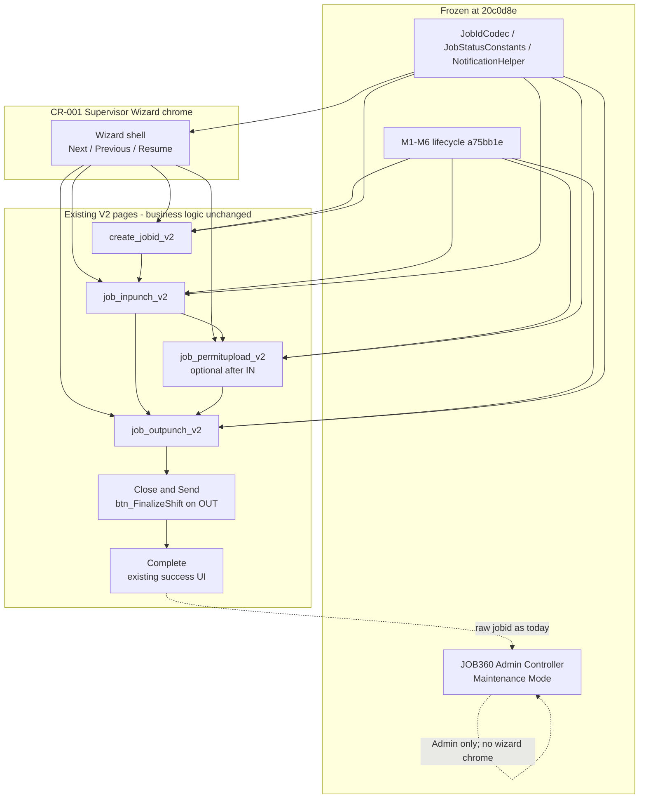

# CR-001 Planning — Unified Supervisor Wizard

Status: Planning only. Not approved for implementation.  
Date: September 2026  
Change type: **Change Request** (presentation shell) per `docs/MAINTENANCE_GUIDELINES.md`  
Base: `Jul_to_Sep_2026_Suport_N_Dev_Works` at **`20c0d8e`**  
JOB360 Admin Controller: **Maintenance Mode** (frozen at `20c0d8e`)  
Protected freeze: `v2.1.0-jobid-remediation` (`a75bb1e`, PR #59–#65)

This document does **not** change executable code, SQL, schema, config, helpers, or frozen M1–M6 predicates.

---

## 1. Executive Summary

JOB360 (`job_360_view.aspx`) remains the **Admin Controller**. It is a frozen administrative platform at `20c0d8e`. CR-001 does not grow that page.

The Unified Supervisor Wizard becomes the **Supervisor experience**. It is a presentation and navigation shell around the certified V2 operational pages.

The existing lifecycle remains authoritative: Create → IN-Punch → Permit Upload → OUT-Punch → Close & Send → Approval.

> The wizard orchestrates existing V2 pages. It does not replace their business logic.

CR-010 helpers (`JobIdCodec`, `JobStatusConstants`, `NotificationHelper`) are the reuse surface. JOB360 inbound `?jobid=` stays **raw**. Close & Send stays on `job_outpunch_v2` (`btn_FinalizeShift` → `UpdateJOBTable1`). Base64 is not authorization.

---

## 2. Why CR-001 exists

Supervisors already complete the frozen lifecycle, but they do it by hopping independent WebForms pages:

- Hub tiles on `jobs_and_manpower_v2` open Create, IN, Permit, or OUT as separate destinations.
- After create, the operator is redirected to another page and must re-orient (inbox vs encoded `jobid`).
- IN does not auto-route to permit or OUT after finalize. Permit and OUT are separate inbox or encoded hops.
- Close & Send is a modal on OUT, then a success hop to hub or JOB360.
- Field use is interrupted: context (which JOBID, which stage) lives in the URL and in each page’s inbox, not in a single supervisor progress surface.

This is operational friction on **existing V2 pages**. It is not a defect in JOB360. JOB360 is the correct Admin cockpit and stays in Maintenance Mode.

CR-001 exists to give supervisors a single staged path **without** changing inbox SQL, close writes, KPI CASE expressions, or JOB360.

---

## 3. Guiding Principles

Frozen sequence (do not reorder, do not skip as a required gate except where today’s V2 already allows it):

1. Create
2. IN
3. Permit
4. OUT
5. Close & Send
6. Approval (downstream; not a wizard write)

Rules:

- Permit is **optional after IN**. Permit-before-IN is never a required gate. IN eligibility remains: no `MasterStatusCode='3'` requirement (`job_inpunch_v2` `ActiveJOB_Checker`).
- Close remains on `job_outpunch_v2` (`btn_FinalizeShift` → `UpdateJOBTable1`: `JOB_Status='Out-Punch Done'`, `MasterStatusCode='4'`, `EntryExit='Exit'`).
- JOB360 remains Admin-only. Do not put wizard chrome on `job_360_view.aspx`. Do not copy 360 `pipelineStep` (permit-then-IN visual order) onto wizard stages.
- The wizard does not introduce a new terminal `JOB_Status` / `MasterStatusCode`.
- Session, creator, and company checks stay the authorization gate. Base64 is not authorization.

Create today may still redirect permit-required jobs to permit after insert. The wizard must **not** interpret that hop as “permit is required before IN.” Changing create’s success redirect to IN-first is **out of CR-001** unless a later amendment is approved.

---

## 4. Wizard Information Architecture

Six supervisor stages. **No new business pages.** Each stage hosts or returns to an existing surface.

| Stage | Existing page | Role |
|-------|---------------|------|
| Create | `create_jobid_v2` | Insert JOBID; existing bind/insert/validation |
| IN | `job_inpunch_v2` | Creator inbox + punch; existing `ActiveJOB_Checker` |
| Permit | `job_permitupload_v2` | Optional after IN; existing `ActiveJOB_Checker` (`Active` + `Entry`) |
| OUT | `job_outpunch_v2` | Punch OUT; existing pending-OUT checks |
| Close | existing OUT finalize | Same `btn_FinalizeShift` / confirm + success modals on OUT |
| Complete | confirmation | Existing OUT success modal / hub return; no new status |

Approval remains the in-charge queue (`JOB_Status='Out-Punch Done' AND EntryExit='Exit'`). The wizard does not own approval writes.

Skip-permit / non-ARC create (`MasterStatusCode='3'`) still lands on IN as today. Permit stage is skippable in chrome when permit is not required or already complete.

---

## 5. Navigation Model

The shell provides **Next**, **Previous**, **Resume**, and **deep-link return**. It does not replace page `Page_Load` decoding or inbox selection.

| Action | Behavior |
|--------|----------|
| Next | Navigate to the next **eligible** existing page with the same encoded `jobid` the V2 pages already use |
| Previous | Return to the prior stage’s existing page; do not roll JOB state |
| Resume | Re-enter the last eligible stage from hub or bookmark using encoded `jobid` + existing inbox/load |
| Deep-link return | V2 `?jobid=` remains URL-safe Base64 decoded **on V2 pages only** |

Encoding:

- Reuse existing `JobIdCodec` via the kept per-page wrappers (`create_jobid_v2.EncodeJobID`, IN/Permit Encode+Decode, OUT Decode).
- Do **not** change the algorithm (`+`→`-`, `/`→`_`, strip `=`; decode pad `%4==2` → `==`, `%4==3` → `=`).
- Do **not** alter inbound JOB360 raw `jobid`. OUT success may still open 360 with raw `jobid` as today.
- Invalid tokens still fail closed (`FormatException` on V2 `Page_Load` — UAT-049).

Resume state (Phase C) may use `sessionStorage` for **chrome only** (last stage key). It must not become a second source of JOB status. Server truth remains `tbl_jobs` / existing loaders.

---

## 6. Mobile-first Experience

Field supervisors complete IN / Permit / OUT on phones. Wizard chrome follows CR-009 Phase E patterns **without sharing 360 stepper semantics or `job360-cockpit.css` as a second state machine**.

| Pattern | Wizard application |
|---------|--------------------|
| Sticky actions | Next / Previous / primary page submit stay reachable while scrolling |
| Progress indicator | Six frozen stages; current + completed **chrome** only |
| One-handed use | Primary action in thumb reach; no hover-only Next |
| Large touch targets | 44px minimum (Phase E) |
| Narrow viewport | Vertical progress; no horizontal 360 timeline copy |

Desktop/tablet keep the same stages; layout widens, logic does not.

---

## 7. Permission Model

| Actor | Surface | Allowed |
|-------|---------|---------|
| Supervisor | Wizard + existing V2 pages | Create, IN, Permit, OUT, Close (existing buttons) |
| Admin / Office Staff | JOB360 only (existing `IsAdmin()`) | Inspector, Edit Core, overrides, Bypass, Force OUT, Cancel, Delete |

Do **not** duplicate Admin controls inside the wizard. Supervisors who are also Admin still use JOB360 for overrides. Wizard hops must not expose `btn_Act_*` admin IDs.

Session gates on V2 pages stay as they are (`USERID` + `WORKMAN` on workflow pages). Do not weaken hub or 360 session keys.

---

## 8. Technical Reuse Map

Reuse CR-010 helpers. Do not duplicate them.

| Helper | Path | Wizard use |
|--------|------|------------|
| `JobIdCodec` | `WebApplication1/App_Code/JobIdCodec.cs` | Encode/decode via existing wrappers |
| `JobStatusConstants` | `WebApplication1/App_Code/JobStatusConstants.cs` | C# comparisons only; **no** SQL interpolation |
| `NotificationHelper` | `WebApplication1/App_Code/NotificationHelper.cs` | Existing `ShowNotification` wrappers; **do not change message text** |

Do **not** reuse:

- `EvaluateSmartLifecycle` / `EvaluateActionMatrix` (JOB360 only)
- `job360-cockpit.css` stepper/audit classes as wizard stages
- Close modals extracted onto 360 or onto a new page
- Hub KPI CASE as wizard progress

Inbox SQL, Close WHERE, and KPI CASE remain literal text.

---

## 9. UI Wireframe

No executable HTML. Chrome only; each stage’s body is the existing ASPX content.

### 9.1 Mobile (≤768px)

```
+----------------------------------+
| JOB  JOB260424322          [x]   |
| Create > IN > Permit > OUT > Cl. |
|           [IN]                   |
+----------------------------------+
|                                  |
|  (existing job_inpunch_v2 body)  |
|                                  |
+----------------------------------+
| [ Prev ]              [ Next ]   |
| sticky 44px actions              |
+----------------------------------+
```

### 9.2 Tablet

```
+------------------------------------------------------+
| JOB260424322   Create  IN*  Permit  OUT  Close  Done |
+------------------+-----------------------------------+
| Stage list       |  existing V2 page body            |
|  o Create        |                                   |
|  * IN            |                                   |
|  o Permit (opt.) |                                   |
|  o OUT           |                                   |
|  o Close         |                                   |
|  o Complete      |                                   |
+------------------+-----------------------------------+
| [Previous]                              [Next]       |
+------------------------------------------------------+
```

### 9.3 Desktop

```
+------------------------------------------------------------------+
| Unified Supervisor Wizard                         JOB260424322   |
| [Create] [IN] [Permit] [OUT] [Close] [Complete]                  |
+------------------------------------------------------------------+
|                                                                  |
|              existing V2 page (full width)                       |
|                                                                  |
+------------------------------------------------------------------+
| Previous                                              Next       |
+------------------------------------------------------------------+
```

Close stage is the OUT page with the existing confirm / success modals — not a new form.

---

## 10. Phase Plan

Each phase is independently mergeable. No phase may edit JOB360 or M1–M6 predicates.

| Phase | Scope | Allowed files (indicative) | Forbidden |
|-------|-------|----------------------------|-----------|
| A | Wizard shell (chrome, stage labels, frozen order) | New shared chrome on V2 ASPX **or** a thin wrapper ASCX used only by the four V2 pages | JOB360; 360 `pipelineStep`; new JOB states |
| B | Existing-page orchestration (Next/Previous encoded hops) | V2 aspx/cs navigation only; still call existing wrappers | Changing inbox SQL, create insert, Close writes |
| C | Resume state (chrome sessionStorage / encoded return) | Client chrome + existing `?jobid=` | Second source of truth for status; decode inbound 360 |
| D | Mobile polish (sticky, 44px, vertical progress) | CSS/markup on wizard chrome | Sharing 360 CSS as lifecycle |
| E | UAT (CR001-UAT-001–030 + reused certified IDs) | Docs / evidence | New business behavior |

---

## 11. Acceptance Criteria

Measurable. Fail the phase if any item is false.

1. No lifecycle change: Create → IN → Permit → OUT → Close & Send → Approval still holds on V2 pages.
2. Permit is not required before IN. `job_inpunch_v2` `ActiveJOB_Checker` still has no `MasterStatusCode='3'` gate.
3. Permit inbox remains `JOBID_Status='Active' AND EntryExit='Entry'`.
4. Close ownership unchanged: `btn_FinalizeShift` → `UpdateJOBTable1` on `job_outpunch_v2` still writes `Out-Punch Done` / `'4'` / `Exit`.
5. Same encoding: `JobIdCodec` algorithm unchanged; V2 still decode inbound; JOB360 inbound still raw.
6. Same redirects for existing buttons unless a phase explicitly documents a chrome-only Next (must land on the same page+query an operator could already reach).
7. `create_jobid_v2.EncodeJobID` remains the 360 hop helper; wizard hops use the same codec/wrappers.
8. No new `MasterStatusCode` / `JOB_Status` values.
9. No schema, SP, or config change.
10. `NotificationHelper` call-site titles/messages/types unchanged.
11. `job_360_view.aspx` / `.aspx.cs` byte-identical to `20c0d8e` throughout CR-001 unless a separate Maintenance Mode hotfix CR is opened.
12. Hub KPI meanings unchanged (Pending IN = Created; Pending Permit = Entry AND `FinalUpldStatus='No'`; Pending OUT = code 3 AND Entry).
13. Base64 is not authorization.
14. Admin overrides are not duplicated in the wizard.

---

## 12. UAT Matrix

IDs `CR001-UAT-001` through `CR001-UAT-030`. No new business behavior. Reuse certified UATs where the wizard only wraps them.

| ID | Focus | Reuses | Expect |
|----|-------|--------|--------|
| CR001-UAT-001 | Shell visible on Create | — | Frozen stage labels; no 360 stepper |
| CR001-UAT-002 | Shell visible on IN | — | Same |
| CR001-UAT-003 | Shell visible on Permit | — | Same |
| CR001-UAT-004 | Shell visible on OUT | — | Close still on this page |
| CR001-UAT-005 | Next Create → IN | UAT-006 / 021 | IN inbox still lists Created / no code-3 gate |
| CR001-UAT-006 | Permit optional after IN | UAT-014 / 015 | Permit inbox still Active+Entry; IN not blocked |
| CR001-UAT-007 | Skip-permit create → IN | existing create path | Same as today |
| CR001-UAT-008 | Encoded hop round-trip | UAT-046 / 047 / 048 | Same alphabet/padding |
| CR001-UAT-009 | Invalid token | UAT-049 | Fail closed on V2 |
| CR001-UAT-010 | JOB360 inbound raw | CR009-UAT-005–008 | Unchanged |
| CR001-UAT-011 | Previous does not roll state | — | DB row unchanged |
| CR001-UAT-012 | Resume chrome | — | Returns to eligible existing page |
| CR001-UAT-013 | Deep-link IN | UAT-046 | Decode on IN only |
| CR001-UAT-014 | Deep-link Permit | UAT-046 | Decode on Permit only |
| CR001-UAT-015 | Deep-link OUT | UAT-046 | Decode on OUT only |
| CR001-UAT-016 | Close confirm | UAT-029 | Same modal on OUT |
| CR001-UAT-017 | Close write | UAT-040 | Same `UpdateJOBTable1` |
| CR001-UAT-018 | Close idempotent | UAT-040A / 040B | Unchanged |
| CR001-UAT-019 | Approval list | M5 | Out-Punch Done + Exit |
| CR001-UAT-020 | Hub Pending IN | UAT-004 / 005 / 035 | Created |
| CR001-UAT-021 | Hub Pending Permit | UAT-035 | Entry + FinalUpldStatus=No |
| CR001-UAT-022 | Hub Pending OUT | UAT-035 | code 3 AND Entry |
| CR001-UAT-023 | No admin buttons in shell | CR009-UAT-030 | JOB360 only |
| CR001-UAT-024 | Messages unchanged | CR-010 Phase 3 | Same PNotify text |
| CR001-UAT-025 | Constants not in SQL | CR-010 Phase 2 | Inbox/Close/KPI SQL text identical |
| CR001-UAT-026 | Mobile sticky actions | CR009-UAT-036–040 patterns | 44px; not 360 CSS copy |
| CR001-UAT-027 | One-handed Next | — | Reachable primary action |
| CR001-UAT-028 | JOB360 file identity | — | `job_360_view` = `20c0d8e` |
| CR001-UAT-029 | No new status codes | — | No `'7'` etc. |
| CR001-UAT-030 | Complete = existing success | UAT-029 / 040 | No new terminal state |

---

## 13. Explicit Non-goals

Forbidden in CR-001:

- Modifying `job_360_view.aspx` / `.aspx.cs` (JOB360 is frozen / Maintenance Mode).
- Changing M1–M6 predicates (IN eligibility, permit inbox, encode contract, Close writes, approval list, hub KPIs).
- Changing `EncodeJobID` / `JobIdCodec` algorithm or padding.
- Decoding inbound JOB360 `?jobid=`.
- Moving Close & Send off `job_outpunch_v2`.
- New status codes or a wizard-complete `JOB_Status`.
- Schema, stored-procedure, or config changes.
- Requiring permit before IN.
- Copying 360 `pipelineStep` / Smart Pipeline order onto wizard chrome.
- Duplicating Admin overrides in the wizard.
- Folding `EvaluateSmartLifecycle` / `EvaluateActionMatrix` into a shared workflow engine.
- Treating Base64 as authorization.
- Weakening session / creator / company checks.
- Sharing 360 stepper CSS as the supervisor state machine.
- Changing `NotificationHelper` message wording.
- Interpolating `JobStatusConstants` into SQL.

---

## Required diagram — dependency graph



JOB360 is not a wizard stage. The wizard depends on frozen V2 pages and CR-010 helpers. It does not depend on `EvaluateSmartLifecycle`.

---

## Planning PR confirmation

- Exactly one new file: `docs/CR-001_UNIFIED_SUPERVISOR_WIZARD_SPEC.md`
- No executable files
- References `20c0d8e`
- References `JobIdCodec`, `JobStatusConstants`, `NotificationHelper`
- JOB360 is frozen / Maintenance Mode
- Close remains on OUT
