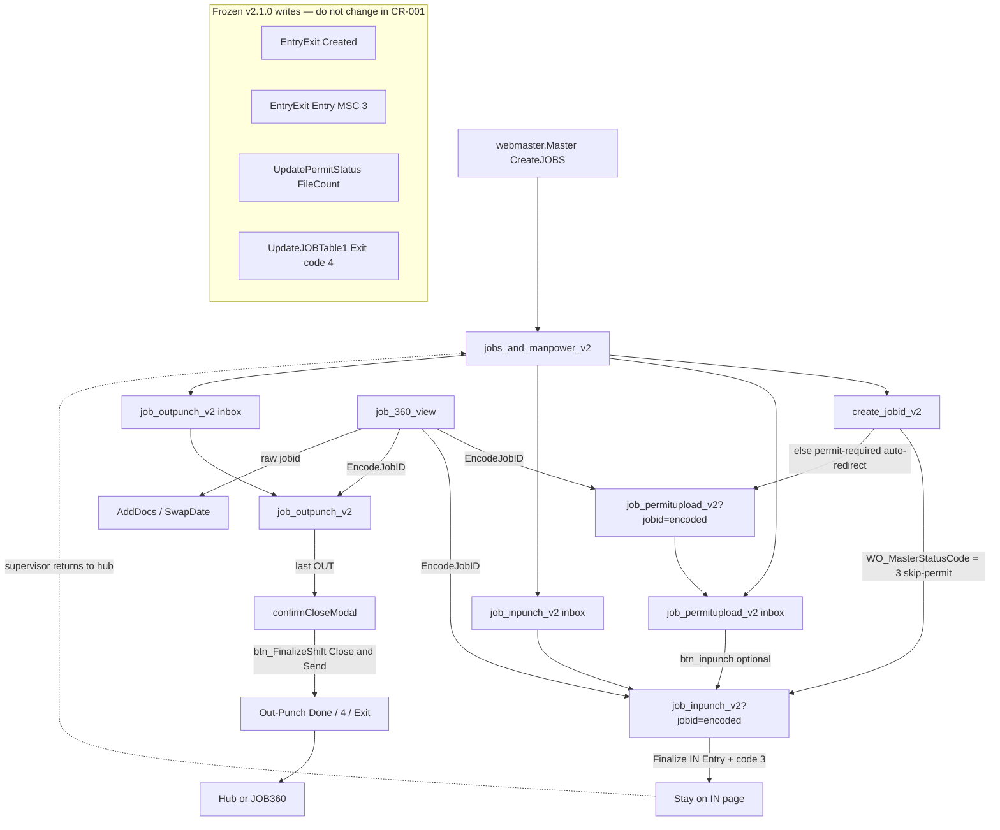

# CR-001 Discovery — Unified JOB Wizard

Status: Planning / architecture discovery only  
Date: September 2026  
Change Request: CR-001 (draft; not approved for implementation)  
Baseline: `v2.1.0-jobid-remediation` (`a75bb1e`)  
Branch: `Jul_to_Sep_2026_Suport_N_Dev_Works`

This document does not change executable code, SQL, `MasterStatusCode`, `JOB_Status`, schema, or the frozen lifecycle. It does not create ASPX pages or helper classes.

Sources: V2 pages listed below; `docs/JOBID_LIFECYCLE_FUNCTIONAL_AUDIT.md`; `docs/MAINTENANCE_GUIDELINES.md`; `docs/JOBID_V2.2_ROADMAP.md` (planning branch).

---

## 1. Executive Summary

V2 already implements the **intended business order** Create → IN → Permit → OUT → Close & Send → Approval on **separate WebForms pages**. Hub tiles, create post-submit redirects, permit “Proceed to IN-Punch”, and JOB360 actions are independent hops. Supervisors re-select the JOBID (or follow a Base64 `jobid` query string) at each hop.

A unified wizard for CR-001 should be a **presentation shell around the existing pages**, not a new state machine and not a new ASPX. Recommended shape: a shared stepper chrome (later, via CR-008 UserControl — not in this discovery) on `create_jobid_v2`, `job_inpunch_v2`, `job_permitupload_v2`, and `job_outpunch_v2`, carrying the same encoded `jobid` that JOB360 already uses.

**Must preserve**

- IN eligibility without `MasterStatusCode='3'` (`job_inpunch_v2` `ActiveJOB_Checker`).
- Permit inbox `JOBID_Status='Active' AND EntryExit='Entry'` (`job_permitupload_v2` `ActiveJOB_Checker`).
- Close & Send `UpdateJOBTable1` → `JOB_Status='Out-Punch Done'`, `MasterStatusCode='4'`, `EntryExit='Exit'`; control ID `btn_FinalizeShift`.
- JOB360 Permit / IN / OUT `create_jobid_v2.EncodeJobID()`.
- Hub KPI meanings (M6). Permit-before-IN must not become a required gate.

**Must not do in CR-001 implementation (when approved)**

- New `JOB_Status` / `MasterStatusCode` values.
- New wizard-complete terminal state.
- Schema / SP changes.
- Replacing Close & Send with auto-close.

Create still **auto-redirects permit-required jobs to permit first** (`WO_MasterStatusCode != "3"`). IN inbox already lists those jobs. A wizard must not treat that redirect as “permit is required before IN.” Optional later CR: change create success to IN first; that is **out of CR-001 unless explicitly amended**.

---

## 2. Current navigation map

### 2.1 Auth

| Page | Session gate | Notes |
|------|----------------|-------|
| `jobs_and_manpower_v2.aspx` | Six keys: `USERID`, `RolePermissionDB`, `UserRoleDB`, `USERNAME`, `WORKMAN`, `REGION` | Stricter than workflow pages |
| `create_jobid_v2` | `USERID` + `WORKMAN` | Also reads `REGION`, `USERTYPE`, company/site on bind/insert |
| `job_inpunch_v2` | `USERID` + `WORKMAN` | |
| `job_permitupload_v2` | `USERID` + `WORKMAN` | |
| `job_outpunch_v2` | `USERID` + `WORKMAN` | |
| `job_360_view.aspx` | `USERID` (login redirect) | Admin/override surface, not the supervisor wizard |

### 2.2 JOBID handoff

V2 deep links use URL-safe Base64 `?jobid=` (`EncodeJobID` / `DecodeJobID`). Algorithm is duplicated on create, permit, IN, OUT. Invalid tokens: `FormatException` caught on permit/IN/OUT `Page_Load` (M3). Permit may insert a successfully decoded JOBID into the dropdown if missing from inbox.

### 2.3 Hops (code-backed)

| From | Trigger | To |
|------|---------|-----|
| Menu | `webmaster.Master` CreateJOBS | `jobs_and_manpower_v2.aspx` |
| Hub | Tile href | `create_jobid_v2.aspx` (no jobid) |
| Hub | Tile href | `job_permitupload_v2.aspx` (no jobid → inbox) |
| Hub | Tile href | `job_inpunch_v2.aspx` (no jobid → inbox) |
| Hub | Tile href | `job_outpunch_v2.aspx` (no jobid → inbox) |
| Create | `btn_submit_Click` after insert | Skip-permit (`WO_MasterStatusCode == "3"`) → IN with encoded jobid; else → **permit** with encoded jobid |
| Permit | `btn_inpunch_Click` | IN with `EncodeJobID(lbl_jobid.Text)` |
| IN | `btn_finalsubmit_Click` | Stays on IN (healing UPDATE `EntryExit='Entry'`, `MasterStatusCode='3'`). **No auto-route to permit or OUT.** |
| OUT | Last OUT | Confirm modal → `btn_FinalizeShift_Click` Close & Send |
| OUT success modal | Link | `job_360_view.aspx` or `jobs_and_manpower_v2.aspx` |
| JOB360 | `btn_Act_UploadPermit/InPunch/OutPunch_Click` | Matching V2 page with encoded jobid |
| JOB360 | AddDocs / SwapDate | Raw `txt_jobid` to non-V2 pages |

Create `btn_submit_Click` contains **two identical redirect blocks** after a successful insert (known audit defect: duplicated create redirects).

### 2.4 Mermaid — current navigation



Intended **business** order remains Create → IN → Permit → OUT → Close even when create’s **HTTP** next page is permit for matrix code ≠ 3.

---

## 3. Wizard architecture proposal

### 3.1 Decision: no new ASPX

CR-001 must not introduce `job_wizard_v2.aspx` (this discovery forbids creating pages; implementation should keep that constraint unless a later CR amends it). A single-page wizard would force ViewState/session mash-up of create + IN + permit + OUT and raise regression risk on M1–M6 writes.

**Recommended: stepper chrome on the four existing workflow pages.**

```
[ Create ] — [ IN ] — [ Permit ] — [ OUT / Close ]
     ^           ^          ^              ^
 existing     existing   existing      existing
 aspx.cs      aspx.cs    aspx.cs       aspx.cs
```

- Each step **is** today’s page. Writes stay in today’s methods.
- Stepper is display + links with encoded `jobid` after create.
- Before create, only step 1 is enabled.
- After create, IN is always enabled (M1). Permit is enabled when `EntryExit='Entry'` **or** when the supervisor chooses to upload before IN (allowed, not required). OUT enabled when `MasterStatusCode='3' AND EntryExit='Entry'` (same as OUT inbox). Close remains last-OUT modal on the OUT page.
- JOB360 remains an overlay, not a wizard step.

### 3.2 Alternatives (rejected for CR-001)

| Option | Why not |
|--------|---------|
| New wizard ASPX hosting four user controls | New page + extraction; contradicts “no new ASPX / no helpers” for this discovery; large rewrite |
| iframe of four pages | Fragile postbacks, session, master page chrome |
| Force create → IN always | Changes current HTTP routing; needs its own CR amendment; IN eligibility already exists without it |
| Wizard writes a new status | Violates freeze |

### 3.3 Query-string contract

Reuse M3: `?jobid={EncodeJobID(plain)}`. Do not invent a `?step=` that bypasses inbox SQL. Stepper links that 404 the job out of an inbox must fail the same way as today’s empty dropdown (except permit’s decoded fallback — do not widen it).

### 3.4 Create dual-redirect

Any wizard “next” after create should call **one** redirect. Deduplicating `btn_submit_Click` is CR-008-adjacent refactor, not a state change. Do not change *destination* (permit vs IN) in CR-001 without an explicit amendment.

---

## 4. Screen inventory

| Screen | File | Role in wizard | Primary actions | JOBID selection |
|--------|------|----------------|-----------------|-----------------|
| Hub | `jobs_and_manpower_v2.aspx` | Launcher / KPI, not a step | Tiles to create/permit/IN/OUT; memos; manage | None |
| Create | `create_jobid_v2.aspx` | Step 1 | Region, WO, billing, date, title, site, approver, location, permit no, shift, GPS, docs, submit | Generated on submit |
| IN | `job_inpunch_v2.aspx` | Step 2 | JOB dropdown, scan/add roster, gatepass modal, Finalize IN-Punch | Inbox Active 3-day creator; or encoded jobid |
| Permit | `job_permitupload_v2.aspx` | Step 3 (repeatable) | JOB dropdown, upload modal, grid delete/download, optional Proceed to IN | Inbox Active + Entry; encoded jobid + fallback insert |
| OUT | `job_outpunch_v2.aspx` | Step 4 + Close | JOB dropdown, punch OUT, CSM links, confirm Close & Send, success modal | Inbox code 3 + Entry; encoded jobid; selection also `FinalUpldStatus='Yes'` |
| JOB360 | `job_360_view.aspx` | Override / inspect | Search, stepper UI, encode to V2, admin actions | Raw search JOBID |

V1 twins (`create_jobid.aspx`, `job_inpunch.aspx`, …) and `jobstatus_flow.ascx` are **not** used by V2 pages. Dead hub control: “Switch to OLD Version” `href="#"` (`jobs_and_manpower_v2.aspx`).

---

## 5. Shared component matrix (reuse)

| Concern | Create | IN | Permit | OUT | Hub | JOB360 | Wizard reuse |
|---------|--------|----|--------|-----|-----|--------|----------------|
| `webmaster.Master` | Yes | Yes | Yes | Yes | Yes | Yes | Keep |
| Encoded `jobid` | Produces | Consumes | Consumes + produces to IN | Consumes | No | Produces to V2 | **Required contract** |
| `EncodeJobID`/`DecodeJobID` copy | Encode only | Both | Both | Decode (+ OUT encode unused locally) | No | Calls create encode | Extract later (CR-008) |
| PNotify `showPNotify` | Yes | Yes | Yes | Yes | No | Own alerts | Shared script later |
| Bootstrap modal | GPS help, switch-V1 | Gatepass, switch-V1 | Upload | Close confirm + success | No | Large edit modals | Close modals stay on OUT |
| Leaflet map | Create GPS | Saved map | No | Saved map | No | No | Unchanged |
| JOB dropdown `ActiveJOB_Checker` | No | Own SQL | Own SQL | Own SQL | No | Search | Do not unify SQL in CR-001 |
| `CountChecker` | No | Yes | Yes | Yes | No | Own counts | Unchanged |
| `JobWorkflowLogger` | Create | IN path | Permit path | Close path | No | Separate | Unchanged |
| Matrix / WO ViewState | Yes (M4 natures) | No | No | No | No | No | Create only |
| `btn_FinalizeShift` | No | No | No | **Must keep ID** | No | No | Frozen |
| Six-key auth | No | No | No | No | Yes | Different | Do not weaken |

### 5.1 Reuse matrix (decision)

| Build vs reuse | Item |
|----------------|------|
| **Reuse as-is** | All four `*.aspx.cs` write methods; Close & Send; inbox SQL; JOB360 encode; hub KPI CASE |
| **Add chrome only** | Stepper links / labels on the four workflow aspx files (implementation later) |
| **Do not merge** | Four inboxes into one query; permit inbox with Pending Permit badge |
| **Defer to CR-008** | Shared encode helper, status constants, common modal, PNotify, header CSS |
| **Defer to CR-002** | Mobile-first layout |
| **Out of CR-001** | New page, new helper class (this discovery), SQL/predicate edits, JOB360 AddDocs encoding |

---

## 6. Mobile UX audit

Evidence is markup-only (no device lab in this discovery).

| Finding | Evidence | Wizard impact |
|---------|----------|----------------|
| Desktop-first Gentelella | `col-md-*` grids; hub badges `min-width: 110px`, absolute badge top-right | Stepper must wrap; don’t add a fifth dense toolbar |
| Some stacked buttons | OUT punch footer `flex-column flex-sm-row`; permit actions `text-md-right` | Keep; Close modal full-width on phone |
| Duplicate submit chrome on create | GPS path: visible JS button + hidden `btn_submit`; non-GPS: visible server button | Easy to miss on small screens; don’t add a third submit |
| Leaflet 300px+ maps | Create / IN / OUT | Collapse map under details on phone (CR-002) |
| Header “Switch to old” | Create + IN modal; permit/OUT link to V1 aspx | Wizard stepper competes with this chrome |
| Hub six keys vs workflow two keys | Hub can 302 to login when IN would load | Wizard should not route through hub for step changes |
| Touch / double-submit | OUT `lockCloseAndSend()` + server idempotent close | Preserve; wizard must not add a second Close button |
| JOB360 stepper CSS | Already a horizontal stepper | Visual reference only; 360 pipelineStep ≠ supervisor wizard (360 still permit-before-IN flavored in button visibility) |

JOB360 `pipelineStep` 2=permit, 3=IN, 4=docs, 5=OUT is **not** the frozen supervisor order. Do not copy 360’s step numbers onto the V2 wizard.

---

## 7. Technical debt opportunities

(Behavior-preserving; implement under CR-008 unless CR-001 chrome needs a thin include.)

1. **Duplicated `EncodeJobID` / `DecodeJobID`** on create, permit, IN, OUT.
2. **Duplicated create success redirects** in `btn_submit_Click` (two identical if/else redirect blocks).
3. **Duplicated `showPNotify` + `.modern-header-btn` + `.modern-panel` CSS** across V2 aspx files.
4. **Switch-to-V1 modal** copied on create and IN; permit/OUT use a header `<a href="*_v1.aspx">`.
5. **Magic status strings** vs a constants file (values must stay identical).
6. **Hub dead `href="#"`** switch-to-old.
7. **Create auto-redirect vs intended IN-first** — documentation/UX debt, not a silent CR-001 fix.
8. **`jobstatus_flow.ascx` unused by V2** — do not resurrect as a required permit-before-IN wizard.

---

## 8. Duplicate UI inventory

| UI | Where copied | Notes |
|----|----------------|-------|
| `showPNotify()` | create, IN, permit, OUT | Same PNotify styling |
| `.modern-header-btn` | create, IN, permit, OUT, hub | Near-identical CSS |
| Switch-to-old modal | create, IN | Logs switch; permit/OUT are links |
| JOB summary tiles (site/date/title/…) | IN, OUT, permit details row | Same card pattern |
| Leaflet saved-map block | IN, OUT | `div_saved_map` |
| JOB dropdown + “select pending/active JOB” | IN, permit, OUT | Different SQL |
| Upload-style Bootstrap modal | Permit attach; IN gatepass | Different fields |
| Loader `OnClientClick="showLoader();"` | IN finalize, OUT punch | |
| Close confirm/success modals | OUT only | Must remain unique; ID `btn_FinalizeShift` |
| JOB360 `.stepper-item` | 360 only | Don’t reuse step semantics |

---

## 9. Risk assessment

| Risk | Likelihood | Impact | Mitigation |
|------|------------|--------|------------|
| Wizard implies permit-before-IN because create redirects to permit | High | Re-breaks UAT-006 | Stepper labels: IN available immediately; permit optional until after IN for ARC |
| Widening permit QueryString fallback | Med | IDOR already noted in audit | Do not insert decoded IDs that fail creator/inbox checks |
| Second Close button in stepper | Med | Double close / UAT-040 | Close only on OUT page via existing modal |
| Changing `btn_FinalizeShift` ID | Low | Breaks code-behind | Frozen |
| Unifying inbox SQL | Med | Drops M5 continuity or M1 eligibility | Keep per-page `ActiveJOB_Checker` |
| JOB360 pipelineStep copied | Med | Wrong next-action | Separate 360 from supervisor wizard |
| New ASPX / helpers in first impl PR | Med | Scope creep vs freeze | This discovery forbids both |
| Deduping create redirects incorrectly | Low | Lost navigation | Keep destination; delete duplicate block only as refactor |
| Hub KPI confusion vs stepper | Low | Supervisors think badge = wizard step | Keep M6 meanings; CR-003 is separate |

---

## 10. Implementation phases

No phase starts without an approved CR-001. No executable work in this document.

| Phase | Intent | Allowed | Forbidden |
|-------|--------|---------|-----------|
| **0** | This discovery | Docs only | Code |
| **1** | Stepper chrome | Markup/CSS on existing four aspx files; links with encoded jobid; disabled states | New aspx, new SQL, new statuses, changing create destination |
| **2** | Carry jobid through hops | Use existing encode; single create redirect (dedupe only) | Changing inbox predicates |
| **3** | Align copy | “IN available now” vs “upload permit” | Permit-required gate |
| **4** | Mobile | Coordinate with CR-002 | New GPS/camera rules (CR-005) |
| **5** | Optional amendment | Create success → IN first | Only with CR text change + UAT-006 re-run |

Rollback: revert chrome/markup; pages and writes remain `a75bb1e` behavior. Application-only. Do not retag `v2.1.0-jobid-remediation`.

---

## 11. UAT strategy

Reuse existing IDs. Do not mint new IDs in this discovery.

| Area | IDs | Wizard check |
|------|-----|----------------|
| IN eligibility | UAT-006, UAT-021 | From create or stepper, ARC job appears on IN without permit |
| Permit continuity | UAT-014, UAT-015, UAT-015A, UAT-015B | Leave/return; second file; closed leaves inbox |
| Permit writes | UAT-013, UAT-018, UAT-018A, UAT-019 | Unchanged `UpdatePermitStatus` |
| Close | UAT-029, UAT-040, UAT-040A, UAT-040B, UAT-035 | Same modal and writes |
| Dashboard | UAT-004, UAT-005, UAT-035A, UAT-035B | Hub still not the wizard; KPIs unchanged |
| JOB360 | UAT-046–049 | Encoded links still work if stepper uses same encode |
| WO natures | UAT-010–012 | Create step still persists ViewState |

Device/stepper visual checks only after CR-001 is approved (no new UAT IDs here).

---

## 12. Recommendation

1. Treat CR-001 as **UX chrome + encoded jobid continuity** on existing V2 pages.  
2. Do **not** create a wizard page or helper in the first implementation.  
3. Do **not** alter `MasterStatusCode` / `JOB_Status` writes.  
4. Do **not** copy JOB360 `pipelineStep` order.  
5. File create dual-redirect and encode duplication under **CR-008**, not as wizard features.  
6. Keep create→permit HTTP redirect until a separate, explicit CR amendment.

**This discovery is not a Change Request approval and not an implementation license.**
