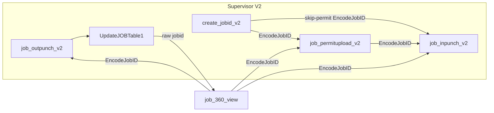
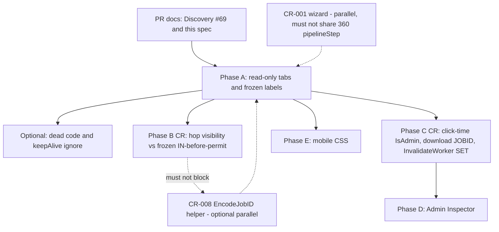

# CR-009 Implementation Specification — JOB360 Admin Cockpit

Status: Implementation specification (documentation only)  
Date: September 2026  
Change Request: CR-009  
Baseline: `v2.1.0-jobid-remediation` (`a75bb1e`)  
Branch: `Jul_to_Sep_2026_Suport_N_Dev_Works`  
Discovery: `docs/CR-009_JOB360_ADMIN_COCKPIT_DISCOVERY.md` (PR #69)  
Related: `docs/JOBID_LIFECYCLE_FUNCTIONAL_AUDIT.md`, `docs/MAINTENANCE_GUIDELINES.md`, `docs/JOBID_V2.2_ROADMAP.md` (planning branch)

This specification does not change executable code, SQL, schema, `MasterStatusCode`, `JOB_Status`, or the frozen lifecycle. It does not create ASPX pages, UserControls, or helper classes. It is not a license to start Phase B–E without a classified Change Request.

Frozen production path (immutable):

```text
Create → IN-Punch → Permit Upload → OUT-Punch → Close & Send → Approval
```

Permit-required jobs must not be redesigned as Permit → IN. Close & Send remains `job_outpunch_v2` `btn_FinalizeShift` → `UpdateJOBTable1` (`JOB_Status='Out-Punch Done'`, `MasterStatusCode='4'`, `EntryExit='Exit'`).

---

## 1. Executive Summary

JOB360 (`job_360_view.aspx`) is the operational cockpit for a single JOBID. It already searches any job, binds core/financial/permit/manpower/CSM panels, encodes hops to V2 Permit / IN / OUT (M3 / UAT-046–048), and hosts admin overrides. It is not the supervisor wizard (CR-001) and not an inbox (no creator filter).

**Target:** keep this ASPX. Wrap existing panels in six presentation tabs. Realign **visual** timeline labels to the frozen six stages. Do not replace Close & Send, do not add JOB states, and do not copy 360 `pipelineStep` (permit-then-IN) onto CR-001 or as a required gate.

**First shippable slice is Phase A only:** read-only tab chrome + frozen labels. `EvaluateActionMatrix` and all SQL stay as in `a75bb1e`. Hidden controls (Raw Inspector, Edit Core) stay hidden. Encoded hops remain exactly as today.

**Must preserve**

- Inbound raw `?jobid=` (OUT success, exceptions, monthly attendance).
- Outbound Permit / IN / OUT `create_jobid_v2.EncodeJobID()`.
- IN eligibility without `MasterStatusCode='3'`.
- Permit inbox `JOBID_Status='Active' AND EntryExit='Entry'`.
- Close & Send writes and control ID `btn_FinalizeShift`.
- Hub KPI meanings (M6). AddDocs / SwapDate raw JOBID (UAT-049).

**Must not do**

- New ASPX or a second control tower.
- New `JOB_Status` / `MasterStatusCode` values (Cancel already writes `'6'`; Delete writes `'0'` — do not expand).
- Schema / stored procedures.
- Force OUT as the normal close.
- Weakening V2 creator inboxes so a 360 hop “just works.” Base64 is not authorization.

---

## 2. Current Architecture

### 2.1 Page

| Item | Value |
|------|--------|
| Page | `WebApplication1/bussiness/production/job_360_view.aspx` |
| Code-behind | `job_360_view.aspx.cs` |
| Master | `webmaster.Master` |
| Hub / menu | Not on `jobs_and_manpower_v2` tiles; not in CreateJOBS menu |
| Layout | Stacked Gentelella panels. **No six user tabs.** Four Bootstrap tabs exist only inside the Raw DB Inspector modal |

### 2.2 Auth and lookup

`Page_Load` requires `Session["USERID"]`, `Session["USERNAME"]`, `Session["WORKMAN"]`. `Load360View` is `SELECT * FROM tbl_jobs WHERE JOBID=@JOBID` — no creator, company, or region filter.

`IsAdmin()` = `Session["USERTYPE"]` equals `Admin` or `Office Staff` (case-insensitive). It gates some **button visibility**, not lookup, and almost never re-checks on click.

Inbound `jobid` is raw. Keep-alive jQuery GET every 10 minutes retriggers `Load360View` on deep links (`!IsPostBack`).

### 2.3 Data load (one shot)

`Load360View` binds labels, then `LoadPermits`, `LoadTBT`, `LoadSOP`, `LoadManpower`, then `EvaluateSmartLifecycle` → live `EvaluateActionMatrix`. Tabs in Phase A must not split this into multiple SQL contracts.

### 2.4 Smart Pipeline vs frozen path

| 360 `pipelineStep` | 360 label | Frozen supervisor path |
|--------------------|-----------|------------------------|
| 1 | Created | Created |
| 2 | Upload Permit | **IN is already eligible** |
| 3 | IN-Punched | Permit additional files after Entry |
| 4 | Site Docs (CSM) | Evidence; OUT page has its own CSM block |
| 5 | OUT-Punched (`Exit` **or** `MAX(LastModified)`) | OUT, then **Close & Send** as a distinct gate |
| 6 | Final Approval | Approval after close |

Phase A changes **labels only**. Next-action visibility stays on the live matrix until Phase B (a Change Request).

### 2.5 Adjacent pages (not absorbed)

| Page | Role vs 360 |
|------|-------------|
| `create_jobid_v2.aspx` | Owns `EncodeJobID` / `DecodeJobID`. Create stays here |
| `job_inpunch_v2.aspx` | Encoded hop. Inbox: Active, 3 days, creator; no code-3 gate |
| `job_permitupload_v2.aspx` | Encoded hop. Inbox: Active, 3 days, creator, `EntryExit='Entry'` |
| `job_outpunch_v2.aspx` | Encoded hop. Close & Send lives here. Success links **back** with raw `jobid` |
| `jobs_and_manpower_v2.aspx` | Hub KPIs (M6). No 360 tile |
| `manage_jobid_v2.aspx` | Monthly grid → `view_jobdetails_v2?JOBID=&dbid=&supv=` (raw). Parallel inspect surface |
| `manage_compliance_docs.aspx` / `swap_jobdate.aspx` | Raw JOBID hops from 360 |



---

## 3. Target JOB360 Cockpit Architecture

Keep **one** WebForms page. Six Bootstrap (or equivalent) tabs wrap **existing** `runat=server` panels. One `Load360View` per search. No new state machine.

```text
job_360_view.aspx
├── Sticky search (txt_jobid / Track / Reset)     — outside tabs
├── Tab 1 Overview   — bottleneck, frozen labels, current hop subset
├── Tab 2 Details    — core + financial + GPS
├── Tab 3 Permits    — gvPermits
├── Tab 4 Manpower   — gvManpower
├── Tab 5 CSM        — gvTBT + gvSOP
└── Tab 6 Admin      — remaining action bar + hidden inspector/modals (stay hidden in Phase A)
```

**Rules**

- Tab chrome is display. It must not skip `EvaluateSmartLifecycle`.
- Frozen labels on Overview: Create → IN → Permit → OUT → Close & Send → Approval.
- Live `pipelineStep` button rules stay until Phase B.
- Destructive writes stay in Tab 6; they are not newly enabled in Phase A.
- Close & Send is never added. Force OUT is never the default close.
- CR-001 stepper is not reused here (`pipelineStep` semantics differ).

**Role of JOB360 after target**

| Actor | JOB360 | V2 pages |
|-------|--------|----------|
| Supervisor | Optional read after close (raw link). Must not punch/close here | Create, IN, Permit, OUT, Close & Send |
| Viewer (authenticated non-admin) | Read panels (current unscoped search — retain until a tenancy CR) | Own inboxes only |
| Admin / Office Staff | Tower read + exceptional writes (Phase C) | Same V2 inboxes; hops do not bypass creator filters |

---

## 4. Six-tab Information Architecture

| Tab | Purpose | Existing surfaces hosted | Actions in Phase A | Later phases |
|-----|---------|--------------------------|--------------------|--------------|
| **Overview** | Identity, frozen labels, bottleneck | Search (sticky, outside tab OK), `stepperContainer` / `lit_step*_details` / `divBottleneck`, short hop subset **as currently visible** | Search, Reset, whatever hops the live matrix already shows | Phase B may retune hop **visibility** only |
| **Details** | Core + ledger | Core Details table, Admin/Financial table, GPS | Read | Phase C: Edit Core if CR enables it |
| **Permits** | Attached files | `gvPermits`, file count label | Download (existing); Upload Permit hop if matrix shows it | No 360 upload write |
| **Manpower** | Attendance ledger | `gvManpower`, `chk_ShowDeleted` | Read; show-deleted | Phase C: Edit/Drop + server `IsAdmin` |
| **CSM** | TBT / SOP evidence | `gvTBT`, `gvSOP` | Read; Add Docs hop if matrix shows it | Do not move TBT/SOP capture onto 360 |
| **Admin** | Overrides + inspector | Remaining `ActionBarRow` buttons, Raw Inspector modal, Core Details modal | **No newly visible writes.** Hidden stays hidden | Phase C auth; Phase D Inspector |

Search stays available on every tab (page header), matching current `txt_jobid` always on screen.

---

## 5. Component inventory

Nothing invented. Every current panel maps to exactly one tab (search is chrome).

| Existing control / panel | Markup ID | Binder / handler | Maps to tab |
|--------------------------|-----------|------------------|-------------|
| Search JOBID | `txt_jobid`, `btn_search`, `btn_reset` | `btn_search_Click`, `btn_reset_Click` | Chrome (all tabs) |
| Action bar container | `ActionBarRow` | `EvaluateActionMatrix` | Overview (encoded hops + Add Docs if shown) and Admin (overrides) |
| Upload Permit | `btn_Act_UploadPermit` | `btn_Act_UploadPermit_Click` | Overview hop |
| IN-Punch | `btn_Act_InPunch` | `btn_Act_InPunch_Click` | Overview hop |
| Add Site Docs | `btn_Act_AddDocs` | `btn_Act_AddDocs_Click` | Overview or CSM hop (same button, not duplicated in markup — **move visually once**) |
| OUT-Punch | `btn_Act_OutPunch` | `btn_Act_OutPunch_Click` | Overview hop |
| Unblock | `btn_Act_Unblock` | `btn_Act_Unblock_Click` | Admin |
| Fix & Resubmit | `btn_Act_Resubmit` | `btn_Act_Resubmit_Click` | Admin |
| Force OUT | `btn_Act_ForceOut` | `btn_Act_ForceOut_Click` | Admin |
| Swap Date | `btn_Act_SwapDate` | `btn_Act_SwapDate_Click` | Admin |
| Delete JOB | `btn_Act_Delete` | `btn_Act_Delete_Click` | Admin |
| Bypass Permits | `btn_Act_ForcePermitBypass` | `btn_Act_ForcePermitBypass_Click` | Admin |
| Reset to Created | `btn_Act_ResetToCreated` | `btn_Act_ResetToCreated_Click` | Admin |
| Cancel/Void | `btn_Act_CancelShift` | `btn_Act_CancelShift_Click` | Admin |
| Admin Rollback | `btn_Act_AdminRollback` | `btn_Act_AdminRollback_Click` | Admin |
| Raw DB Inspector button | `btn_Act_ViewRawData` | `btn_Act_ViewRawData_Click` | Admin (stays `Visible=false` in Phase A) |
| Smart Pipeline | `step1`–`step6`, `lit_step*_details` | `EvaluateSmartLifecycle` | Overview (label copy may change in Phase A; step **logic** unchanged until a CR) |
| Bottleneck | `divBottleneck`, `lbl_bottleneck` | lifecycle + matrix | Overview |
| Core Details table | `lbl_jobdate` … `lbl_jobstatus` | `Load360View` | Details |
| Edit Core button | `btn_EditCoreDetails` | `btn_EditCoreDetails_Click` | Details / Admin (stays hidden Phase A) |
| Financial ledger | `lbl_billingstatus` … `lbl_gps` | `Load360View` | Details |
| Permits grid | `gvPermits`, `lbl_filecount` | `LoadPermits`, `gvPermits_RowCommand` | Permits |
| TBT grid | `gvTBT` | `LoadTBT` | CSM |
| SOP grid | `gvSOP` | `LoadSOP` | CSM |
| Manpower grid | `gvManpower`, `chk_ShowDeleted` | `LoadManpower`, row commands | Manpower |
| Worker modal | `modalEditWorker`, `btn_SaveWorkerEdit` | `btn_SaveWorkerEdit_Click` | Manpower (modal) |
| Unused worker save | `btnSaveEdit_Click` | **Not wired** | Do not surface; remove in refactor |
| Core modal | `modalEditCoreDetails`, `btn_SaveCoreDetails` | `btn_SaveCoreDetails_Click` | Details (modal) |
| Raw Inspector modal | `modalRawData`, `gvRawJobs` … `gvRawSOP` | `btn_Act_ViewRawData_Click` | Admin |
| Keep-alive script | inline jQuery | GET current URL | Chrome (Phase D/refactor may ignore `keepAlive`) |
| Empty Unblock | `btn_Act_UnblockJob_Click` | **Not in markup** | Do not surface |
| `_OLD` handlers / matrix | `EvaluateActionMatrix_OLD`, `*_Click_OLD` | **Not called** | Do not surface |

**Not on this page (must not be added as new 360 components)**

Create JOB, Close & Send / `btn_FinalizeShift`, permit upload/delete writes, approval decision, print, export, V1 switch, hub KPI CASE, `manage_jobid_v2` grid, `supv` QueryString.

---

## 6. Permission Matrix

Roles used here:

| Role | Session | Meaning |
|------|---------|---------|
| **Viewer** | USERID + USERNAME + WORKMAN, `USERTYPE` not Admin/Office Staff | Authenticated read (today: unscoped JOBID search) |
| **Supervisor** | Same session; operational owner of the job on V2 | Create / IN / Permit / OUT / Close & Send on **V2 pages**. JOB360 is not their punch surface |
| **Admin** | `USERTYPE` Admin or Office Staff (`IsAdmin()`) | Tower + exceptional writes after Phase C server checks |

Office Staff ≡ Admin is **existing**. Narrowing it needs a CR.

Every **existing** action:

| Action | Existing handler | Required authorization | Lifecycle state (when visible today) |
|--------|------------------|------------------------|--------------------------------------|
| Track / auto-load | `btn_search_Click` / `Page_Load` | Viewer+ (session 3 keys) | Any JOBID |
| Reset | `btn_reset_Click` | Viewer+ | UI |
| Upload Permit hop | `btn_Act_UploadPermit_Click` | Visibility: 3-day/grace + `pipelineStep==2`. Target page: creator inbox Entry | 360 step 2 (permit outstanding). **Phase B CR** may also show after IN while Entry — V2 inbox is source of truth |
| IN hop | `btn_Act_InPunch_Click` | Visibility: `pipelineStep==3`. Target: creator inbox, no code-3 | 360 step 3. Frozen: Created already eligible on IN page |
| OUT hop | `btn_Act_OutPunch_Click` | Visibility: `pipelineStep==5`. Target: creator + code 3 + Entry (+ permit Yes on select) | 360 step 5 |
| Add Docs hop | `btn_Act_AddDocs_Click` | Visibility: `pipelineStep==4` | 360 step 4 |
| Swap Date hop | `btn_Act_SwapDate_Click` | **Not IsAdmin**; no first IN | Pre-IN only |
| Unblock | `btn_Act_Unblock_Click` | Visible IsAdmin + blocked + not Exit. **Need click-time IsAdmin (Phase C)** | Blocked, not closed |
| Resubmit | `btn_Act_Resubmit_Click` | Visible if Rejected/Returned/Cancelled; **not IsAdmin**. Phase C: Admin | After reject/return |
| Force OUT | `btn_Act_ForceOut_Click` | In-window: any user if Entry + first IN + created date &lt; today. Lockout: IsAdmin visibility. Phase C: Admin always | Entry with workers; **not** Close & Send |
| Delete | `btn_Act_Delete_Click` | No attendance; **not IsAdmin**. Phase C: Admin | Pre-IN |
| Bypass | `btn_Act_ForcePermitBypass_Click` | Visible IsAdmin + `MasterStatusCode='1'`. Phase C: click IsAdmin | Created / code 1 |
| Reset to Created | `btn_Act_ResetToCreated_Click` | Visible IsAdmin + code 3 + 0 workers. Phase C: click IsAdmin | Empty Entry/code 3 |
| Cancel/Void | `btn_Act_CancelShift_Click` | Visible IsAdmin + (code 1 or empty code 3). Phase C: click IsAdmin | Ghost/empty |
| Admin Rollback | `btn_Act_AdminRollback_Click` | Visible IsAdmin + Approved. Phase C: click IsAdmin | Approved |
| Raw Inspector | `btn_Act_ViewRawData_Click` | Hidden. Phase D: Admin + click IsAdmin | Any loaded job |
| Edit Core open/save | `btn_EditCoreDetails_Click` / `btn_SaveCoreDetails_Click` | Hidden / no click auth. Phase C if enabled: Admin | Any loaded (product CR) |
| Permit download | `gvPermits_RowCommand` | Any loaded user; **Id only**. Phase C: session + `Id AND JOBID` | Job with files |
| Show deleted | `chk_ShowDeleted_CheckedChanged` | Viewer+ | Any with attendance |
| Edit worker | `EditWorker` / `btn_SaveWorkerEdit_Click` | Grid IsAdmin; save unchecked. Phase C: click IsAdmin | Attendance row not deleted |
| Drop worker | `InvalidateWorker` | Grid IsAdmin. Phase C: click IsAdmin + fix SET | Attendance row not deleted |
| Close & Send | **none** | Supervisor on OUT page only | After last OUT |
| Print / Export / Approve / Create | **none** | — | Excluded |

Visibility is not authorization. Phase A does not add server checks (no behavior change). Phase C adds click-time `IsAdmin()` without changing SQL predicates except InvalidateWorker SET repair and download `JOBID` match.

---

## 7. Lifecycle Matrix

Source of truth is V2 predicates and M6 KPIs, not 360 `pipelineStep`.

| State | Predicate | Allowed from JOB360 | Forbidden from JOB360 |
|-------|-----------|---------------------|------------------------|
| **Create** (Created) | `EntryExit='Created'` | VIEW; encoded IN hop lands on V2 inbox (UAT-006). Permit hop must not become a gate | Require permit before IN. Bypass writing Entry/code 3 as “normal unlock.” Close |
| **IN** (Entry) | Healing: `JOB_Status='In-Punch Done'`, `EntryExit='Entry'`, typically code `3` | VIEW; Permit hop (inbox Entry); OUT hop if OUT inbox matches | Blocking IN because permit outstanding. 360 IN **insert** |
| **Permit** pending | `EntryExit='Entry' AND FinalUpldStatus='No'` | VIEW; Permit hop; additional files while Entry | 360 writing `PermitUpload` except existing Bypass. Dropping inbox while Entry |
| **Permit** complete | `FinalUpldStatus='Yes'` (job may still be Entry) | VIEW; more files while Entry; OUT hop | Treating this as Closed |
| **OUT** pending | `MasterStatusCode='3' AND EntryExit='Entry'` | VIEW; OUT hop | Force OUT as default close. Timeline “complete” via `MAX(LastModified)` meaning Closed |
| **Close** | Last OUT then `UpdateJOBTable1`: Out-Punch Done / `4` / `Exit` | VIEW; navigate to OUT page | `btn_FinalizeShift` on 360. Auto-close. Force OUT as the certified close |
| **Approval** | `Incharge_Approval='Approved'` after close; inbox `Out-Punch Done` AND `Exit` | VIEW; existing Rollback is exceptional Admin | Approve-from-360. Supervisor reopen via 360 |

Phase A **allowed actions** are VIEW + existing hops exactly as the live matrix shows. Phase B may add IN hop visibility at Created and Permit hop while Entry **without** changing V2 SQL.

---

## 8. Data Ownership Matrix

`tbl_jobs` stores `Creator_Company`, `Creator_Workman`, `JOB_Company`. JOB360 queries do **not** use them. `supv` is used by `manage_jobid_v2` → `view_jobdetails_v2` only.

| Operation | Handler | WHERE keys | Company / Creator_Company | Creator_Workman | USERID | WORKMAN | supv | Server-side validation required |
|-----------|---------|------------|---------------------------|-----------------|--------|---------|------|----------------------------------|
| Load job | `Load360View` | JOBID | No | No | Login only | Login only | Unused | Phase A: keep. Tenancy CR to add `Creator_Company` |
| Load permits | `LoadPermits` | JOBID, DeleteStatus=0 | No | No | No | No | Unused | Same JOBID as loaded job |
| Load TBT/SOP | `LoadTBT` / `LoadSOP` | Ref_JOBID | No | No | No | No | Unused | Same |
| Load manpower | `LoadManpower` | JOBID ± DeleteStatus | No | No | No | No | Unused | Same |
| Stepper aggregate | `EvaluateSmartLifecycle` | JOBID | No | No | No | No | Unused | Read only |
| Permit download | `gvPermits_RowCommand` | **Id only** | No | No | No | No | Unused | **Phase C:** `Id AND JOBID=@loaded` |
| Unblock / Bypass / Reset / Cancel / Delete / Resubmit / Rollback / Force OUT job row | matching `btn_Act_*` | JOBID | No | No | No | No | Unused | **Phase C:** `IsAdmin()` then existing UPDATE |
| Reset permit delete | `btn_Act_ResetToCreated_Click` | JOBID | No | No | No | No | Unused | `IsAdmin()` |
| Force OUT attendance | `btn_Act_ForceOut_Click` | JOBID, Outpunch null | No | No | No | No | Unused | `IsAdmin()`; do not replace Close & Send |
| Save core | `btn_SaveCoreDetails_Click` | JOBID | No | No | No | No | Unused | `IsAdmin()` if enabled |
| Save worker | `btn_SaveWorkerEdit_Click` | attendance Id | No | No | No | Writes ModifiedByWrk | Unused | `IsAdmin()` + Id belongs to loaded JOBID |
| Invalidate worker | `InvalidateWorker` | JOBID + EmployeeWrk; broken job UPDATE | No | No | No | No | Unused | `IsAdmin()`; fix SET / transaction (Phase C) |
| Raw Inspector | `btn_Act_ViewRawData_Click` | JOBID | No | No | No | No | Unused | `IsAdmin()` if enabled (Phase D) |
| V2 IN/Permit/OUT after hop | V2 `ActiveJOB_Checker` | Creator_Workman + 3-day + status | No company on inbox SQL | **Yes** | Session | Session WORKMAN | Unused | **Do not weaken** |

Phase A does not add tenant predicates (that would change who can inspect). Document the gap; a tenancy CR is out of Phase A–E unless explicitly approved.

---

## 9. Technical Refactoring Map

Safe refactors only. Prove identical predicates and redirects. Classify as Refactor per `docs/MAINTENANCE_GUIDELINES.md`. Prefer CR-008 for shared helpers rather than inventing them inside CR-009 Phase A.

| Refactor | Current location | Safe approach | Not allowed |
|----------|------------------|---------------|-------------|
| Shared `EncodeJobID` / `DecodeJobID` | Duplicated on create / IN / permit / OUT; 360 calls `create_jobid_v2.EncodeJobID()` | Extract one helper; algorithm unchanged; 360 still encodes the same way | Changing padding/URL-safe alphabet; using Base64 as auth |
| Status constants | Magic strings Created / Entry / Exit / `1`/`3`/`4`/`5` / Out-Punch Done | Names file with **exact** frozen values | Adding `'6'`/`'0'` as first-class frozen states |
| Reusable modal chrome | OUT Close modals; 360 worker/core/inspector modals | Shared markup/script only | Moving Close & Send onto 360; sharing 360 stepper with CR-001 |
| PNotify `ShowNotification` | Copied per page | Optional extract | Changing message that implies new states |
| Date helpers | `GetSafeString`, `ParseDateSafe`, `FormatDate`, `GetTATBadge` on 360 | Extract if tests show identical output | Changing TAT rules |
| Dead code | `EvaluateActionMatrix_OLD`, `*_Click_OLD`, `btnSaveEdit_Click`, empty `btn_Act_UnblockJob_Click` | Delete after proving unused | Calling `_OLD` Resubmit (different SQL) |
| Keep-alive | GET with `keepAlive` | Ignore QS in `Page_Load` so `Load360View` does not re-run | Shortening interval; using ping as auth |
| `InvalidateWorker` job UPDATE | `UPDATE tbl_jobs WHERE JOBID=@JOBID` (no SET) | Drop no-op or add specified SET; transaction with attendance | Inventing a headcount formula without spec |

**Not a refactor (needs a CR):** `EvaluateActionMatrix` hop order; Force OUT vs `UpdateJOBTable1`; Cancel `'6'`; enabling Inspector/Edit Core; company filter; encoding AddDocs/SwapDate without decoder.

---

## 10. UI Wireframe

ASCII only. Existing fields. No new widgets except tab chrome.

### 10.1 Desktop

```text
+----------------------------------------------------------------------------------+
| JOB 360-Degree Lifecycle View                                                    |
| JOBID [____________]  [Track Job] [Reset]                                        |
+----------------------------------------------------------------------------------+
| [Overview] [Details] [Permits] [Manpower] [CSM] [Admin]                          |
+----------------------------------------------------------------------------------+
| OVERVIEW                                                                         |
| Created --> IN-Punch --> Permit --> OUT-Punch --> Close & Send --> Approval      |
| (label order frozen; completion still from existing EvaluateSmartLifecycle       |
|  until a display CR splits Close from MAX(LastModified))                         |
|                                                                                  |
| Bottleneck: {lbl_bottleneck}                                                     |
| Hops (only if live matrix already shows them):                                   |
|   [Upload Permit] [IN-Punch Manpower] [Add Site Docs] [OUT-Punch Shift]          |
+----------------------------------------------------------------------------------+

DETAILS                         PERMITS
+---------------------------+   +----------------------------------------------+
| JOB Date / Creator / Site |   | Attached Permits (n)                         |
| Title / Shift / WO / Status   | File | Uploaded By | On | [Download]         |
| Billing / L1 / EMC / Lump |   +----------------------------------------------+
| TBT verified / Permit no  |
| Unblocked Until / GPS     |   MANPOWER
+---------------------------+   +----------------------------------------------+
                                | [ ] Show Deleted Records                     |
CSM                             | Emp | IN | OUT | Hrs | OT | Status | Admin   |
+---------------------------+   | (Edit/Drop remain IsAdmin grid Visible)      |
| TBT grid (existing cols)  |   +----------------------------------------------+
| SOP grid (existing cols)  |
+---------------------------+   ADMIN
                                +----------------------------------------------+
                                | Unblock | Resubmit | Force OUT | Swap Date   |
                                | Delete | Bypass | Reset | Cancel | Rollback  |
                                | Raw Inspector (hidden Phase A)               |
                                +----------------------------------------------+
```

Worker / core / inspector modals unchanged; still opened only by existing buttons.

### 10.2 Mobile

```text
+---------------------------+
| JOB 360                   |
| [JOBID        ] [Track]   |
| [Reset]                   |
+---------------------------+
| Overview | Details | ...  |   <-- scrollable tab strip
+---------------------------+
| OVERVIEW                  |
| Created                   |
|   v                       |
| IN-Punch                  |
|   v                       |
| Permit                    |
|   v                       |
| OUT-Punch                 |
|   v                       |
| Close & Send              |
|   v                       |
| Approval                  |
|                           |
| Bottleneck text           |
| [hop buttons stacked]     |
+---------------------------+
| Grids: table-responsive   |
| horizontal scroll (Phase A)|
| Phase E: card-per-worker  |
| Inspector: desktop-only   |
+---------------------------+
```

Phase A may stack the existing horizontal stepper with CSS (`flex-direction: column` under a breakpoint) **without** changing step logic. Phase E is the dedicated mobile pass. Supervisors still punch on V2 pages (CR-002), not here.

---

## 11. Phase Breakdown

No phase starts in this documentation PR. Do not retag `v2.1.0-jobid-remediation`.

Discovery P0–P7 maps as: P0 = this program’s docs; P1+P2 ⊂ Phase A; P3 ⊂ Phase A/D; P4+P7 ⊂ Phase C; P5 ⊂ Phase B; P6 out unless both ends decode.

### Phase A — Read-only cockpit

| | |
|--|--|
| **Scope** | Tab chrome around existing panels. Frozen **label** order on Overview. Search sticky. Do **not** change `EvaluateActionMatrix`, SQL, hidden buttons, or hop encode |
| **Files likely affected** | `job_360_view.aspx` (markup/CSS). `.aspx.cs` only if literal step **names** in markup need matching text — prefer markup-only. No V2 pages |
| **Risk** | Low if matrix/SQL untouched. Medium if tabs skip `Load360View` or hide a hop the matrix still sets Visible |
| **Rollback** | Revert markup/CSS. Tag stays |
| **UAT scope** | CR009-UAT-001–025 plus regression UAT-046–049, UAT-006, UAT-014/015, UAT-029/040, UAT-004/005 |

### Phase B — Workflow actions

| | |
|--|--|
| **Scope** | Change **visibility** of encoded IN/Permit/OUT hops to match frozen order (IN at Created; Permit while Entry). Still only `Response.Redirect` + `EncodeJobID`. No punch/close writes on 360 |
| **Files likely affected** | `job_360_view.aspx.cs` `EvaluateActionMatrix` (and markup if hop placement changes). **Not** V2 `ActiveJOB_Checker` |
| **Risk** | Medium: wrong next-action if permit-before-IN is reintroduced. V2 inboxes remain source of truth |
| **Rollback** | Revert matrix method |
| **UAT scope** | CR009-UAT-026–029; UAT-006; UAT-014/015; UAT-046–048. Formal CR required |

### Phase C — Admin controls

| | |
|--|--|
| **Scope** | Click-time `IsAdmin()` on all writes. Permit download `Id AND JOBID`. Optionally hide Delete/Swap/in-window Force OUT from non-admin. Fix `InvalidateWorker` SET/transaction. Do **not** change Bypass/Cancel/Force OUT **SQL** unless a nested CR says so |
| **Files likely affected** | `job_360_view.aspx.cs` write handlers, `gvPermits_RowCommand`, `gvManpower_RowCommand` |
| **Risk** | High: payroll/attendance and unofficial codes `'6'`/`'0'` |
| **Rollback** | Revert handlers |
| **UAT scope** | CR009-UAT-030–037. Force OUT is override, not UAT-040 |

### Phase D — Audit

| | |
|--|--|
| **Scope** | Enable Raw Inspector for Admin with click-time `IsAdmin()`. Optional: ignore `keepAlive` on load; delete unused `_OLD` methods |
| **Files likely affected** | `job_360_view.aspx` / `.aspx.cs` Inspector visibility + `Page_Load` keep-alive |
| **Risk** | Medium: `SELECT *` PII. Keep permits without blob (already excluded) |
| **Rollback** | Hide button again |
| **UAT scope** | CR009-UAT-038–039 |

### Phase E — Mobile

| | |
|--|--|
| **Scope** | Vertical timeline, larger hop targets, manpower cards. No new actions. Inspector remains desktop |
| **Files likely affected** | `job_360_view.aspx` CSS/markup |
| **Risk** | Low presentation |
| **Rollback** | Revert CSS |
| **UAT scope** | CR009-UAT-040 |

**Stop conditions (any phase)**

- Close & Send writes or renaming `btn_FinalizeShift`
- New `MasterStatusCode` values
- Permit required before IN
- Permit inbox SQL reused as Pending Permit KPI
- Base64 as authorization
- CR-001 wizard chrome on this page
- Print/export/schema/SP

---

## 12. New UAT Matrix

IDs **CR009-UAT-001** … **CR009-UAT-040** are allocated for implementation PRs. They are not certified by this specification PR. Reuse frozen IDs wherever the behavior is already certified.

| ID | Phase | Scenario | Expected | Reuse |
|----|-------|----------|----------|-------|
| CR009-UAT-001 | A | Empty search | Warning; no dashboard | — |
| CR009-UAT-002 | A | Unknown JOBID | Not Found; dashboard hidden | — |
| CR009-UAT-003 | A | Valid JOBID Track | Panels bind; same JOBID | — |
| CR009-UAT-004 | A | Inbound raw `?jobid=` from OUT success | Dashboard loads | UAT-049 inbound |
| CR009-UAT-005 | A | Encoded Permit hop | Selected V2 JOBID | **UAT-046** |
| CR009-UAT-006 | A | Encoded IN hop | Selected V2 JOBID | **UAT-047** |
| CR009-UAT-007 | A | Encoded OUT hop | Selected V2 JOBID | **UAT-048** |
| CR009-UAT-008 | A | Invalid/empty encoded token on V2 | No 500 | **UAT-049** |
| CR009-UAT-009 | A | AddDocs / SwapDate | Raw `txt_jobid` | **UAT-049** |
| CR009-UAT-010 | A | Six tabs host inventory in §5 | No panel missing; no new widget | — |
| CR009-UAT-011 | A | Overview label order | Create → IN → Permit → OUT → Close & Send → Approval | — |
| CR009-UAT-012 | A | `EvaluateActionMatrix` hop set vs `a75bb1e` | Unchanged in Phase A | — |
| CR009-UAT-013 | A | Details fields | Existing labels only | — |
| CR009-UAT-014 | A | Permits grid + download | Existing columns; file opens | — |
| CR009-UAT-015 | A | Manpower grid | Existing columns | — |
| CR009-UAT-016 | A | TBT + SOP grids | Existing columns | — |
| CR009-UAT-017 | A | Inspector / Edit Core | Still hidden | — |
| CR009-UAT-018 | A | Created job labels | Not Closed/Approved | Hub Pending IN meaning **UAT-004** family |
| CR009-UAT-019 | A | Entry after IN | Entry shown; IN page still no code-3 | **UAT-006** |
| CR009-UAT-020 | A | Permit pending Entry + FinalUpldStatus=No | Outstanding permit visible | **UAT-005**, **UAT-014** |
| CR009-UAT-021 | A | Additional permit while Entry | Still in permit inbox | **UAT-015**, **UAT-015A** |
| CR009-UAT-022 | A | After Close (`Exit`) | Not in permit inbox; Closed label | **UAT-015B**, **UAT-040** |
| CR009-UAT-023 | A | OUT pending code 3 + Entry | Not Closed | **UAT-004** |
| CR009-UAT-024 | A | All workers OUT, Close not sent | Still Entry/code 3; **no** 360 Finalize | **UAT-029** |
| CR009-UAT-025 | A | Closed Out-Punch Done / 4 / Exit | Closed; approval pending copy | **UAT-040**, **UAT-035** |
| CR009-UAT-026 | B | IN hop visible on Created permit-required job | Hop only; V2 inbox still lists it | **UAT-006**; **must not** require permit first |
| CR009-UAT-027 | B | Permit hop while Entry after IN | V2 inbox Entry | **UAT-014** |
| CR009-UAT-028 | B | Permit-before-IN not required | Created job can still IN on V2 | **UAT-006**, **UAT-021** |
| CR009-UAT-029 | B | OUT hop still encoded | Same JOBID | **UAT-048** |
| CR009-UAT-030 | C | Site Staff POST Force OUT | Rejected server-side | — |
| CR009-UAT-031 | C | Site Staff POST Bypass / Cancel / Delete | Rejected | — |
| CR009-UAT-032 | C | Admin Unblock | Existing grace 24h SQL unchanged | — |
| CR009-UAT-033 | C | Permit download other JOB’s Id | Not found / forbidden | — |
| CR009-UAT-034 | C | InvalidateWorker | Attendance invalid; no SQL error from missing SET | — |
| CR009-UAT-035 | C | Force OUT vs Close & Send | Override path; not UAT-040; OUT page close still works | **UAT-040** regression |
| CR009-UAT-036 | C | Cancel still writes `'6'` unless a nested CR changes it | Documented unofficial code | — |
| CR009-UAT-037 | C | Historical >3 day | Read works; standard hops follow current lockout | — |
| CR009-UAT-038 | D | Inspector hidden for Viewer | No `SELECT *` | — |
| CR009-UAT-039 | D | Admin Inspector | Four inner tabs; permits without blob | — |
| CR009-UAT-040 | E | Narrow viewport | Vertical labels; hops tappable; no punch on 360 | — |

**Always regress on every 360 PR:** UAT-046, UAT-047, UAT-048, UAT-049, UAT-006, UAT-014, UAT-015, UAT-029, UAT-040, UAT-004, UAT-005.

**Not allocated (excluded features):** print, export, V1 navigation, Approve-from-360, Create-from-360, `btn_FinalizeShift` on 360, cross-company isolation (no predicate today — do not fail Phase A for missing isolation; a tenancy CR would add IDs beyond 040).

---

## 13. Explicit Non-goals

- New ASPX, UserControl, API, or second control tower
- Helper class in Phase A (EncodeJobID extract is CR-008 / later refactor)
- Schema, stored procedures, new tables
- New `JOB_Status` or `MasterStatusCode` values; expanding `'6'` / `'0'` as official frozen states
- Redesigning permit-required jobs as Permit → IN
- Copying 360 `pipelineStep` onto CR-001 wizard chrome
- Close & Send / `btn_FinalizeShift` / `UpdateJOBTable1` on JOB360
- Force OUT as the supervisor close or as a substitute for UAT-040
- 360 performing IN insert, OUT punch SP (except existing Force OUT override), or permit file upload/delete (except existing Reset hard-delete)
- Approval decision UI on 360 (Rollback remains exceptional)
- Print, export, PDF, Excel
- Navigation back to V1 JOBID pages
- Hub KPI CASE changes; using permit inbox as Pending Permit
- Weakening V2 `Creator_Workman` inboxes or treating Base64 as authorization
- Company / `supv` filter in Phase A (would change who can inspect)
- Enabling Raw Inspector or Edit Core in Phase A
- Sharing 360 stepper CSS/semantics with the supervisor wizard
- Mobile punching on 360 (CR-002 owns V2 mobile)
- Retagging `v2.1.0-jobid-remediation`
- Implementing Phases B–E from this specification without a classified CR
- Modifying executable code in this specification PR

---

## Implementation dependency graph



Phase B and Phase C can proceed independently after A. Phase D depends on C if Inspector is a write-adjacent Admin surface (read with `IsAdmin`). Phase E depends only on A. CR-001 must not wait on 360 tabs and must not import 360 step numbers.

---

## Effort characterization (not calendar)

| Phase | Invasiveness | Typical files | Nature of work |
|-------|--------------|---------------|----------------|
| A | Low | 1 ASPX (+ CSS in page) | Markup wrap; no SQL |
| B | Medium | 1 `.aspx.cs` method | Visibility CR; freeze-sensitive |
| C | High | 1 `.aspx.cs` write cluster | Auth + one SQL bugfix |
| D | Medium | 1 page | Enable existing Inspector |
| E | Low | 1 ASPX CSS | Presentation |

This specification PR: **one markdown file**, documentation-only.

---

## Files in this specification

| File | Role |
|------|------|
| `docs/CR-009_IMPLEMENTATION_SPEC.md` | This document (new) |

Existing discovery, audit, changelog, and maintenance guidelines are not modified by this specification.
