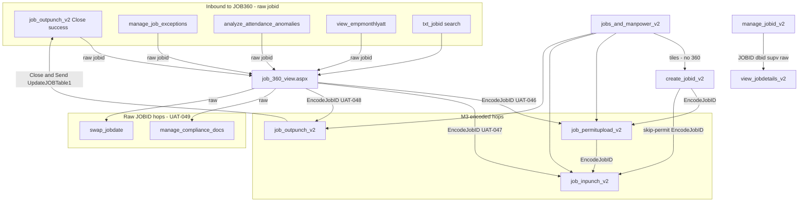

# CR-009 Discovery — JOB360 Admin Cockpit

Status: Planning / architecture discovery only  
Date: September 2026  
Change Request: CR-009 (draft; not approved for implementation)  
Baseline: `v2.1.0-jobid-remediation` (`a75bb1e`)  
Branch: `Jul_to_Sep_2026_Suport_N_Dev_Works`

This document does not change executable code, SQL, `MasterStatusCode`, `JOB_Status`, schema, or the frozen lifecycle. It does not create ASPX pages, UserControls, or helper classes.

Sources: `job_360_view.aspx` / `.aspx.cs`; related V2 pages listed below; `docs/JOBID_LIFECYCLE_FUNCTIONAL_AUDIT.md`; `docs/MAINTENANCE_GUIDELINES.md`; `docs/JOBID_V2.2_ROADMAP.md` (planning branch); `docs/CR-001_UNIFIED_WIZARD_DISCOVERY.md` (planning branch).

---

## 1. Executive Summary

JOB360 (`job_360_view.aspx`) is already the **operational cockpit** for a single JOBID: search any job, inspect core/financial/permit/manpower/CSM data, jump to V2 Permit / IN / OUT with encoded `jobid` (M3 / UAT-046–048), and run admin overrides. It is **not** the supervisor wizard (that is CR-001) and **not** an inbox (no creator filter).

Treat v2.1.0 as frozen. A JOB360 cockpit program must **observe** Create → IN-Punch → Permit Upload → OUT-Punch → Close & Send → Approval. It must **not** copy the page’s current Smart Pipeline order (Created → Permit → IN → Site Docs → OUT → Approval) onto supervisor next-actions or onto CR-001 stepper chrome.

**Today the page is a stacked dashboard, not six user tabs.** The only Bootstrap tabs are inside the Raw DB Inspector modal (`tbl_jobs`, `tbl_attendance`, `tbl_jobspermit`, `tbl_tbt` & `tbl_sop`). Edit Core Details and Raw DB Inspector buttons remain `Visible="false"` and are never turned on in `EvaluateActionMatrix`.

**Recommended shape (when a later CR is approved):** keep this ASPX. Wrap the existing panels in **six presentation tabs** (Overview, Details, Permits, Manpower, CSM, Admin). Realign the **visual** timeline to the frozen six stages. Do not replace Close & Send, do not add JOB states, and do not use 360 `pipelineStep` as the supervisor wizard order.

**Must preserve**

- JOB360 inbound raw `?jobid=` (OUT success modal, exceptions, monthly attendance).
- Permit / IN / OUT outbound `create_jobid_v2.EncodeJobID()` (UAT-046–049).
- IN eligibility without `MasterStatusCode='3'`.
- Permit inbox `JOBID_Status='Active' AND EntryExit='Entry'`.
- Close & Send on `job_outpunch_v2`: `UpdateJOBTable1` → `JOB_Status='Out-Punch Done'`, `MasterStatusCode='4'`, `EntryExit='Exit'`; control ID `btn_FinalizeShift`.
- Hub KPI meanings (M6). Permit-before-IN is not a required gate.

**Must not do in CR-009 implementation (when approved)**

- New ASPX or a second control tower.
- New `JOB_Status` / `MasterStatusCode` values (360 Cancel already writes `'6'`; Delete writes `'0'` — do not expand that).
- Schema / stored-procedure changes.
- Replacing Close & Send with Force OUT as the normal close path.
- Copying 360 `pipelineStep` 2=permit / 3=IN onto CR-001 wizard chrome.
- Weakening session, creator, or company checks to “open any job from 360.”

---

## 2. Current feature inventory

### 2.1 Page identity

| Item | Value |
|------|--------|
| Page | `WebApplication1/bussiness/production/job_360_view.aspx` |
| Code-behind | `job_360_view.aspx.cs` (~1,718 lines) |
| Master | `webmaster.Master` |
| Title | 360-Degree JOB View / JOB 360-Degree Lifecycle View |
| Role in v2.1.0 | Admin override / inspect overlay. Not a primary supervisor page. Not in hub tiles. Not in `webmaster.Master` CreateJOBS menu. |

### 2.2 Auth and lookup

`Page_Load` requires `Session["USERID"]`, `Session["USERNAME"]`, and `Session["WORKMAN"]`. Missing any key redirects to `~/login.aspx`. This is **stricter than CR-001’s earlier note of USERID-only**, and **looser than the hub** (`jobs_and_manpower_v2` also requires `RolePermissionDB`, `UserRoleDB`, `REGION`).

`Load360View` runs `SELECT * FROM tbl_jobs WHERE JOBID=@JOBID`. There is **no creator, company, or region filter**. Any authenticated user who can open the page can track any JOBID. `IsAdmin()` only gates some buttons, not the lookup.

Inbound `Request.QueryString["jobid"]` is treated as a **raw** JOBID (trimmed into `txt_jobid`). Producers that already pass raw IDs: OUT Close success (`job_outpunch_v2.aspx` `showCloseSuccessModal`), `manage_job_exceptions.aspx`, `analyze_attendance_anomalies.aspx`, `view_empmonthlyatt.aspx`.

### 2.3 Visible layout (stacked panels)

| # | Surface | Markup / binder | Notes |
|---|---------|-----------------|--------|
| 1 | Search | `txt_jobid`, `btn_search`, `btn_reset` | Track Job / Reset. Reset hides `MainDashboardRow`. |
| 2 | Action bar | `ActionBarRow` + 13 `LinkButton`s | Shown after a successful load. Visibility from `EvaluateActionMatrix`. |
| 3 | Smart Pipeline | `step1`–`step6` + `lbl_bottleneck` | Horizontal stepper. Order is permit-then-IN. |
| 4 | Core Details | Labels + optional Edit | Edit button stays hidden (see §10). |
| 5 | Admin / Financial ledger | Billing, L1 code, EMC, lumpsum, TBT verified, original permit, UnblockedUntil, GPS | GPS becomes a Google Maps `query=` link. |
| 6 | Attached Permits | `gvPermits` / `LoadPermits` | `tbl_jobspermit` `DeleteStatus=0`. Download via `gvPermits_RowCommand`. |
| 7 | TBT | `gvTBT` / `LoadTBT` | `tbl_tbt` `Ref_JOBID`. Empty `catch {}`. |
| 8 | SOP | `gvSOP` / `LoadSOP` | `tbl_sop` `Ref_JOBID`. Empty `catch {}`. |
| 9 | Manpower | `gvManpower` / `LoadManpower` | Optional deleted rows. Admin Edit / Drop. Backdated row highlight (>30 min). |
| 10 | Modals | Worker edit, core-details edit, Raw DB Inspector | Inspector has **four** Bootstrap tabs. |

Session keep-alive: jQuery `$.get` to the current URL every 10 minutes with `keepAlive=` timestamp. Because `Page_Load` auto-loads on `!IsPostBack` when `jobid` is present, a keep-alive GET on a deep link **re-runs `Load360View`**.

### 2.4 Action bar (code-backed)

| Control | Kind | Destination or write | Encode |
|---------|------|----------------------|--------|
| `btn_Act_UploadPermit` | Navigate | `job_permitupload_v2.aspx?jobid=` | `EncodeJobID` |
| `btn_Act_InPunch` | Navigate | `job_inpunch_v2.aspx?jobid=` | `EncodeJobID` |
| `btn_Act_OutPunch` | Navigate | `job_outpunch_v2.aspx?jobid=` | `EncodeJobID` |
| `btn_Act_AddDocs` | Navigate | `manage_compliance_docs.aspx?jobid=` | **Raw** `txt_jobid` |
| `btn_Act_SwapDate` | Navigate | `swap_jobdate.aspx?jobid=` | **Raw** `txt_jobid` |
| `btn_Act_Unblock` | Write | `IsBlocked=0`, `JOBID_Status='Active'`, `UnblockedUntil=+24h` | — |
| `btn_Act_Resubmit` | Write | `MasterStatusCode='3'`, `JOB_Status='Permit Uploaded'`, `EntryExit='Entry'` | Does **not** reset `Incharge_Approval` |
| `btn_Act_ForceOut` | Write | Per-worker `SP_Update_AttendancePunchOUT`, then `JOB_Status='Out-Punch Done'`, code `'4'`, `EntryExit='Exit'` | **Not** `UpdateJOBTable1`; always `JOBID_Status='Active'` |
| `btn_Act_Delete` | Write | Soft-delete: `DeleteStatus=1`, `JOBID_Status='Deleted'`, code `'0'`, `EntryExit='Deleted'`, `Incharge_Approval='Cancelled'` | Not `IsAdmin`-gated |
| `btn_Act_ForcePermitBypass` | Write | `PermitUpload='Bypassed'`, `FinalUpldStatus='Yes'`, `JOB_Status='Permit Bypassed (Emergency)'`, code `'3'`, `EntryExit='Entry'` | Unlocks IN without files |
| `btn_Act_ResetToCreated` | Write | `DELETE tbl_jobspermit` then Created / code `'1'` / `EntryExit='Created'` | Admin + code 3 + 0 workers |
| `btn_Act_CancelShift` | Write | `JOBID_Status='Cancelled'`, `JOB_Status='Voided by Admin'`, **`MasterStatusCode='6'`**, `EntryExit='Deleted'` | Code `6` is **not** in the frozen 1/3/4/5 set |
| `btn_Act_AdminRollback` | Write | `Incharge_Approval='Returned'`, keeps Out-Punch Done / code 4 | Comment says “Step 4”; frozen close is already code 4 / Exit |
| `btn_Act_ViewRawData` | Inspect | Binds four raw grids, shows modal | Button never made visible (see §10) |

Manpower grid (admin only): Edit worker times/OT/status; Drop (`InvalidateWorker`) sets `DeleteStatus=1` / `AttendanceStatus='Invalidated'`. The follow-on `UPDATE tbl_jobs WHERE JOBID=@JOBID` has **no SET clause** (runtime SQL error after the attendance update already committed).

### 2.5 What JOB360 does not do

- Create a JOBID (`create_jobid_v2`).
- Run Close & Send / `btn_FinalizeShift` / `UpdateJOBTable1` (Force OUT is a parallel close write).
- Appear on `jobs_and_manpower_v2` tiles or `webmaster.Master`.
- Filter like an inbox (no 3-day SQL filter on load; 3-day window only gates **actions**).
- Display `WO_BillingNature` / `WO_ContractNature` (M4 lives on create).
- Decode inbound Base64 `jobid` (inbound is raw only).

---

## 3. Navigation dependency map

### 3.1 Related pages

| Page | Relation to JOB360 |
|------|--------------------|
| `create_jobid_v2.aspx` | Owns `EncodeJobID()` / `DecodeJobID()`. 360 calls encode for V2 hops. Create does not link to 360. |
| `job_inpunch_v2.aspx` | Encoded hop from 360. Inbox: Active, 3 days, creator; **no** code-3 gate (M1). |
| `job_permitupload_v2.aspx` | Encoded hop. Inbox: Active, 3 days, creator, `EntryExit='Entry'` (M5). Additional files remain possible. |
| `job_outpunch_v2.aspx` | Encoded hop. Close & Send is the frozen close. Success modal links **back** to 360 with **raw** `jobid`. |
| `jobs_and_manpower_v2.aspx` | Hub. No 360 tile. KPI CASE must stay M6. |
| `manage_jobid_v2.aspx` | Monthly grid → `view_jobdetails_v2.aspx?JOBID=&dbid=&supv=` (raw, not encoded). Parallel inspect surface, not 360. |
| `view_jobdetails_v2.aspx` | Permit + manpower grids; attach manpower; notifications. Overlaps 360 visually; different query contract. |
| `manage_compliance_docs.aspx` / `swap_jobdate.aspx` | Non-V2; 360 still passes raw JOBID (UAT-049). |
| `manage_job_exceptions.aspx` / `analyze_attendance_anomalies.aspx` / `view_empmonthlyatt.aspx` | Open 360 in a new tab with raw `jobid`. |

### 3.2 Mermaid — dependency graph



### 3.3 Page interaction diagram

```mermaid
sequenceDiagram
  actor User
  participant Hub as jobs_and_manpower_v2
  participant Create as create_jobid_v2
  participant IN as job_inpunch_v2
  participant Permit as job_permitupload_v2
  participant OUT as job_outpunch_v2
  participant J360 as job_360_view
  participant Close as UpdateJOBTable1

  User->>Hub: Open Create JOBID menu
  User->>Create: Submit JOB
  alt skip-permit WO code 3
    Create->>IN: encoded jobid
  else permit-required WO
    Create->>Permit: encoded jobid
    Note over Create,Permit: HTTP redirect is not a permit-before-IN gate
  end
  User->>IN: Scan workers ActiveJOB_Checker no code-3
  User->>Permit: Additional files while Entry
  User->>OUT: Last OUT confirm modal
  User->>Close: btn_FinalizeShift Close and Send
  Close-->>OUT: Out-Punch Done / 4 / Exit
  OUT->>J360: success link raw jobid
  User->>J360: Inspect / override
  J360->>Permit: EncodeJobID
  J360->>IN: EncodeJobID
  J360->>OUT: EncodeJobID
```

JOB360 is an **overlay after or beside** the supervisor path. CR-001 owns wizard chrome on the four V2 pages. CR-009 owns cockpit presentation on this page only.

---

## 4. 360° capability matrix

How complete is the cockpit versus the frozen lifecycle and adjacent inspect pages?

| Capability | Frozen need | JOB360 today | `view_jobdetails_v2` | Hub |
|------------|-------------|--------------|----------------------|-----|
| Find any JOBID | Admin/office inspect | Yes, unscoped search | Via monthly grid + `JOBID` QS | No |
| Show frozen stage | Create→IN→Permit→OUT→Close→Approval | **No** — stepper is Permit→IN→Docs→OUT | Status labels only | KPI badges (M6 meanings) |
| Distinguish OUT vs Close & Send | Close is the approval gate | Step 5 completes on `EntryExit='Exit'` **or** `MAX(LastModified)` on attendance | Not modeled | Pending OUT = code 3 AND Entry |
| Jump to IN | Encoded | Yes (UAT-047) | No | Tile, no jobid |
| Jump to Permit | Encoded | Yes (UAT-046) | No | Tile, no jobid |
| Jump to OUT / Close | Encoded; close stays on OUT page | Yes hop (UAT-048); **no** Close & Send here | No | Tile, no jobid |
| Additional permits after first | Inbox stays Entry | Upload button only when `pipelineStep==2` | Permit grid + delete | Pending Permit = Entry AND FinalUpldStatus=No |
| Manpower ledger | Read attendance | Yes + admin edit/drop | Yes + attach/edit (different contract) | No |
| CSM TBT/SOP | Read | Yes (silent fail) | Not on this page | No |
| Financial / WO natures | Inspect | Billing/L1/EMC/lumpsum; **no** M4 natures | Work permit no. / site fields | No |
| GPS | Inspect | Maps link | Not on 360’s GPS pattern | No |
| Approval state | Pending/Approved/Returned | Step 6 + Rollback | Approval fields vary | No approval badge |
| Audit / raw rows | Admin debug | Modal implemented; **button never shown** | No | No |
| Creator-scoped safety | Inbox pages only | **Unscoped** (by design for cockpit) | `supv` QS trusted | Creator KPIs |

**Gap that matters for a cockpit:** the visual pipeline and `EvaluateActionMatrix` next-action still treat permit as step 2 and IN as step 3. Frozen operations treat IN as eligible at Created (UAT-006) and permit as additional-file work after Entry (UAT-014/015). A six-tab cockpit can **show** both facts; it must not **hide** IN until permit completes.

---

## 5. Six-tab architecture

### 5.1 Current vs proposed

There are **no six user-facing tabs** on the live page. Do not invent a new ASPX. Proposed architecture is **tab chrome around existing panels** on `job_360_view.aspx`.

| Tab | Purpose | Existing panels to host | Frozen alignment |
|-----|---------|-------------------------|------------------|
| **1. Overview** | Identity, bottleneck, primary hops | Search (sticky), action bar (context-filtered), bottleneck alert, compact timeline | Shows Create→IN→Permit→OUT→Close→Approval **as labels**, not as 360 `pipelineStep` numbers |
| **2. Details** | Core + financial ledger | Core Details table, Admin/Financial table, GPS | Read-only by default; Edit Core stays admin-gated if ever enabled |
| **3. Permits** | Files + hop to V2 upload | `gvPermits`, Upload Permit action | Additional files while Active + Entry remain possible; do not require permit before IN |
| **4. Manpower** | Attendance ledger | `gvManpower`, show-deleted, edit/drop modals | IN/OUT hops encoded; Close & Send stays on OUT page |
| **5. CSM** | TBT + SOP | `gvTBT`, `gvSOP`, Add Site Docs hop | Site docs are parallel evidence, not a supervisor wizard step that blocks IN |
| **6. Admin** | Overrides + raw inspector | Unblock, Bypass, Reset, Cancel, Rollback, Force OUT, Delete, Swap Date, Raw inspector | Overrides remain exceptional; Force OUT is not Close & Send |

Raw Inspector’s four inner tabs stay **inside Tab 6**. Do not promote `SELECT *` grids to the supervisor Overview.

### 5.2 Tab rules (implementation constraints, not this PR)

- One ASPX, one `Load360View`. Tabs are client or `asp:Menu`/Bootstrap nav; they must not split SQL across postbacks in a way that skips `EvaluateSmartLifecycle`.
- Action bar may pin a **short** subset on Overview (IN / Permit / OUT encoded hops) and keep destructive buttons on Tab 6.
- Next-action visibility, if changed at all, needs its **own** CR. Visual tab labels may describe frozen order without changing `EvaluateActionMatrix` in the first implementation phase.
- Do not add a seventh “Wizard” tab. CR-001 owns supervisor chrome on the four V2 pages.
- Do not put `btn_FinalizeShift` on JOB360.

### 5.3 What not to copy from the current stepper

JOB360 `pipelineStep` used by `EvaluateActionMatrix`:

| `pipelineStep` | 360 meaning | Frozen supervisor meaning |
|----------------|-------------|---------------------------|
| 1 | Created | Created |
| 2 | Upload Permit (active if `PermitUpload` is Yes/Bypassed and no files) | **IN is already eligible** |
| 3 | IN-Punched | Permit additional files after Entry |
| 4 | Site Docs (CSM) | Not a required gate before OUT in the frozen path (OUT still has its own CSM incomplete block on the OUT page) |
| 5 | OUT-Punched | OUT, then **Close & Send** as a distinct gate |
| 6 | Final Approval | Approval (`Out-Punch Done` AND `Exit`) |

CR-001 already forbids copying these step numbers onto the wizard. CR-009 forbids copying them onto cockpit tab **order** as if they were the frozen lifecycle.

---

## 6. Role-based permissions

### 6.1 `IsAdmin()`

```text
Session["USERTYPE"] equals "Admin" OR "Office Staff" (case-insensitive)
```

Site Staff and other types can still **open and search** JOB360. They are not limited to jobs they created.

### 6.2 Visibility vs execution

| Action | Who can see it today | Server-side `IsAdmin()` on click? | Risk |
|--------|----------------------|-----------------------------------|------|
| Search any JOBID | Any session with three keys | No | Cockpit by design; not an inbox |
| Upload Permit / IN / OUT hops | 3-day or grace, by `pipelineStep` | No (navigation only; target page has its own inbox) | Encoded hop may land on empty inbox if user is not creator (V2 still filters) |
| Add Docs / Swap Date | Swap/Delete if no first IN | No | Raw JOBID to non-V2 pages |
| Delete JOB | Anyone, if no attendance | **No** | Destructive; not admin-gated |
| Fix & Resubmit | Anyone, if Rejected/Returned/Cancelled | **No** | Live handler does not clear `Incharge_Approval` |
| Force OUT (in window) | Anyone if Entry + first IN + created date &lt; today | **No** | Parallel close write |
| Force OUT (lockout) | Admin only | No extra check on click | Same writes as in-window Force OUT |
| Unblock / Bypass / Reset / Cancel / Rollback | Admin / Office Staff | UnblockJob_Click has a guard but is empty; Unblock on the live button does **not** re-check `IsAdmin()` | Visibility-only security |
| Edit / Drop worker | `IsAdmin()` in Row template | Drop has no click-time admin check | Broken follow-on `tbl_jobs` UPDATE |
| Edit Core Details | Button never shown | Click has no admin check | Dead UI |
| Raw Inspector | Button never shown | Click has no admin check | Would dump `SELECT *` |

### 6.3 Recommended permission model (future CR, not this discovery)

| Role | Overview–CSM tabs | Encoded hops | Destructive / state writes | Raw inspector |
|------|-------------------|--------------|----------------------------|---------------|
| Site Staff / creator | Own jobs only **or** keep unscoped read if product wants a true tower | Yes, still subject to V2 inbox | No | No |
| Office Staff | Unscoped read | Yes | Unblock / Resubmit only if product confirms Office Staff ≡ Admin | Optional |
| Admin | Unscoped read | Yes | Bypass, Reset, Cancel, Force OUT, Rollback, Delete | Yes |

Do **not** weaken V2 inbox creator checks so that a 360 hop “just works” for a non-creator. Base64 is not authorization (`docs/MAINTENANCE_GUIDELINES.md`).

A permission hardening pass is a **Change Request**, because it changes who can mutate `tbl_jobs`. Discovery only records the gap.

---

## 7. Lifecycle timeline design

### 7.1 Frozen timeline (cockpit should display)

```text
Created → IN-Punch → Permit Upload (additional files OK) → OUT-Punch → Close & Send → Approval
```

Canonical predicates (do not change):

| Stage | Evidence on `tbl_jobs` / attendance |
|-------|-------------------------------------|
| Created | `EntryExit='Created'` (hub Pending IN) |
| IN done | Attendance rows; healing writes `JOB_Status='In-Punch Done'`, `EntryExit='Entry'`, `MasterStatusCode='3'` |
| Permit outstanding | `EntryExit='Entry' AND FinalUpldStatus='No'` (hub Pending Permit) |
| Permit available | Inbox: Active + Entry (not the badge) |
| OUT pending | `MasterStatusCode='3' AND EntryExit='Entry'` |
| Closed | `JOB_Status='Out-Punch Done'`, `MasterStatusCode='4'`, `EntryExit='Exit'` |
| Approved | `Incharge_Approval='Approved'` after close |

### 7.2 What `EvaluateSmartLifecycle` does today

Advances `currentStep` 1→6:

1. Created always completed (creator + timestamp + WO type/billing).
2. Permit **skipped** unless `PermitUpload` is Yes or Bypassed; completed if `FileCount>0` or `FinalUpldStatus='Yes'`.
3. IN completed if active attendance count &gt; 0; empty-shift warning if `JOB_Status='In-Punch Done'` or `EntryExit='Entry'` with 0 workers.
4. CSM skipped unless `CSM_Documents='Yes'`; else TBT/SOP counts.
5. OUT completed if `EntryExit='Exit'` **or** `dtLastOutPunchUpdated` (`MAX(LastModified)`).
6. Approval from `Incharge_Approval`.

Then `EvaluateActionMatrix(row, currentStep, …)` uses that `currentStep` as `pipelineStep`.

### 7.3 Timeline design for the cockpit (visual only unless a CR changes the matrix)

| Display stage | Complete when | Active / bottleneck copy | Must not imply |
|---------------|---------------|--------------------------|----------------|
| 1 Created | Row exists | — | — |
| 2 IN-Punch | `actualWorkerCount > 0` | Ready to scan even if permit outstanding | Must not wait for step-2 permit |
| 3 Permit | `FinalUpldStatus='Yes'` or skip-permit / Bypassed | Outstanding files while Entry | Must not block IN |
| 4 OUT-Punch | Workers have OUT times; job still Entry / code 3 | Awaiting OUT | Must not equal Close |
| 5 Close & Send | `Out-Punch Done` / `4` / `Exit` | Last OUT then Close on OUT page | Force OUT is override, not this stage |
| 6 Approval | `Incharge_Approval='Approved'` | Pending in-charge | Rollback is admin-only |

**Known visual defect to fix only under a CR:** step 5 treating `MAX(LastModified)` as OUT-complete can mark the pipeline complete **before** Close & Send. That fights M1/M6 (Pending OUT until close) and UAT-040.

TAT badges (`GetTATBadge`) are useful on Overview; keep them as presentation.

Deleted / Cancelled / Blocked already abort the pipeline visually. Preserve those banners.

---

## 8. Shared component opportunities

### 8.1 Duplicate component matrix

| Concern | JOB360 | Create / IN / Permit / OUT | Hub | `view_jobdetails_v2` / `manage_jobid_v2` | Reuse? |
|---------|--------|----------------------------|-----|------------------------------------------|--------|
| `EncodeJobID` / `DecodeJobID` | Calls create’s encode | Duplicated algorithm on four V2 pages | — | Raw `JOBID` QS | CR-008 helper; algorithm frozen |
| Session gate | 3 keys | 2 keys (USERID+WORKMAN) | 6 keys | 3 keys on manage | Do not unify by dropping keys |
| `ShowNotification` / PNotify | Local copy | Local copies | Local | Local | Presentation only |
| `.modern-panel` / Gentelella | Yes | Yes | Yes | Yes | CSS only |
| Horizontal `.stepper-item` | 360-specific, permit-then-IN | CR-001 may add **different** chrome | No | No | **Do not share 360 step semantics** |
| Permit GridView | `gvPermits` download | Permit page owns uploads | No | Grid + delete | Read-only reuse later; writes stay on permit page |
| Manpower GridView | Admin edit/drop | IN/OUT punches | No | Attach/edit/delete | Different columns and SPs; do not merge |
| Close & Send modal | Absent | OUT page only | No | No | **Never extract onto 360** |
| Action matrix | `EvaluateActionMatrix` + `_OLD` | Page inboxes | KPI CASE | — | 360-only; do not drive wizard |
| Raw `SELECT *` inspector | Modal | No | No | No | Admin tab only |
| `JobWorkflowLogger` | Some overrides | Create/IN/OUT | — | — | Keep call-sites |
| `IsAdmin()` | USERTYPE Admin/Office Staff | Create uses USERTYPE for Site Staff WO filter | — | — | Extract only with tests; do not broaden |

### 8.2 CR-001 / CR-008 boundary

- CR-001: stepper on the **four V2 pages**, carry encoded `jobid`, do not copy 360 `pipelineStep`.
- CR-008: shared encode helper, status constants, modal chrome — **behavior-preserving**.
- CR-009: cockpit tabs + frozen timeline **on JOB360**. Shared UserControl is out of this discovery’s first implementation phase (same rule as CR-001: no helper class in the discovery PR).

Safe later extract (Engineering-lead refactor, prove identical): `GetSafeString`, `ParseDateSafe`, `FormatDate`, `GetTATBadge`. Unsafe to extract without a CR: `EvaluateActionMatrix`, Force OUT, Bypass, Cancel (`MasterStatusCode='6'`).

---

## 9. Mobile UX review

JOB360 is a **desktop control tower**. Bootstrap `col-md-*` / `col-sm-12` stacks panels on small screens, but several patterns fight field use (CR-002 is the supervisor mobile CR; this section is cockpit-specific).

| Pattern | Desktop | Phone / small tablet | Cockpit implication |
|---------|---------|----------------------|---------------------|
| Search row | `col-md-3/5/4` | Stacks; Track/Reset remain usable | Keep search sticky in Overview |
| Action bar | `d-flex flex-wrap` many `btn-sm` | Wraps into a tall stack of 10+ buttons | Tab 6 should hide god-mode on small viewports; pin 3 hops |
| Smart Pipeline | `display:flex` six equal columns, 40px counters, TAT cards | Horizontal stepper **squeezes / overflows**; names wrap; skipped strike-through hard to tap | Vertical timeline on `max-width` ~768px |
| Dual `col-md-6` cards | Side-by-side details/permits | Stacks — acceptable | Tab split is better than infinite scroll |
| Grids | `table-responsive` + many columns (manpower OT, status, admin) | Horizontal scroll required | Card-per-worker on mobile; keep table on desktop |
| Modals | Worker + core + 95% raw inspector | Raw inspector `max-width: 1400px` / `SELECT *` is not mobile-viable | Admin tab / desktop only |
| Tooltips | `$('[title]').tooltip` hover | Hover fails on touch | Use visible labels |
| Keep-alive GET | 10 min | Extra data/battery; re-loads 360 | Harmless; do not add shorter pings |
| Touch targets | `btn-xs` Edit/Drop | Below 44px | Enlarge in Admin/Manpower tabs |

**Do not** fold JOB360 into CR-002’s supervisor mobile-first IN/Permit/OUT layouts. Supervisors should stay on V2 pages. Cockpit mobile work is **read + hop**, not punch.

---

## 10. Technical debt inventory

| ID | Debt | Evidence | Risk if left | Safe cleanup? |
|----|------|----------|--------------|---------------|
| D1 | Dual action matrices | `EvaluateActionMatrix` live; `EvaluateActionMatrix_OLD` still compiled | Confusion; accidental call | Delete `_OLD` in a refactor CR after diff review |
| D2 | `_OLD` click handlers | `btn_Act_Resubmit_Click_OLD`, `ForceOut_Click_OLD`, `AdminRollback_Click_OLD` | Dead code | Same |
| D3 | Empty Unblock duplicate | `btn_Act_UnblockJob_Click` admin-guards then no-ops (body commented) | False sense of a second Unblock | Remove or wire; live Unblock is `btn_Act_Unblock_Click` |
| D4 | Duplicate worker-save | `btnSaveEdit_Click` vs `btn_SaveWorkerEdit_Click`; markup uses the latter | Two writers | Delete unused handler |
| D5 | Raw Inspector / Edit Core never shown | `Visible="false"`; never set in matrix | Features exist but unreachable | Enable behind `IsAdmin()` as Enhancement, or delete |
| D6 | Stepper ≠ frozen order | Permit is step 2; IN is step 3 | Wrong next-action (IN hidden while permit outstanding) | Visual CR vs matrix CR — split them |
| D7 | Step 5 vs Close & Send | `EntryExit='Exit' \|\| dtLastOutPunchUpdated.HasValue` | Shows OUT complete before close; Pending OUT still true | Presentation CR; do not change close writes |
| D8 | Force OUT ≠ Close & Send | Direct UPDATE to 4/Exit/Out-Punch Done; always Active; no `CheckforPendingPermit`; no WhatsApp/email; not `btn_FinalizeShift` | Approval queue can fill without OUT-page idempotency (UAT-040A/B) | Keep as admin override; do not use as default close |
| D9 | Bypass writes Entry/code 3 without IN | `PermitUpload='Bypassed'` … `MasterStatusCode='3'` | Empty shift at code 3; Reset/Cancel matrix uses that | Do not broaden; document as emergency only |
| D10 | Cancel writes `MasterStatusCode='6'` | `btn_Act_CancelShift_Click` | New code outside frozen 1/3/4/5 | Do not add more codes; any change needs a CR |
| D11 | Delete writes code `'0'` | `btn_Act_Delete_Click` | Same | Same |
| D12 | Live Resubmit does not reset approval | Sets code 3 / Permit Uploaded / Entry only | Button stays visible (Rejected); approval inbox predicates may not match | Fix only with a CR + UAT |
| D13 | `InvalidateWorker` job UPDATE | `UPDATE tbl_jobs WHERE JOBID=@JOBID` (no SET); no transaction with attendance | Attendance invalidated; job headcount not updated; error toast | Bugfix/hotfix classification; prove no predicate change |
| D14 | Empty `catch {}` on TBT/SOP | `LoadTBT` / `LoadSOP` | Silent empty grids | Log; do not hide failures |
| D15 | Raw vs encoded split | Inbound raw; V2 hops encoded; AddDocs/SwapDate raw | UAT-049 documents this | Encode AddDocs/SwapDate only with a CR if those pages start decoding |
| D16 | Unscoped lookup | Any JOBID | Expected for a tower; surprise for a supervisor bookmark | Optional creator default later; do not weaken V2 inboxes |
| D17 | Visibility-only admin | Most writes skip click-time `IsAdmin()` | Forged postback | Add server checks without changing SQL predicates |
| D18 | Delete/Swap/Resubmit/in-window Force OUT not admin-only | Matrix §6 | Supervisors can mutate | Permission CR |
| D19 | Keep-alive reloads `Load360View` | GET with `jobid` is not PostBack | Extra DB load; success PNotify every 10 min on deep links | Ignore `keepAlive` QS in Page_Load (Enhancement) |
| D20 | `btn_Act_ForceOut` for non-admin inside 3-day window | `entryExit==Entry` and created date &lt; today | Parallel close | Permission CR |

Out of scope for “debt only”: new columns, new SPs, permit-before-IN, putting Close & Send on 360, sharing 360 stepper with CR-001.

---

## 11. Safe implementation phases

None of these phases start in this PR. Each later PR must classify per `docs/MAINTENANCE_GUIDELINES.md` and must not retag `v2.1.0-jobid-remediation`.

| Phase | Type | Scope | Explicitly out |
|-------|------|-------|----------------|
| **P0 — this document** | Documentation | Discovery only | Any `.aspx` / `.cs` |
| **P1 — tab chrome** | Enhancement (presentation) | Bootstrap/ASP tabs wrapping existing panels; no SQL; action bar grouping | Matrix rewrite; new pages; helpers |
| **P2 — frozen timeline labels** | Enhancement (presentation) | Rename/reorder **display** stages to Create→IN→Permit→OUT→Close→Approval; bottleneck copy; do **not** change `EvaluateActionMatrix` yet | Next-action SQL; Close on 360 |
| **P3 — dead UI / dead code** | Refactor | Remove `_OLD` methods if diff-identical unused; ignore `keepAlive` on load; decide Inspector/Edit Core: admin-visible or deleted | Predicate changes |
| **P4 — click-time `IsAdmin()`** | Change Request | Re-check admin on writes; optionally hide Delete/Swap/Force OUT from non-admin | Changing Bypass/Cancel SQL |
| **P5 — matrix vs frozen hops** | Change Request | Allow encoded IN hop when Created even if permit outstanding; allow Permit hop while Entry after IN | Requiring permit before IN; changing inbox SQL |
| **P6 — encode remaining links** | Change Request | Only if AddDocs/SwapDate gain `DecodeJobID` | Breaking UAT-049 raw contract without both sides |
| **P7 — InvalidateWorker SQL** | Hotfix or small CR | Valid SET / drop the no-op UPDATE; wrap in a transaction | Headcount formula invention without spec |

**Stop conditions (any phase)**

- Would change Close & Send writes or rename `btn_FinalizeShift`.
- Would add `MasterStatusCode` values (including expanding `'6'` / `'0'`).
- Would make permit a required gate before IN.
- Would reuse permit inbox SQL as the Pending Permit badge.
- Would decode Base64 as authorization.
- Would put wizard chrome from CR-001 onto this page as a second state machine.

Rollback for P1–P2 is revert markup. Rollback for P4–P6 is revert the CR; v2.1.0 tag stays.

---

## 12. UAT strategy

No new UAT IDs in this discovery. Implementation CRs reuse certified IDs and add IDs only when the CR requires new coverage (`docs/MAINTENANCE_GUIDELINES.md`).

### 12.1 Regression (must stay green)

| Area | IDs | JOB360 cockpit must not break |
|------|-----|-------------------------------|
| IN eligibility | UAT-006, UAT-021 | Encoded IN hop still opens inbox-eligible Created jobs |
| Permit continuity | UAT-014, UAT-015, UAT-015A, UAT-015B | Additional files while Entry; gone after Close (`Exit`) |
| Permit writes | UAT-013, UAT-018, UAT-018A, UAT-019 | 360 must not write permit status itself |
| Close & Send | UAT-029, UAT-040, UAT-040A, UAT-040B, UAT-035 | Close remains on OUT; 360 Force OUT stays override-only |
| Dashboard | UAT-004, UAT-005, UAT-035A, UAT-035B | KPI meanings unchanged if 360 Force OUT/Bypass used in tests — call out override jobs separately |
| JOB360 encode | **UAT-046, UAT-047, UAT-048, UAT-049** | Permit/IN/OUT still encoded; invalid token no 500; AddDocs/SwapDate still raw unless a CR changes both sides |
| WO natures | UAT-010–012 | 360 does not display natures; create persistence untouched |

### 12.2 Cockpit presentation checks (reuse 046–049; no new IDs until a CR)

When P1/P2 markup ships, execute as **extensions of UAT-046–049**, not new numbers, unless tabs hide a hop:

1. Open 360 from OUT success (raw `jobid`) — dashboard loads (UAT-049 inbound).
2. Overview still exposes encoded Permit / IN / OUT for a job inside the 3-day window — same JOBID on the V2 page (UAT-046–048).
3. Tabs do not require a full new `Load360View` contract (same grids/labels).
4. Timeline **labels** may say IN before Permit; **buttons** must not newly require permit before IN.
5. Raw Inspector, if still hidden, is not a UAT failure (current baseline).
6. Admin overrides: if exercised, record as override path, not supervisor happy path.

### 12.3 Override caution (no happy-path UAT)

Bypass, Reset to Created, Cancel/Void (`code 6`), Delete (`code 0`), Force OUT, Admin Rollback, Drop worker: **do not add to supervisor smoke**. If a later CR touches them, that CR supplies IDs and rollback notes. Do not certify Force OUT as Close & Send.

### 12.4 Suggested UAT IDs only after CR approval

If P5 changes next-action visibility, **then** add IDs (examples, not allocated here): 360 shows IN hop on a Created permit-required job; 360 shows Permit hop on an Entry job with `FinalUpldStatus='Yes'`. Until that CR exists, do not mint numbers.

---

## Risk assessment

| Risk | Likelihood | Impact | Mitigation |
|------|------------|--------|------------|
| Copying 360 `pipelineStep` into CR-001 or cockpit tabs | High if rushed | Reintroduces permit-before-IN | Separate tab **labels** from `EvaluateActionMatrix`; CR-001 already forbids copy |
| Step 5 / Force OUT confused with Close & Send | High | Jobs appear “done” while Pending OUT remains, or close without UAT-040A/B | Display Close as its own stage; keep `btn_FinalizeShift` on OUT only |
| Tab chrome accidentally skips `Load360View` | Med | Empty grids / stale actions | One load; tabs are display |
| Enabling Inspector/Edit Core without `IsAdmin()` | Med | PII / `SELECT *` / title edits | Server-side admin check |
| Non-admin Delete / Force OUT | Med | Frozen states mutated outside office | P4 CR |
| Cancel `MasterStatusCode='6'` used as a pattern | Low | New unofficial states | Freeze; no new codes |
| Encode AddDocs without decoder | Med | Broken CSM hop (inverse of pre-M3 bug) | UAT-049: keep raw until both sides change |
| Shared stepper UserControl with 360 semantics | Med | Wizard shows wrong next step | No shared 360 stepper |
| Unscoped search treated as inbox | Low | Supervisors poke others’ jobs | Product decision; V2 inboxes stay creator-scoped |
| Keep-alive PNotify spam | Low | Noise | Ignore `keepAlive` QS |
| InvalidateWorker inconsistent headcount | Med | Roster vs master mismatch | D13 hotfix |
| Implementation sneaking into this PR | — | Violates freeze | This PR is docs only |

**Residual risk after P1–P2 only:** visual cockpit improves; live next-action can still hide IN while permit is outstanding. That is **existing** v2.1.0 360 behavior, not a regression, until P5.

---

## Recommendation

1. Keep `job_360_view.aspx` as the single admin cockpit. Do not build a second tower.
2. Implement six tabs as **presentation** around current panels (P1), then frozen timeline **labels** (P2), without touching SQL or `EvaluateActionMatrix`.
3. Keep M3 encode for Permit/IN/OUT. Keep inbound raw `jobid`. Keep AddDocs/SwapDate raw until a paired CR.
4. Do not copy 360 `pipelineStep` to CR-001. Do not move Close & Send onto 360.
5. Treat Force OUT, Bypass, Cancel (`6`), Delete (`0`), and unscoped search as **known override debt**, not as the v2.1.0 supervisor path.
6. Permission hardening and matrix-vs-frozen hops are separate Change Requests (P4/P5).

This discovery is not approval to implement.

---

## Files in this discovery

| File | Role |
|------|------|
| `docs/CR-009_JOB360_ADMIN_COCKPIT_DISCOVERY.md` | This document (new) |

No executable files, issue templates, or schema objects are included.
