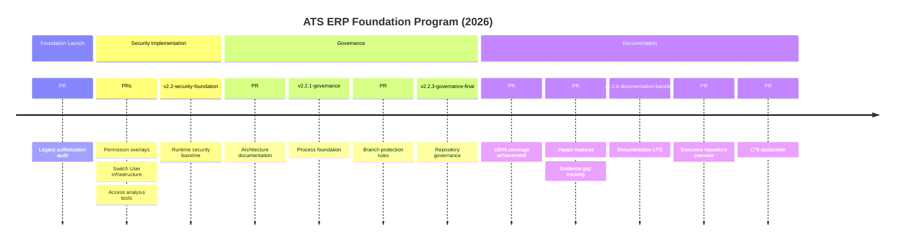

# ATS ERP Foundation Program Closure

**Program:** ATS ERP Repository Modernization Foundation  
**Closure Date:** 2026-09-08  
**Final Baseline:** `v2.2.4-documentation-baseline` (`e4552b3`)  
**Status:** Complete — Repository Enters Long-Term Support (LTS)  
**Next Stream:** `feature/security-admin-v2.3`

---

## 📋 Executive Summary

The ATS ERP Foundation Program is officially closed, establishing `v2.2.4-documentation-baseline` (`e4552b3`) as the Long-Term Support (LTS) baseline and authorizing `feature/security-admin-v2.3` as the next development stream.

---

## 🎯 Program Completion Matrix

| Program | Status | Completion Baseline | Objectives Met |
| --- | --- | --- | --- |
| **Security Foundation** | ✅ **Complete** | `v2.2-security-foundation` | Runtime security, authorization service, permission overlays |
| **Authorization Platform** | ✅ **Complete** | `v2.2-security-foundation` | Centralized auth, legacy migration, access tooling |
| **Repository Governance** | ✅ **Complete** | `v2.2.3-governance-final` | CODEOWNERS, branch protection, process automation |
| **ERP Documentation Phase-1** | ✅ **Complete** | `v2.2.4-documentation-baseline` | Evidence-first docs, 100% coverage, gap tracking |
| **Project Manifest** | ✅ **Complete** | `v2.2.4-documentation-baseline` | Executive repository overview, permanent navigation |

**Total Completion:** 5/5 programs delivered successfully

---

## 📊 LTS Baseline Declaration

| Item | Value |
| --- | --- |
| **LTS Baseline** | `v2.2.4-documentation-baseline` |
| **Commit** | `e4552b3` |
| **Supported Branch** | `Jul_to_Sep_2026_Suport_N_Dev_Works` |
| **Documentation State** | Complete — First-pass coverage across all areas |
| **Governance State** | Institutionalized — Self-maintaining processes |
| **Security State** | Operational — AuthorizationService, overlays, Switch User |
| **Next Development Stream** | `feature/security-admin-v2.3` |

### LTS Rationale

**`v2.2.4-documentation-baseline`** becomes the Long-Term Support baseline because:

1. **Foundational Completeness**: All core infrastructure programs delivered
2. **Documentation Governance**: Institutionalized impact matrices ensure self-maintaining docs
3. **Security Architecture**: Operational authorization service with legacy migration complete
4. **Evidence-First Discipline**: Established evidence gap tracking prevents schema invention
5. **Process Automation**: CODEOWNERS, branch protection, and documentation impact integration
6. **Executive Overview**: Project manifest provides permanent repository orientation

**Future Work is Additive**: All subsequent development builds on this stable foundation without requiring foundational rewrites or governance changes.

---

## 📅 Modernization Timeline

### Visual Timeline

### Milestone Matrix

| Milestone | Date | Deliverables | Impact |
| --- | --- | --- | --- |
| **Foundation Launch** | Q2 2026 | Security audit, legacy assessment | Established modernization scope |
| **Security Foundation** | Q3 2026 | AuthorizationService, overlays, tooling | Runtime security operational |
| **Process Governance** | Q3 2026 | CONTRIBUTING, CODEOWNERS, protection | Development process institutionalized |
| **Documentation LTS** | Q3 2026 | Evidence-first docs, governance automation | Knowledge base self-maintains |
| **Foundation Closure** | Q3 2026 | Project manifest, LTS declaration | Repository ready for feature development |

---

## 🏛️ Repository Standards (Permanent)

### Authentication Standards
- **Identity Model**: ASP.NET InProc Session (not Forms Authentication)
- **Session Builder**: `GrantAuthenticatedSession()` for login establishment
- **Session Keys**: Standardized via `SessionKeys.cs` constants
- **Session Validation**: Five-key check in `webmaster.Master.cs`

### Authorization Standards  
- **Authorization Service**: `AuthorizationService.CanAccess()` for all permission checks
- **Overlay Precedence**: User grants override role restrictions
- **Switch User**: Impersonation with audit trails and nested prevention
- **Legacy Migration**: Hardcoded `WorkmanSL` gates systematically replaced

### Documentation Standards
- **Evidence-First Policy**: Repository artifacts only, no schema invention
- **Impact Matrix**: Mandatory change-to-documentation mapping for all PRs
- **Coverage Dashboard**: Index-file counts with quality indicators
- **Evidence Gap Register**: Explicit tracking of unknowns (15 active gaps)
- **Cross-Linking**: All architecture documents include "See also" sections

### Governance Standards
- **CODEOWNERS**: Required review enforcement for security and governance changes
- **Release Evidence**: Every tag requires evidence pack with validation artifacts
- **Branch Preservation**: Completed feature branches archived, not deleted
- **Documentation Impact**: PR template checklist integration

---

## 📂 Active vs Archived Programs

| Area | State | Status | Maintenance |
| --- | --- | --- | --- |
| **Foundation Programs** | 🗃️ **Archived (Completed)** | All objectives met | Historical reference only |
| **Documentation Governance** | 🔄 **Living** | Self-maintaining via impact matrices | Continuous via PR process |
| **Security Admin Implementation** | 🚧 **Active Next** | Ready to start from LTS baseline | Feature development |
| **JOBID Product Development** | 🚧 **Active Product** | Separate product roadmap | Ongoing label: `jobid-v2.2` |
| **CR Backlog** | 📋 **Planned** | Future enhancement pipeline | Post-v2.3 consideration |

### State Definitions

- **🗃️ Archived (Completed)**: Objectives fully achieved, documentation preserved, no further action required
- **🔄 Living**: Continuously maintained through institutionalized processes  
- **🚧 Active Next**: Ready for immediate development from current LTS baseline
- **🚧 Active Product**: Ongoing parallel development stream with separate lifecycle
- **📋 Planned**: Future consideration pending active stream completion

**Important**: "Archived" means **successfully completed**, not abandoned. All historical documentation, architecture decisions, and implementation evidence remain accessible.

---

## 🎯 Program Objectives vs Outcomes

### Security Foundation
**Objectives:**
- Centralize authorization logic
- Eliminate hardcoded permission gates
- Implement permission overlays
- Provide Switch User capability
- Create security analysis tools

**Outcomes:**
- ✅ `AuthorizationService` operational across ERP
- ✅ Permission overlays with 5-minute cache
- ✅ Switch User with audit trails and nested prevention
- ✅ Permission Inspector and Access Analyzer tools deployed
- ✅ Legacy `WorkmanSL` migration framework established

### Repository Governance
**Objectives:**
- Establish development process standards
- Implement required code review
- Automate branch protection
- Document architectural decisions

**Outcomes:**
- ✅ CONTRIBUTING guidelines with C# 6 and Session standards
- ✅ CODEOWNERS enforcement for security and governance
- ✅ Branch protection preventing force-push and requiring reviews
- ✅ Architecture documentation with cross-linked flows

### Documentation Program
**Objectives:**
- Document all business modules from repository evidence
- Create comprehensive database call contracts
- Establish evidence-first documentation discipline
- Implement self-maintaining documentation governance

**Outcomes:**
- ✅ 100% coverage across 10 documentation areas (69 files)
- ✅ Evidence gap register tracking 15 explicit unknowns
- ✅ Documentation impact matrices institutionalized in PR process
- ✅ Coverage dashboard with quality indicators (Complete/First Pass/Evidence Gap)

---

## 📚 Lessons Learned

### Technical Lessons
1. **Evidence-First Documentation**: Repository artifacts provide more reliable documentation than assumptions
2. **Incremental Authorization Migration**: Gradual overlay implementation prevented disruption while enabling modernization
3. **Governance Integration**: Embedding documentation requirements in PR templates ensures sustainability
4. **Cross-Link Architecture**: Comprehensive linking between architectural concepts improves navigation

### Process Lessons
1. **Baseline Tagging**: Clear version baselines enable confident development iteration
2. **Branch Preservation**: Maintaining feature branch history provides valuable implementation reference
3. **Impact Matrices**: Explicit change-to-documentation mapping prevents coverage degradation
4. **Evidence Gap Tracking**: Formal unknown tracking prevents accidental schema invention

### Organizational Lessons
1. **Foundation First**: Establishing governance before feature development ensures sustainable practices
2. **Documentation as Governance**: Self-maintaining documentation requires institutionalized processes
3. **Executive Overviews**: Repository manifests provide essential context for new team members
4. **LTS Declarations**: Clear support baselines enable confident long-term development

---

## 🛡️ Long-Term Support Statement

**ATS ERP Repository** enters Long-Term Support (LTS) state at `v2.2.4-documentation-baseline` with institutionalized governance ensuring self-maintaining documentation, stable security foundation, and proven development processes. All future development builds additively on this foundation without breaking changes.

**LTS Duration:** Indefinite support as permanent foundation for ATS ERP development  
**LTS Policy:** See [`release/LTS_BASELINE.md`](release/LTS_BASELINE.md) for complete support commitments, maintenance guarantees, and technical specifications

---

## 🚀 Next Development Stream Authorization

**Approved Next Implementation**: `feature/security-admin-v2.3`

### Development Authorization
- **Branch From**: `v2.2.4-documentation-baseline` (`e4552b3`)
- **Base Branch**: `Jul_to_Sep_2026_Suport_N_Dev_Works`  
- **Prerequisites Met**: ✅ Security Foundation operational, governance institutionalized, documentation complete
- **Architecture Ready**: ✅ AuthorizationService, PermissionRepository, Switch User infrastructure available

### Target Capabilities  
- **Permission Groups CRUD**: UI for managing overlay permission groups
- **Delegated Administration**: Non-admin users managing specific permission sets
- **Enhanced Access Control**: Granular permission assignment and audit capabilities
- **Legacy Authorization Cleanup**: Complete migration from hardcoded `WorkmanSL` gates

**Implementation Note**: This is the **only approved** next development stream. All other feature work must be deferred until v2.3 completion or receive explicit architectural review.

---

## 📊 Repository Health at LTS

Repository achieves excellent health with operational security foundation, 100% documentation coverage across all areas, and institutionalized governance processes. All technical infrastructure, process automation, and quality gates are operational and ready for long-term support.

**Current Status:** See `PROJECT_MANIFEST.md` (from PR #110) for executive overview and current readiness assessment  
**Coverage Detail:** See [`DOCUMENTATION_COVERAGE.md`](DOCUMENTATION_COVERAGE.md) for complete coverage dashboard  
**Evidence Tracking:** See [`EVIDENCE_GAP_REGISTER.md`](EVIDENCE_GAP_REGISTER.md) for 15 explicit gaps and evidence policy

---

## 📅 Historical Significance

This Foundation Program represents the **definitive modernization** of the ATS ERP repository from legacy development practices to enterprise-grade governance and documentation standards. 

**Before Foundation**: Ad-hoc development, incomplete documentation, hardcoded authorization, manual processes
**After Foundation**: Institutionalized governance, evidence-first documentation, centralized authorization, automated quality gates

**Legacy Value**: This closure document serves as the permanent historical record of the repository's transformation and the rationale for all current standards and processes.

---

## 📍 References

- **Project Manifest**: `PROJECT_MANIFEST.md` (from PR #110) — Executive repository overview
- **LTS Baseline**: [`release/LTS_BASELINE.md`](release/LTS_BASELINE.md) — Long-term support policy and commitments
- **Documentation Index**: [`ERP_DOCUMENTATION_INDEX.md`](ERP_DOCUMENTATION_INDEX.md) — Complete navigation
- **Documentation Coverage**: [`DOCUMENTATION_COVERAGE.md`](DOCUMENTATION_COVERAGE.md) — Living coverage dashboard
- **Evidence Gap Register**: [`EVIDENCE_GAP_REGISTER.md`](EVIDENCE_GAP_REGISTER.md) — Explicit unknown tracking
- **Security Baseline**: [`../SECURITY_FOUNDATION_BASELINE.md`](../SECURITY_FOUNDATION_BASELINE.md) — Security foundation evidence
- **Documentation Charter**: [`ERP_DOCUMENTATION_CHARTER.md`](ERP_DOCUMENTATION_CHARTER.md) — Evidence-first principles
- **Governance Hub**: [`governance/cursor_governance.md`](governance/cursor_governance.md) — Repository governance
- **Release Timeline**: [`appendix/release-timeline.md`](appendix/release-timeline.md) — Historical milestones

---

**📅 Closure Authorized:** 2026-09-08  
**🏷️ Final Baseline:** `v2.2.4-documentation-baseline`  
**📋 Program Status:** Foundation Complete — Repository Ready for Feature Development  
**✨ Outcome:** Long-Term Support (LTS) repository with institutionalized governance