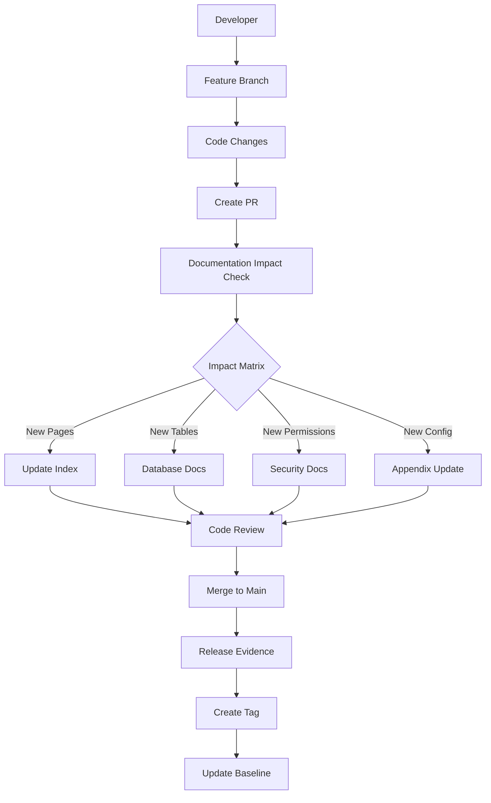

# ATS ERP Repository Manifest

**Executive Overview · Entry Point for All Development**  
**Created:** Documentation Governance Enhancement (PR #110)  
**Baseline:** `v2.2.4-documentation-baseline` (`e4552b3`)  
**Purpose:** Permanent repository executive map for developers, architects, administrators, and automation

---

## 📋 Repository Metadata

| Field | Value |
| --- | --- |
| **Repository** | `Aminrup-Technologies/WebApplication1` |
| **Current LTS Baseline** | `v2.2.4-documentation-baseline` (`e4552b3`) |
| **Primary Branch** | `Jul_to_Sep_2026_Suport_N_Dev_Works` |
| **Documentation Program** | Phase-1 Complete |
| **Security Foundation** | Complete |
| **Governance** | Institutionalized |
| **Next Workstream** | `feature/security-admin-v2.3` |

---

## 🏢 Repository Purpose

**ATS ERP** is an enterprise resource planning system built on ASP.NET WebForms (.NET Framework 4.8, C# 6) providing comprehensive workforce and project management capabilities.

### Business Domains

- **Human Resources**: Employee registration, muster data, attendance tracking, payroll processing
- **Project Management**: JOBID lifecycle, supervisor workflows, work order management  
- **Safety & Compliance**: CSM/HSE modules, toolbox talks, incident reporting, permit management
- **Supply Chain**: Supply memo, inventory, expense tracking
- **Administration**: User management, role-based permissions, system configuration
- **Reporting**: Dashboard analytics, Superset integration, export capabilities

### Supported Users

- **Office Staff**: HR administrators, payroll processors, management dashboards
- **Field Supervisors**: JOBID management, attendance oversight, safety compliance  
- **Workers**: Attendance punch, expense claims, safety training acknowledgment
- **IT Administrators**: System configuration, user provisioning, troubleshooting
- **Executives**: Analytics dashboards, compliance reporting, operational oversight

### High-Level Architecture  

- **Frontend**: ASP.NET WebForms pages (`*.aspx`) with master pages for consistent UI
- **Backend**: C# code-behind (`*.aspx.cs`) with Session-based identity management  
- **Data Access**: Stored procedure calls to SQL Server database
- **Security**: InProc Session model with role-based authorization and permission overlays
- **Integrations**: SMTP notifications, MSG91 SMS, Apache Superset analytics

### Repository Philosophy

**Evidence-first documentation** with **zero-runtime-change governance**. All implementation decisions are documented from repository artifacts (code, commits, PRs, tags) rather than assumptions. Documentation maintains itself through institutionalized impact matrices and evidence gap tracking.

**Navigation Hub:** [`docs/ERP_DOCUMENTATION_INDEX.md`](ERP_DOCUMENTATION_INDEX.md)

---

## 📅 Release Lineage

### Timeline Visualization

```mermaid
gitgraph
    commit id: "v2.1.0-jobid-remediation"
    commit id: "v2.2-security-foundation"
    commit id: "v2.2.1-governance"  
    commit id: "v2.2.2-operational"
    commit id: "v2.2.3-governance-final"
    commit id: "v2.2.4-documentation-baseline"
    commit id: "feature/security-admin-v2.3" type: HIGHLIGHT
```

### Release Matrix

| Tag | Purpose | SHA | Programs Completed |
| --- | --- | --- | --- |
| `v2.1.0-jobid-remediation` | JOBID Operational | `a75bb1e` | JOBID v2.2 Predicates |
| `v2.2-security-foundation` | Runtime Security | `1f6c147` | Authorization Service, Permission Overlay |  
| `v2.2.1-governance` | Process Foundation | `19c286e` | CONTRIBUTING, Architecture Flows |
| `v2.2.2-operational` | Consolidation | `20ba520` | JOBID Roadmap, Release Templates |
| `v2.2.3-governance-final` | Repository Governance | `495fc68` | CODEOWNERS, Branch Protection |  
| `v2.2.4-documentation-baseline` | Documentation LTS | `e4552b3` | Documentation Program Phase-1 |

---

## 🎯 Program Milestones

| Program | Status | Completion | Documentation |
| --- | --- | --- | --- |
| **Security Foundation** | ✅ **Complete** | `v2.2-security-foundation` | [Security Baseline](../SECURITY_FOUNDATION_BASELINE.md) |
| **Authorization Platform** | ✅ **Complete** | `v2.2-security-foundation` | [Authorization Architecture](architecture/authorization-flow.md) |
| **Documentation Program** | ✅ **Phase-1 Complete** | `v2.2.4-documentation-baseline` | [Documentation Index](ERP_DOCUMENTATION_INDEX.md) |
| **Repository Governance** | ✅ **Complete** | `v2.2.3-governance-final` | [Cursor Governance](governance/cursor_governance.md) |
| **Operational Consolidation** | ✅ **Complete** | `v2.2.2-operational` | [Release Timeline](appendix/release-timeline.md) |
| **Security Admin CRUD** | 🚧 **Ready to Start** | Target: `v2.3` | [Switch User Ops](administration/switch-user-ops.md) |

---

## 🗂️ Repository Map

```
📁 WebApplication1/               # Main ASP.NET application
├── 📁 bussiness/production/     # 158 ERP .aspx pages + code-behind  
├── 📁 administration/           # Admin interface components
├── 📁 vendors/                  # Third-party libraries (jQuery, Bootstrap, etc.)
├── 📁 App_Data/                 # Application data files
├── 📁 App_Code/                 # Shared code classes
└── 📄 Web.config                # Application configuration

📁 docs/                          # Complete documentation hierarchy
├── 📁 architecture/             # System design and flow documentation  
├── 📁 modules/                  # Business module documentation
├── 📁 database/                 # Database and stored procedure docs
├── 📁 security/                 # Security model and verification
├── 📁 administration/           # Operational administration guides
├── 📁 developer/                # Developer handbook and guidelines
├── 📁 troubleshooting/          # Operational runbooks
├── 📁 governance/               # Process and governance documentation
├── 📁 release/                  # Release management and templates
├── 📁 appendix/                 # Reference materials and inventories  
└── 📄 ERP_DOCUMENTATION_INDEX.md # Master navigation hub

📁 scripts/                       # Database and deployment scripts
📁 .github/                       # GitHub workflow and templates  
├── 📄 pull_request_template.md  # PR checklist with documentation impact
└── 📄 CODEOWNERS               # Review requirements and ownership

📄 README.md                      # Repository entry point
📄 CONTRIBUTING.md               # Development guidelines and process
📄 SECURITY_FOUNDATION_BASELINE.md # Security foundation documentation
```

---

## 📊 Documentation Health

**Coverage Dashboard:** [`DOCUMENTATION_COVERAGE.md`](DOCUMENTATION_COVERAGE.md)  
**Method:** Index-file counts (not schema completeness)  
**Last Updated:** `v2.2.4-documentation-baseline`

| Area | Coverage | Quality | Files |
| --- | ---: | --- | ---: |
| **Architecture** | 100% | ✅ **Complete** | 10/10 |
| **Business Modules** | 100% | 📋 **First Pass** | 19/19 |  
| **Database** | 100% | ⚠️ **First Pass + Evidence Gap** | 10/10 |
| **Security** | 100% | 📋 **First Pass** | 6/6 |
| **Administration** | 100% | 📋 **First Pass** | 5/5 |
| **Developer** | 100% | 📋 **First Pass** | 3/3 |
| **Troubleshooting** | 100% | 📋 **First Pass** | 7/7 |
| **Operations** | 100% | 📋 **First Pass** | 3/3 |
| **Integrations** | 100% | 📋 **First Pass** | 1/1 |
| **Appendix** | 100% | 📋 **First Pass** | 5/5 |

**Legend:**  
- ✅ **Complete**: Active documentation with verified call sites, no open evidence gaps
- 📋 **First Pass**: Documented from inventory/code analysis, depth may be limited
- ⚠️ **Evidence Gap**: Documentation present but evidence register blocks stronger claims

---

## 🔍 Evidence Health

**Evidence Gap Register:** [`EVIDENCE_GAP_REGISTER.md`](EVIDENCE_GAP_REGISTER.md)  
**Total Active Gaps:** 15 (EG-001 through EG-015)  
**Evidence-First Policy:** Repository artifacts only; no schema invention

### Major Gap Categories

| Category | Count | Critical Gap | Future Source |
| --- | ---: | --- | --- |
| **Stored Procedure Bodies** | 5 | SP definitions not in repository | SQL export or scripts/ |
| **Table Schema** | 4 | Missing CREATE table statements | Explicit column SELECTs |  
| **Legacy/Public** | 3 | Out-of-ERP components | Future program inclusion |
| **Future Features** | 2 | v2.3 overlay CRUD UI | Implementation evidence |
| **Workflow Details** | 1 | Homepage data contracts | Code-behind analysis |

**Policy:** Gaps close **only** when repository evidence appears. No assumptions or invented schema permitted.

---

## 🏛️ Governance Map

| Need | Document | Purpose |
| --- | --- | --- |
| **Development Process** | [`CONTRIBUTING.md`](../CONTRIBUTING.md) | Branching, coding standards, PR requirements |
| **Code Review** | [`.github/CODEOWNERS`](../.github/CODEOWNERS) | Required reviewers, protection policies |
| **Documentation Standards** | [`docs/ERP_DOCUMENTATION_CHARTER.md`](ERP_DOCUMENTATION_CHARTER.md) | Evidence-first principles, quality gates |
| **Change Impact** | [`docs/governance/documentation_impact_matrix.md`](governance/documentation_impact_matrix.md) | Required docs for code changes |
| **Documentation Lifecycle** | [`docs/governance/documentation_governance.md`](governance/documentation_governance.md) | Ownership, review, deprecation |
| **Branch Management** | [`docs/governance/cursor_governance.md`](governance/cursor_governance.md) | Protection rules, merge policies |

**Governance Philosophy:** Every change carries its documentation impact automatically through institutionalized processes.

---

## ⚙️ Development Lifecycle



**Key Checkpoints:**
1. **Documentation Impact**: Every PR must assess doc requirements via impact matrix
2. **Index Updates**: New documentation must be added to master index  
3. **Evidence Gaps**: Missing schema documented as EG entries, not invented
4. **Cross-Links**: All new docs must include relevant "See also" sections
5. **Coverage Recount**: Dashboard percentages updated when index changes

---

## 🚀 v2.3 Readiness

**Repository Status:** ✅ **Ready for Security Admin Implementation**

The repository is prepared for the next major development cycle:

### Ready Capabilities
- ✅ **Authorization Foundation**: `AuthorizationService` and `PermissionRepository` operational
- ✅ **Permission Overlay**: Runtime overlay grants with 5-minute cache  
- ✅ **Switch User**: Impersonation infrastructure with audit trails
- ✅ **Documentation Governance**: Institutionalized impact tracking and evidence gaps
- ✅ **Security Tooling**: Permission Inspector, Access Analyzer operational
- ✅ **Release Process**: Proven tag-and-evidence workflow from Security Foundation

### Target Features for `feature/security-admin-v2.3`
- 🎯 **Permission Groups CRUD**: UI for managing overlay permission groups
- 🎯 **Delegated Administration**: Non-admin users managing specific permission sets
- 🎯 **Legacy Authorization Cleanup**: Migrate remaining hardcoded `WorkmanSL` gates
- 🎯 **Enhanced Audit Trails**: Expanded logging for permission changes

### Implementation Roadmap Reference
- [Switch User Operations](administration/switch-user-ops.md)  
- [Authorization Architecture](architecture/authorization-flow.md)
- [Permission Overlay](architecture/permission-overlay.md)
- [Security Foundation Baseline](../SECURITY_FOUNDATION_BASELINE.md)

**Next Step:** Cut `feature/security-admin-v2.3` from `v2.2.4-documentation-baseline` when implementation begins.

---

## 📍 Navigation

- **🏠 Repository Entry**: [`README.md`](../README.md)
- **📚 Documentation Hub**: [`docs/ERP_DOCUMENTATION_INDEX.md`](ERP_DOCUMENTATION_INDEX.md)  
- **🎯 Quick Start**: [`CONTRIBUTING.md`](../CONTRIBUTING.md)
- **🔒 Security**: [`SECURITY_FOUNDATION_BASELINE.md`](../SECURITY_FOUNDATION_BASELINE.md)
- **📋 Documentation Standards**: [`docs/ERP_DOCUMENTATION_CHARTER.md`](ERP_DOCUMENTATION_CHARTER.md)
- **📊 Documentation Health**: [`docs/DOCUMENTATION_COVERAGE.md`](DOCUMENTATION_COVERAGE.md)
- **🔍 Evidence Tracking**: [`docs/EVIDENCE_GAP_REGISTER.md`](EVIDENCE_GAP_REGISTER.md)

---

**📅 Last Updated:** 2026-09-08 (Documentation Governance Enhancement)  
**🏷️ Baseline:** `v2.2.4-documentation-baseline`  
**📋 Manifest Status:** Active — Permanent executive reference