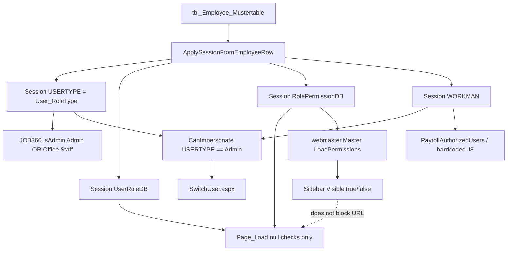

# Role & Permission Architecture Audit

**Mode:** Read-only architecture audit. No executable code was changed.  
**Date:** 2026-09-07  
**Baseline:** workspace at `cursor/switch-user-cf5b` (`0736209`), which includes session-builder PR #87, impersonation foundation PR #89, and Switch User GitHub PR #91.  
**Question this audit answers:** why an allowlisted `WORKMAN` with `USERTYPE = "Office Staff"` is blocked from `SwitchUser.aspx`, whether that is consistent with the ERP’s real authorization model, and whether `CanImpersonate()` should ever treat Office Staff as Admin.

---

## Executive summary

The ERP does **not** have a single authorization source. It is a **hybrid of four independent mechanisms**:

| Layer | What it actually does | Authoritative for Switch User? |
| --- | --- | --- |
| Session presence (`USERID` + `UserRoleDB` + `RolePermissionDB` + `USERNAME` + `WORKMAN`) | Proves “someone logged in.” Does **not** compare role values. | No (too weak) |
| `RolePermissionDB` → `tlb_EmployeePermissions` | Hides/shows master **menu chrome**. Pages remain URL-reachable. | No (cosmetic; no Switch User row exists) |
| `USERTYPE` (`tbl_Employee_Mustertable.User_RoleType`) | The **only** Session string that pages compare for privilege. | Yes, as a **narrow** gate |
| Workman allowlists (`SwitchUserAuthorizedUsers`, `PayrollAuthorizedUsers`, hardcoded `J8`/`A84`/…) | Named-person elevation, independent of role text. | Yes, as the **second** gate |

`UserRoleDB` is the numeric type id (`tlb_emp_roles.EmpType_Value`). No production page compares its **value** for allow/deny. It is stored, null-checked, and written back during employee edit. It is **not** the runtime authority.

`Office Staff` is **intentionally privileged inside specific modules** (JOB360 admin helper, two HR/exceptions dashboards, JOB create WO/region rules). It is **not** a global administrator. Treating Office Staff as Admin for Switch User would contradict both Switch User’s current gate and the payroll/workman-allowlist pattern used for other high-privilege operations.

**Recommended Switch User gate (do not implement in this document):** keep the combination already in `ImpersonationAudit.CanImpersonate()`:

1. `USERTYPE == "Admin"` (exact; not Office Staff)
2. `WORKMAN` in `SwitchUserAuthorizedUsers`
3. not already impersonating

Do **not** replace that with `UserRoleDB`, `RolePermissionDB`, or a new `tlb_EmployeePermissions` row unless a later CR also rebuilds page-level enforcement (menus are not security).

---

## 1. Authorization sources discovered

Search coverage (workspace `WebApplication1/` plus `docs/`):

| Term | Verified consumers (not exhaustive for presence-only Session checks) |
| --- | --- |
| `USERTYPE` | Set at login; compared on JOB360, job exceptions, attendance anomalies, JOB create v1/v2; null-checked on a few payroll/job pages; Switch User `CanImpersonate` |
| `UserRoleDB` | Set at login; **null-checked** on ~100 pages + masters; written on employee register/edit; **never compared to a privilege value** |
| `RolePermissionDB` | Set at login; null-checked with `UserRoleDB`; **value consumed only** by `webmaster.Master.cs` `LoadPermissions` |
| `tlb_EmployeePermissions` | **Single query** in `webmaster.Master.cs`. No INSERT/UPDATE in this repo |
| `tlb_emp_roles` | Role catalog (`Employee_Type`, `EmpType_Value`) via `manage_rolls.aspx.cs` |
| `tlb_emp_roles_permission` | Permission-profile catalog via `manage_rollsaccess.aspx.cs`; assigned onto employees as `RolePermissionDB` |
| `IsAdmin` | Only `job_360_view.aspx.cs` |
| `Office Staff` / `Admin` / `Site Staff` | See §6 |
| `PayrollAuthorizedUsers` | `viewupdate_empmustertabledata_v2.aspx.cs` only |
| `SwitchUserAuthorizedUsers` | `ImpersonationAudit.CanImpersonate` only |
| `CanAccess` / `HasPermission` / `HasRole` | **No matches** |
| `SessionKeys.Permission` (`PERMISSION`) | Declared; **never read or written** |

Masters inspected:

| File | Auth behavior |
| --- | --- |
| `WebApplication1/bussiness/production/webmaster.Master.cs` | Canonical production gate + menu permissions |
| `WebApplication1/bussiness/production/aminrup/aminrup.Master.cs` | Session presence only; no menu table |
| `WebApplication1/Admin/Admin.Master.cs` | Empty `Page_Load`; logout only. Legacy `atsweb.Admin` |
| `WebApplication1/atsSite.Master.cs` | Empty `Page_Load` |

`Web.config.example` has `<authentication mode="Forms">` and `SwitchUserAuthorizedUsers` / `PayrollAuthorizedUsers`. There is still no `SetAuthCookie` / Forms ticket in login (Session remains the identity). `SessionKeys.Permission` is unused.

---

## 2. Session authorization inventory

Keys that participate in authorization or identity (from `WebApplication1/bussiness/production/SessionKeys.cs` and `Login.aspx.cs` `ApplySessionFromEmployeeRow`).

| Session key | Constant | Set in | Read for security | Purpose |
| --- | --- | --- | --- | --- |
| `USERID` | `SessionKeys.UserID` | `Login.aspx.cs` 795 (`LoginID`) | Nearly every page; master 26 | Logged-in identity |
| `WORKMAN` | `SessionKeys.WorkmanSL` | `Login.aspx.cs` 796 | Master; allowlists; hardcoded workman checks | Employee id used as **named privilege** |
| `USERNAME` | `SessionKeys.UserName` | `Login.aspx.cs` 798 (`FullName`) | Master chrome; presence checks | Display name |
| `USERFNAME` | `SessionKeys.UserFirstName` | `Login.aspx.cs` 797 | Master chrome only | Display |
| `USERTYPE` | `SessionKeys.UserType` | `Login.aspx.cs` 799 (`User_RoleType`) | Value compared: JOB360, exceptions, anomalies, JOB create, `CanImpersonate` | **Descriptive role name that some modules treat as privilege** |
| `UserRoleDB` | `SessionKeys.UserRoleDB` | `Login.aspx.cs` 800 | Presence only (master 26, homepage 33, ~100 pages) | Numeric `tlb_emp_roles.EmpType_Value` |
| `RolePermissionDB` | `SessionKeys.RolePermissionDB` | `Login.aspx.cs` 801 | Presence on pages; **value** only in master `LoadPermissions` (48) | Numeric `tlb_emp_roles_permission.Emp_PermissionValue`; menu lookup key |
| `REGION` | `SessionKeys.Region` | `Login.aspx.cs` 802 | Many pages require it; JOB create region lock for Site Staff | Data scope, not role |
| `PERMISSION` | `SessionKeys.Permission` | **Never set** | **Never read** | Dead constant |
| `IS_IMPERSONATING` | `SessionKeys.IsImpersonating` | `SwitchUser.aspx.cs` after apply | `ImpersonationAudit` | Impersonation flag |
| `ORIGINAL_*` | `SessionKeys.Original*` | `ImpersonationAudit.CaptureOriginalIdentity` | Restore gate | Admin snapshot |

**Which key governs security?**

- **Login / “can use the ERP at all”:** presence of `USERID` + (usually) `UserRoleDB` + `RolePermissionDB` + `USERNAME` + `WORKMAN`. Values of the two `*DB` keys are ignored.
- **Menu chrome:** value of `RolePermissionDB`.
- **Module privilege (JOB360 admin, exceptions, Switch User):** value of `USERTYPE` and/or `WORKMAN` allowlists.
- **Canonical for Switch User today:** `USERTYPE` **and** `WORKMAN` allowlist. Not `UserRoleDB`.

---

## 3. Role resolution at login

### 3.1 Database columns (employee master)

`Login.aspx.cs` `FetchEmployeeRowByLoginId` (lines 143–153) selects from `tbl_Employee_Mustertable`:

```
User_RoleType, UserRoleDB, RolePermissionDB
```

There is **no stored procedure** on this path. Inline parameterized SQL.

How those columns are populated at registration (`emp_registration.aspx.cs` 494–507):

| Muster column | Session key | Source control | Lookup table |
| --- | --- | --- | --- |
| `User_RoleType` | `USERTYPE` | `DDL_EmployeeType.SelectedItem.Text` | `tlb_emp_roles.Employee_Type` |
| `UserRoleDB` | `UserRoleDB` | `DDL_EmployeeType.SelectedValue` | `tlb_emp_roles.EmpType_Value` |
| `Role_Permission` | *(not sessioned)* | `DDL_RolePermissions.SelectedItem.Text` | `tlb_emp_roles_permission.Emp_PermissionText` |
| `RolePermissionDB` | `RolePermissionDB` | `DDL_RolePermissions.SelectedValue` | `tlb_emp_roles_permission.Emp_PermissionValue` |

The two dropdowns are **independent**: type text/id from `tlb_emp_roles`; permission profile filtered by `EmpType_Value` (`emp_registration.aspx.cs` 396). An Office Staff row can be given any permission profile that exists for that type, including a fat menu profile.

The same mapping is written on edit: `viewupdate_empmustertabledata.aspx.cs` 691–695.

### 3.2 Login materialization

`ApplySessionFromEmployeeRow` (`Login.aspx.cs` 790–801):

```csharp
session[SessionKeys.UserType] = employee["User_RoleType"].ToString();
session[SessionKeys.UserRoleDB] = employee["UserRoleDB"].ToString();
session[SessionKeys.RolePermissionDB] = employee["RolePermissionDB"].ToString();
```

`GrantAuthenticatedSession` (816+) still owns LastLogin / LoginStatus / login audit / `ATS_SavedID`. Switch User reuses only `ApplySessionFromEmployeeRow`.

### 3.3 Is `USERTYPE` descriptive or authoritative?

**Both, depending on the page.**

- **Descriptive (most of the ERP):** pages never read `USERTYPE`. A user reaches `homepage_v2.aspx` and almost every production page with only presence checks. `homepage_v2.aspx.cs` 33 does **not** require `USERTYPE`.
- **Authoritative (small set):** JOB360 `IsAdmin()`, job exceptions, attendance anomalies, JOB create WO/region rules, Switch User `CanImpersonate`. Those compare the **string** `Admin` / `Office Staff` / `Site Staff`.

So `USERTYPE = "Office Staff"` on a live login means: `tbl_Employee_Mustertable.User_RoleType` is the `Employee_Type` label from `tlb_emp_roles` for that employee. It is **not** a bug and **not** derived from `RolePermissionDB`.

---

## 4. Menu permission architecture

### 4.1 The only permission-table consumer

`WebApplication1/bussiness/production/webmaster.Master.cs`

| Lines | Behavior |
| --- | --- |
| 24–28 | On `!IsPostBack`, if `USERID` / `RolePermissionDB` / `UserRoleDB` / `USERNAME` / `WORKMAN` missing → `~/login.aspx` |
| 48 | `LoadPermissions(Session["RolePermissionDB"].ToString())` |
| 97–109 | `SELECT ParentKey, ChildKey, IsVisible FROM tlb_EmployeePermissions WHERE Emp_PermissionValue = @Emp_PermissionValue` |
| 113–168 | `ApplyPermissions`: sets `Visible` on sidebar `<li>` ids (`HomePage`, `Payroll`, …) and child controls |

Menu items in `webmaster.Master` default to `visible="false"` (e.g. `HomePage`, `Payroll`). They become visible only if the permission row says `IsVisible`.

`aminrup.Master.cs` 17–19: same Session **presence** check; **no** `tlb_EmployeePermissions` query.

### 4.2 Are menus cached?

No. Reloaded on each non-postback master `Page_Load`. Postbacks do **not** re-apply permissions (same `!IsPostBack` pattern as the Session gate).

### 4.3 Cosmetic vs enforcing

**Cosmetic.** Evidence:

1. `ApplyPermissions` only sets `Control.Visible` (`webmaster.Master.cs` 134–144, 139–146).
2. Production pages do **not** re-query `tlb_EmployeePermissions`.
3. A user who knows the URL and has a logged-in Session can open e.g. `pyrl_managedashbrd.aspx` if the page’s own `Page_Load` only checks Session **presence** (`pyrl_managedashbrd.aspx.cs` 37).
4. Prior JOB lifecycle audit already recorded this: `docs/JOBID_LIFECYCLE_FUNCTIONAL_AUDIT.md` 441.

There is **no** INSERT/UPDATE of `tlb_EmployeePermissions` in this repository. Menu matrices are maintained outside this codebase (or by unpublished SQL).

Switch User is **not** a sidebar item. Entry is the profile dropdown in `webmaster.Master` (`lnk_switchUser`), shown when `CanImpersonate` or impersonating (`webmaster.Master.cs` `BindImpersonationChrome`). No `tlb_EmployeePermissions` row is involved.

| Permission table | Consumer | Purpose |
| --- | --- | --- |
| `tlb_EmployeePermissions` | `webmaster.Master.cs` `LoadPermissions` / `ApplyPermissions` | Sidebar visibility keyed by `RolePermissionDB` |
| `tlb_emp_roles` | `manage_rolls.aspx.cs`; employee type DDLs | Catalog of `Employee_Type` / `EmpType_Value` |
| `tlb_emp_roles_permission` | `manage_rollsaccess.aspx.cs`; employee permission DDLs | Catalog of menu-profile ids (`Emp_PermissionValue`) assigned to employees |

---

## 5. Page-level authorization

### Pattern A — Session presence (dominant)

Typical predicate (`webmaster.Master.cs` 26, `homepage_v2.aspx.cs` 33, and ~100 `*.aspx.cs` files):

```
USERID && RolePermissionDB && UserRoleDB && USERNAME && WORKMAN
(+ REGION on most operational pages)
```

Redirect: `~/login.aspx` or `login.aspx`.  
**Does not inspect `USERTYPE`, does not compare `UserRoleDB`/`RolePermissionDB` values.**

Almost all Production / Payroll / CSM / Expenses / Analytics pages use Pattern A.

### Pattern B — `USERTYPE` value gate

| Page | Condition | Redirect |
| --- | --- | --- |
| `manage_job_exceptions.aspx.cs` 19 | `USERTYPE` is `Admin` **or** `Office Staff` | `~/login.aspx` |
| `analyze_attendance_anomalies.aspx.cs` 22 | same | `~/login.aspx` |
| `job_360_view.aspx.cs` 48–53 `IsAdmin()` | same; used for **admin chrome/writes**, not page entry | Page entry is Pattern C |

### Pattern C — Weaker Session (JOB360)

`job_360_view.aspx.cs` 20: `USERID` && `USERNAME` && `WORKMAN` only. No `RolePermissionDB` / `UserRoleDB` / `USERTYPE` on entry. Any authenticated user can load any JOBID (`docs/CR-009_JOB360_ADMIN_COCKPIT_DISCOVERY.md` §2.2).

### Pattern D — `USERTYPE` for data-scope (not page deny)

| Page | Condition | Behavior |
| --- | --- | --- |
| `create_jobid.aspx.cs` 673–686 | `Office Staff` vs `Site Staff` vs else | WO list: Site Staff limited to `WO_Type='ARC'`; Office Staff and else get all Active WOs |
| `create_jobid_v2.aspx.cs` 64–72 | `Site Staff` | Region dropdown **disabled** (home region only); comment says “Admins and Managers can freely switch” — **Office Staff is in the else branch (unlocked)** |
| `create_jobid_v2.aspx.cs` 873–875 | `Site Staff` | Same ARC-only WO filter; Office Staff/Admin share the unrestricted query |

### Pattern E — Workman allowlist / hardcoded ids

| Page | Gate | Behavior |
| --- | --- | --- |
| `viewupdate_empmustertabledata_v2.aspx.cs` 86–104 | `PayrollAuthorizedUsers` appSetting vs `WORKMAN` | Hides payroll tab |
| `ImpersonationAudit.cs` 41–52 + 183–195 | `USERTYPE==Admin` **and** `SwitchUserAuthorizedUsers` | Switch User |
| `pyrl_managedashbrd.aspx.cs` 126–140 | `WORKMAN == "J8"` | Extra F17 / control panel |
| `pyrl_gnrtdashbrd.aspx.cs` 37 | `J8` | Same style of extra chrome |
| `viewupdate_emppayrolldata.aspx.cs` 33 | `J8` | Extra chrome |
| `view_jobdetails.aspx.cs` 61 / `view_jobdetails_v2.aspx.cs` 69 | `A84`, `K208`, `N21`, `J8` | Attach-manpower row |
| `add_expense_heads.aspx.cs` 42 / `add_expense_subheads.aspx.cs` 45 | `J8`, `A84`, `K208` | Extra access |

### Pattern F — Switch User (stacked PR #91)

`SwitchUser.aspx.cs` 22–38: authenticated Session (includes `UserRoleDB`/`RolePermissionDB` **presence**) then `CanImpersonate` / `CanReturnFromImpersonation`. Unauthorized → `homepage_v2.aspx`, not login.

`CanImpersonate` (`ImpersonationAudit.cs` 41–48):

- not impersonating
- `USERID` and `WORKMAN` present
- `USERTYPE` equals `"Admin"` **only** (`AdminUserType`, line 25)
- `WORKMAN` in `SwitchUserAuthorizedUsers`

### Grouping

| Group | Typical gate | Notes |
| --- | --- | --- |
| Production (JOB create/manage, CSM, expenses, master data) | Pattern A | URL is the real ACL |
| Payroll generate/manage | Pattern A + Pattern E (`J8` / `PayrollAuthorizedUsers`) | Not `USERTYPE` |
| JOB360 | Pattern C entry + Pattern B `IsAdmin()` for admin UI | Office Staff ≡ Admin **on this page** |
| Admin role catalogs | Pattern A (`manage_rolls`, `manage_rollsaccess`) | No extra Admin check |
| Switch User | Pattern F | Admin + allowlist |

`WebApplication1/Admin/Admin.Master.cs` is unused by the production ERP surface.

---

## 6. Office Staff exception report

Every `"Office Staff"` occurrence in `*.cs`:

| File | Lines | Condition | Behavior | Scope |
| --- | --- | --- | --- | --- |
| `job_360_view.aspx.cs` | 48–53, and every `IsAdmin()` caller | `USERTYPE` Admin **or** Office Staff | Admin cockpit: inspector, edit core, force out, manpower Edit/Drop, etc. | **JOB360 only** |
| `manage_job_exceptions.aspx.cs` | 19 | same | Page allowed; others redirected to login | **This page only** (JOB exceptions dashboard) |
| `analyze_attendance_anomalies.aspx.cs` | 22 | same | Page allowed | **This page only** (payroll attendance audit UI) |
| `create_jobid.aspx.cs` | 673–676 | `== "Office Staff"` | Unrestricted Active WO list (same SQL as the `else`/Admin branch) | **JOB create v1 WO binder** |
| `create_jobid.aspx.cs` | 678–681 | `== "Site Staff"` | ARC-only WOs | Contrast: Site Staff is **restricted**, not elevated |
| `create_jobid_v2.aspx.cs` | 64–72 | Site Staff vs else | Office Staff is **not** named; falls through to unlocked region dropdown | **JOB create v2** |
| `create_jobid_v2.aspx.cs` | 873–875 | Site Staff vs else | Office Staff gets full WO list | **JOB create v2** |
| `ImpersonationAudit.cs` | 25, 48 | `Admin` only | Office Staff **fails** `CanImpersonate` | Switch User |
| `docs/CR-009_PHASE_C_SECURITY_AUDIT.md` | 16 | Documents JOB360 `IsAdmin()` | “Office Staff ≡ Admin is existing; narrowing it needs a separate CR.” | Documentation |

**Not found:** Office Staff as a global administrator; Office Staff in `PayrollAuthorizedUsers`; Office Staff in Switch User; Office Staff compared to `UserRoleDB`.

### Why Office Staff “looks like an administrator”

Verified, not inferred:

1. **Same `USERTYPE` string is used as Admin on JOB360 and two dashboards** (table above).
2. **JOB create does not restrict Office Staff** the way it restricts Site Staff (region lock + ARC WOs).
3. **Menus follow `RolePermissionDB`, not `USERTYPE`.** If that employee’s `RolePermissionDB` matches a wide `tlb_EmployeePermissions` set, the sidebar looks like an admin’s. This audit cannot read live DB rows; the code path is unambiguous (`webmaster.Master.cs` 48, 102–103).
4. **Switch User does not participate in (1)–(3).** Allowlist + `Admin` string only.

```
Office Staff
  ├─ JOB360 IsAdmin()          → elevated (module)
  ├─ job exceptions page       → elevated (module)
  ├─ attendance anomalies page → elevated (module)
  ├─ JOB create WO/region      → not Site-Staff-restricted (module)
  ├─ sidebar menus             → whatever RolePermissionDB maps to (cosmetic)
  └─ SwitchUser.aspx           → blocked unless USERTYPE is Admin
```

---

## 7. Role vs permission matrix

`Employee` is **not** a `USERTYPE` string in code. The verified non-office operational type is `Site Staff`. Cells below are **verified code behavior**, not live DB assignments.

| Capability | Admin (`USERTYPE=="Admin"`) | Office Staff | Site Staff (verified operational type) |
| --- | --- | --- | --- |
| Login / Session | Yes, if muster Active + password/MFA | Yes, same login path | Yes, same login path |
| Homepage `homepage_v2` | Yes if Session presence keys exist (`homepage_v2.aspx.cs` 33; **no USERTYPE check**) | Same | Same |
| Menu visibility | Rows in `tlb_EmployeePermissions` for **that user’s** `RolePermissionDB` | Same mechanism; **not** tied to the Office Staff label | Same mechanism |
| JOB360 page open | Yes (Pattern C: any logged-in user) | Yes | Yes |
| JOB360 admin actions (`IsAdmin()`) | Yes | **Yes** (`job_360_view.aspx.cs` 52–53) | **No** (unless `USERTYPE` is Admin/Office Staff) |
| `manage_job_exceptions.aspx` | Yes | **Yes** (line 19) | **No** |
| `analyze_attendance_anomalies.aspx` | Yes | **Yes** (line 22) | **No** |
| JOB create region switch (v2) | Unlocked (else branch) | **Unlocked** (else branch) | **Locked** to home region (64–67) |
| JOB create WO list | All Active WOs | All Active WOs | ARC only |
| Payroll menus / pages | Pattern A (presence); extra `J8` chrome; payroll tab allowlist is **WORKMAN**, not USERTYPE | Same Pattern A; **no** Office Staff special case | Same |
| Approvals (JOB/CSM pages) | Pattern A only in `jobs_approval.aspx.cs` 16, `csm_approvals.aspx.cs` 17 | Same | Same |
| Switch User | **Yes if also in `SwitchUserAuthorizedUsers`** (`ImpersonationAudit.cs` 48 + 183–195) | **No** — `USERTYPE` must be `Admin` | **No** |

Empty/unknown (no code evidence): whether a given Office Staff row in production has a wide `RolePermissionDB`. That is data, not code.

---

## 8. Database architecture (from code)

No schema scripts for these tables were found in-repo. Relationships below are those **implied by SQL in the application**.

```
tlb_emp_roles
  Employee_Type     ──► tbl_Employee_Mustertable.User_RoleType  ──► Session USERTYPE
  EmpType_Value     ──► tbl_Employee_Mustertable.UserRoleDB     ──► Session UserRoleDB
         │
         │ EmpType_Value
         ▼
tlb_emp_roles_permission
  Emp_PermissionText  ──► tbl_Employee_Mustertable.Role_Permission   (display only; not sessioned)
  Emp_PermissionValue ──► tbl_Employee_Mustertable.RolePermissionDB ──► Session RolePermissionDB
         │
         │ Emp_PermissionValue
         ▼
tlb_EmployeePermissions
  ParentKey, ChildKey, IsVisible
  consumed only by webmaster.Master sidebar
```

Employee master: `tbl_Employee_Mustertable` holds both the labels and the numeric ids. Login copies three of four fields into Session (`Role_Permission` text is not sessioned).

Additional privilege tables (not role catalogs):

| Table / setting | Used for |
| --- | --- |
| `appSettings/SwitchUserAuthorizedUsers` | Workman allowlist for Switch User |
| `appSettings/PayrollAuthorizedUsers` | Workman allowlist for payroll tab on employee edit v2 |
| `tlb_Backdate_Exceptions` | Per-workman JOB create backdate days (`create_jobid_v2.aspx.cs` 93–118) |

---

## 9. Permission / identity flow



---

## 10. Security findings (answers)

### 1. What is the canonical authorization source?

There isn’t one. Runtime behavior is:

1. **Authenticated?** Session presence (`USERID` + usually `UserRoleDB`/`RolePermissionDB`/`WORKMAN`).
2. **See a menu?** `RolePermissionDB` → `tlb_EmployeePermissions` (cosmetic).
3. **Do a privileged thing?** either `USERTYPE` string compare **or** `WORKMAN` allowlist/hardcode.

### 2. Is `USERTYPE` sufficient?

**No, not by itself** for Switch User. It is sufficient to **exclude** Office Staff/Site Staff from Switch User, which matches the current design. It is **not** sufficient to **grant** Switch User: payroll-class operations also require a Workman allowlist. `USERTYPE` is also **insufficient** as a global admin flag because most pages ignore it.

### 3. Is `UserRoleDB` the real authority?

**No.** Evidence: grep of `Session["UserRoleDB"].ToString()` / `SessionKeys.UserRoleDB` shows **no value comparison**. Uses are: login write (`Login.aspx.cs` 800), presence checks, impersonation snapshot (`ImpersonationAudit.cs` 98), employee editors. Authority for privilege is **not** this key.

### 4. Is `RolePermissionDB` consumed anywhere?

**Yes, once, for menus:** `webmaster.Master.cs` 48 and 102–103. Everywhere else it is a non-null Session ticket. There is no page that says `if RolePermissionDB == N then allow`.

### 5. Are menu permissions cosmetic or enforcing?

**Cosmetic.** See §4.3. Direct URL + valid Session bypasses the sidebar.

### 6. What should `SwitchUser.aspx` gate on?

**Recommended (no code change in this audit):** keep **combination**:

| Check | Why |
| --- | --- |
| `USERTYPE == "Admin"` | Only string the ERP uses for a *named* global-ish role; Office Staff elevation is **module-local** (JOB360 / two dashboards / JOB create). Widening Switch User to Office Staff would copy JOB360’s exception into identity takeover. |
| `WORKMAN ∈ SwitchUserAuthorizedUsers` | Same pattern as `PayrollAuthorizedUsers`; named operators, not “everyone with this role label.” Explains the debug case: allowlist passed, `USERTYPE` blocked. |
| Not impersonating | Nested impersonation already rejected. |

**Do not gate Switch User on:**

- `UserRoleDB` — unused as a privilege value; numeric ids are environment-specific.
- `RolePermissionDB` / new `tlb_EmployeePermissions` row — would only show a menu, not enforce the page; also invents a permission the rest of the ERP does not enforce on postback.
- `USERTYPE == Admin OR Office Staff` — that is the JOB360 exception, documented as existing-and-narrow (`docs/CR-009_PHASE_C_SECURITY_AUDIT.md` 16). Switch User is identity takeover, not a JOB overlay.

**Debug inconsistency explained:** `WORKMAN` matching `SwitchUserAuthorizedUsers` is necessary but not sufficient. `ImpersonationAudit.cs` 48 requires `SessionKeys.UserType` equal to `"Admin"`. An allowlisted operator whose muster `User_RoleType` is `"Office Staff"` is **working as designed**, not hitting a bug in the allowlist.

---

## 11. Recommended security gate for `SwitchUser.aspx`

Freeze this until after IIS UAT of PR #91. If a later CR changes the gate, it should be its own PR (not folded into logout #92).

**Keep (current PR #91):**

```
CanImpersonate =
    authenticated USERID + WORKMAN
    AND USERTYPE equals "Admin" (case-insensitive)
    AND WORKMAN in SwitchUserAuthorizedUsers
    AND not IS_IMPERSONATING
```

**If operators with `USERTYPE = Office Staff` must impersonate**, do **not** only add `"Office Staff"` to `IsAdmin()`-style checks. Prefer one of:

1. Change that employee’s `User_RoleType` to `Admin` in muster (data fix; login already copies it), **or**
2. A dedicated CR that documents Office Staff as a second Switch User type **and** still requires the Workman allowlist.

Option 2 is a privilege-model change, not a bugfix. This audit does not recommend it.

---

## 12. Out of scope / not verified

- Live `tlb_emp_roles` / `tlb_EmployeePermissions` row contents (no DB in this environment).
- Whether production Office Staff rows share Admin `RolePermissionDB` values (data).
- Forms Authentication `<forms>` in `Web.config.example` (unused by login Session builder; covered by the earlier auth-session audit).
- `Loginold.aspx.cs` hardcoded Admin/123 (dead/legacy).
