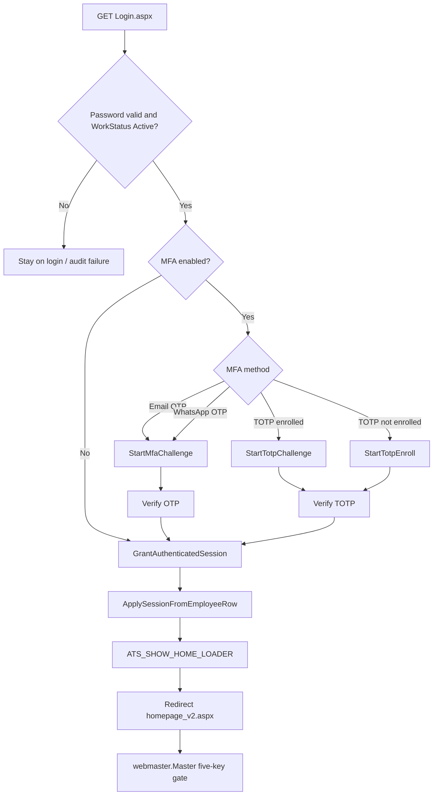
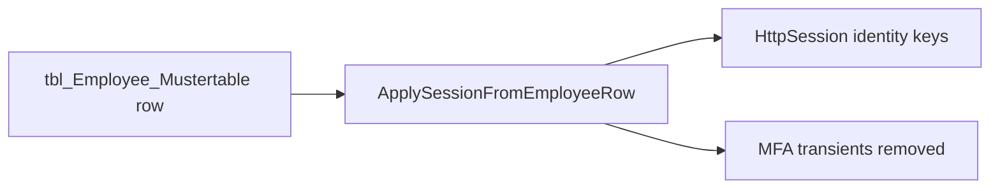

# Authentication flow

**Baseline:** Security Foundation v2.2 (`v2.2-security-foundation`, `1f6c147`).  
**Canonical login:** `WebApplication1/Login.aspx` / `Login.aspx.cs` (`login`).  
**Identity store:** `tbl_Employee_Mustertable`.  
**Session:** ASP.NET InProc; cookie `ASP.NET_SessionId`.

This is documentation of the running system. Do not introduce Forms Authentication. Do not add a second Session builder.

## Runtime overview

MFA challenge Session keys (`MFA_PENDING_LOGINID`, OTP hash/exp/tries, method) are written **without** `USERID`. `ApplySessionFromEmployeeRow` clears those transients when identity is finally granted.

## Password gate

`Login.aspx` verifies the password against the employee row, then requires `WorkStatus = Active`. Inactive accounts never reach MFA or `GrantAuthenticatedSession`.

Remember-me only stores LoginID in cookie `ATS_SavedID` (15 days). It is not a ticket.

## MFA sequencing

Preserve this order. Do not grant identity Session keys until the challenge succeeds (or MFA is off).

| Method | Start | Complete |
| --- | --- | --- |
| Email OTP | `StartMfaChallenge` — needs a registered email | `GrantAuthenticatedSession(..., "SUCCESS_MFA", true)` |
| WhatsApp OTP | Same, needs a registered mobile | Same |
| TOTP enrolled | `StartTotpChallenge` | Same |
| TOTP not enrolled | `StartTotpEnroll` then persist secret | Same |

Missing email/mobile while that method is enabled is a hard deny (`MFA_NO_EMAIL` / `MFA_NO_MOBILE`). Too many tries or expiry returns the user to a fresh login.

`GrantAuthenticatedSession` with `markMfaVerified = true` updates `MFALastVerified` when the column exists.

## `ApplySessionFromEmployeeRow`

`internal static` on `login`. Shared by **login** and **Switch User**.

It:

1. Calls `ClearMfaSession()`.
2. Writes the identity keys from the employee `DataRow` (see table below).
3. Resolves `User_Photo` from `PrfPicFile` or `No_Image.jpg`.

It does **not** write LastLogin, LoginStatus, login audit, `ATS_SavedID`, `ATS_SHOW_HOME_LOADER`, or impersonation keys.

## `GrantAuthenticatedSession`

Login-only. Switch User must not call this method.

Order inside the method:

1. Insert `tbl_UserLoginAudit` (`SUCCESS` or `SUCCESS_MFA`).
2. `UPDATE` LastLogin and LoginStatus = 1.
3. Optionally `MFALastVerified`.
4. Set or expire `ATS_SavedID`.
5. `ApplySessionFromEmployeeRow(row)`.
6. `Session[ATS_SHOW_HOME_LOADER] = true`.
7. Redirect `~/bussiness/production/homepage_v2.aspx` (end response).

## `homepage_v2` and the master

`webmaster.Master` `Page_Load`:

1. Consumes one-shot `ATS_SHOW_HOME_LOADER` (then removes it).
2. Binds impersonation chrome (`BindImpersonationChrome`).
3. On `!IsPostBack`, if any of `USERID`, `RolePermissionDB`, `UserRoleDB`, `USERNAME`, `WORKMAN` is missing → `~/login.aspx`.
4. Loads sidebar rows from `tlb_EmployeePermissions` using the **value** of `RolePermissionDB` (visibility only).

Landing page itself does not compare `USERTYPE` for privilege.

## Session keys

Constants: `WebApplication1/bussiness/production/SessionKeys.cs`.

### Identity (set by `ApplySessionFromEmployeeRow`)

| Constant | Session name | Source column |
| --- | --- | --- |
| `UserID` | `USERID` | `LoginID` |
| `WorkmanSL` | `WORKMAN` | `WorkmanSL` |
| `UserFirstName` | `USERFNAME` | `FirstName` |
| `UserName` | `USERNAME` | `FullName` |
| `UserType` | `USERTYPE` | `User_RoleType` |
| `UserRoleDB` | `UserRoleDB` | `UserRoleDB` |
| `RolePermissionDB` | `RolePermissionDB` | `RolePermissionDB` |
| `Region` | `REGION` | `WorkRegion` |
| `UserState` | `STATE` | `WorkState` |
| `CompanyCode` | `COMPANY_CODE` | `WorkCompany` |
| `WorkSite` | `U_SITE` | `WorkSite` |
| `SiteCode` | `U_SITECODE` | `Worksite_Code` |
| `Designation` | `U_DESG` | `SkillDesignation` |
| `Skill` | `U_SKILL` | `SkillCategory` |
| `UserPhoto` | `User_Photo` | `PrfPicFile` or default |

`PERMISSION` is declared and unused. Do not start using it for security.

### MFA transients (challenge only)

`MFA_PENDING_LOGINID`, `MFA_OTP_HASH`, `MFA_OTP_EXP`, `MFA_OTP_TRY`, `MFA_OTP_EMAIL`, `MFA_OTP_MOBILE`, `MFA_REMEMBER`, `MFA_RESEND_AT`, `MFA_METHOD`, `MFA_TOTP_ENROLL`, `MFA_TOTP_SECRET`.

### Login UX / impersonation

| Constant | Session name | Set by |
| --- | --- | --- |
| `ShowHomeLoader` | `ATS_SHOW_HOME_LOADER` | `GrantAuthenticatedSession` |
| `IsImpersonating` | `IS_IMPERSONATING` | Switch User after apply |
| `OriginalUserID` | `ORIGINAL_USERID` | `CaptureOriginalIdentity` |
| `OriginalWorkmanSL` | `ORIGINAL_WORKMAN` | same |
| `OriginalUserName` | `ORIGINAL_USERNAME` | same |
| `OriginalUserType` | `ORIGINAL_USERTYPE` | same |
| `OriginalUserRoleDB` | `ORIGINAL_UserRoleDB` | same |
| `OriginalRolePermissionDB` | `ORIGINAL_RolePermissionDB` | same |
| `ImpersonationCorrelation` | `IMPERSONATION_CORR` | GUID pairing IMPERSONATE / IMPERSONATE_RETURN |

See `docs/architecture/impersonation-lifecycle.md` for ORIGINAL_* rules.

## See also

- [Authentication](authentication-flow.md) (this page)
- [Authorization](authorization-flow.md)
- [Switch User](switch-user.md)
- [Permission overlay](permission-overlay.md)
- [Session](session-architecture.md)
- [Administration](../administration/README.md)
- [Troubleshooting](../troubleshooting/README.md)
