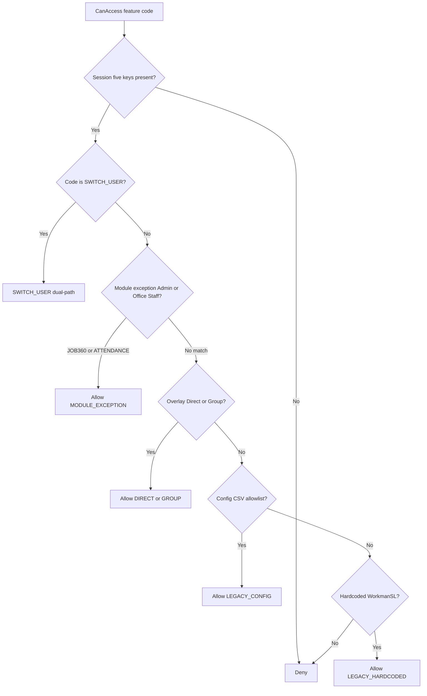
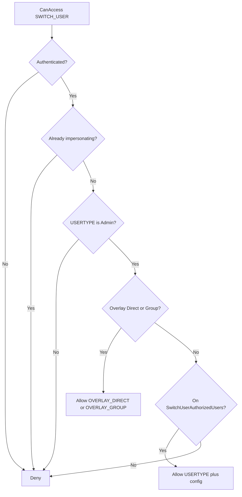
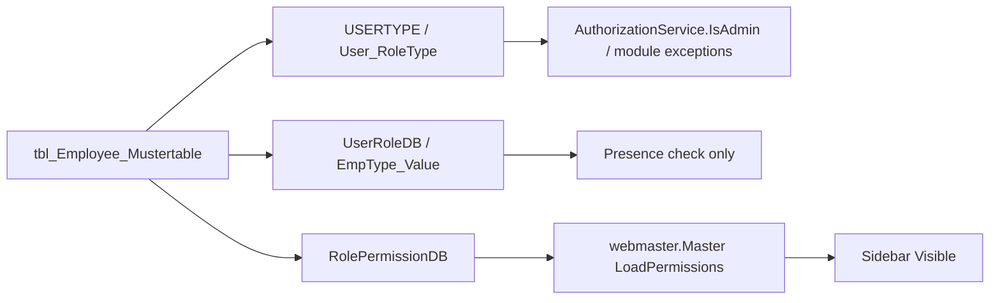

# Authorization flow

**Baseline:** Security Foundation v2.2 (`v2.2-security-foundation`, `1f6c147`).  
**Canonical API:** `WebApplication1/App_Code/AuthorizationService.cs`.  
**This document is the decision tree new code must follow.**

The ERP is a **hybrid**. Session presence, platform role (`USERTYPE`), module exceptions, overlay grants, config CSVs, and leftover hardcoded WorkmanSL lists all exist. `AuthorizationService.CanAccess` is the single place that evaluates them in order.

## Precedence

Every **new** privilege check calls `AuthorizationService.CanAccess(code)` (or `HasPermission`, which is the same). Do not invent a parallel tree.

| Step | Layer | What it proves | Authoritative for |
| ---: | --- | --- | --- |
| 1 | Session | Someone logged in (`USERID` + `RolePermissionDB` + `UserRoleDB` + `USERNAME` + `WORKMAN` **present**) | Authentication only |
| 2 | Platform role (`USERTYPE`) | `User_RoleType` string. `IsAdmin()` is **Admin** only | SWITCH_USER (required); also feeds module exceptions |
| 3 | Module exception | Admin **or** Office Staff for `JOB360_OVERRIDE` and `ATTENDANCE_OVERRIDE` | Those two codes only |
| 4 | Overlay | `tlb_employee_permissions` / groups via `PermissionRepository` | Platform codes once granted |
| 5 | Config | `SwitchUserAuthorizedUsers`, `PayrollAuthorizedUsers` | SWITCH_USER fallback; payroll override |
| 6 | Hardcoded (legacy) | Named WorkmanSL lists inside `AuthorizationService` | Export/payroll chrome, attach manpower, expense heads |
| 7 | Deny | No matching layer | Default |

Empty overlay fails **closed** (no grant). For SWITCH_USER that means the config fallback still applies, so allow/deny matches Admin + CSV until overlay rows exist.

## SWITCH_USER dual-path

Special case. Office Staff never passes step 2.

`ImpersonationAudit.CanImpersonate` is the **legacy-only** engine (Admin + CSV, ignores overlay). Pages and chrome use `CanAccess("SWITCH_USER")`. Do not add new callers of `CanImpersonate`.

## Why `UserRoleDB` is not runtime authority

`UserRoleDB` is `tlb_emp_roles.EmpType_Value` (example on UAT Admin J8: catalog id `ATS-OS`, whose **label** is Office Staff). Login copies the column into Session. Masters and ~100 pages **null-check** it so a session looks complete.

No production page compares the **value** of `UserRoleDB` to allow or deny a feature.

Using it as security would:

- Treat a catalog id as a privilege.
- Confuse Office Staff (type label / type id) with Admin (`User_RoleType`).
- Ignore overlay and config gates that already wrap named features.

`RolePermissionDB` is also not page authorization. Its value selects sidebar rows in `tlb_EmployeePermissions`. Hidden menus do not block a direct URL.

## Tracked feature codes

`AuthorizationFeatureCodes`:

| Code | Typical layers |
| --- | --- |
| `SWITCH_USER` | Admin + overlay **or** Admin + config |
| `PAYROLL_OVERRIDE` | Overlay or `PayrollAuthorizedUsers` |
| `JOB360_OVERRIDE` | Module exception (Admin or Office Staff) then overlay |
| `ATTENDANCE_OVERRIDE` | Same module exception |
| `EXPORT_PAYROLL` | Overlay or hardcoded `J8` |
| `USER_ADMIN` | Overlay only (until a page is migrated) |
| `LEGACY_PAYROLL_DASHBOARD` | Overlay or hardcoded `J8` |
| `LEGACY_ATTACH_MANPOWER` | Overlay or J8/A84/K208/N21 |
| `LEGACY_EXPENSE_HEADS` | Overlay or J8/A84/K208 |

New platform permissions are added to `tlb_permissions` and checked with `CanAccess`. Do not add a new WorkmanSL string compare on a page.

## Rules for contributors

- Never introduce a new `WORKMAN == "J8"` (or similar) check on a page.
- Never compare `Session["USERTYPE"]` on a new page; call `IsAdmin()` or `CanAccess`.
- Never use `UserRoleDB` or `tlb_EmployeePermissions` for allow/deny.
- Preserve dual-path until a release pack shows overlay-only is safe.
