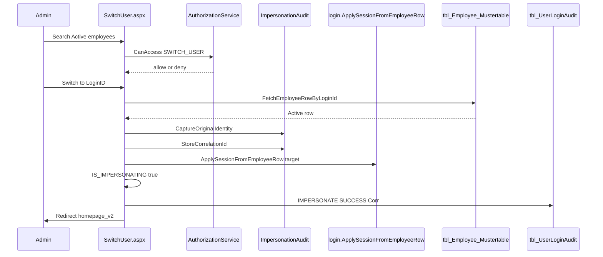
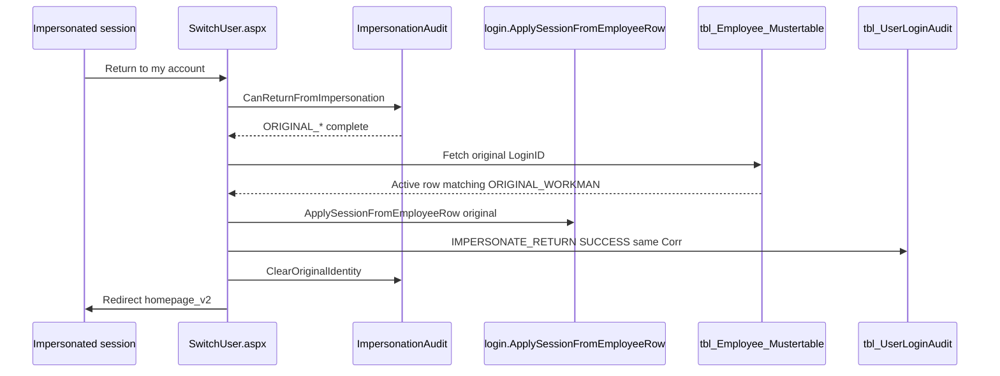

# Impersonation lifecycle

**Baseline:** Security Foundation v2.2 (`v2.2-security-foundation`, `1f6c147`).  
**Page:** `WebApplication1/bussiness/production/SwitchUser.aspx`.  
**Helpers:** `ImpersonationAudit`, `AuthorizationService.CanAccess("SWITCH_USER")`, `login.ApplySessionFromEmployeeRow`.

Switch User replays the login Session builder **without a password** and **without** `GrantAuthenticatedSession`. The target does not get a LastLogin bump, LoginStatus change, or `ATS_SavedID` rewrite.

## Who may switch

`CanAccess("SWITCH_USER")` (see `docs/architecture/authorization-flow.md`):

1. Authenticated five-key Session.
2. Not already impersonating (no nested switch).
3. `USERTYPE == Admin`.
4. Overlay Direct/Group **or** `SwitchUserAuthorizedUsers`.

Office Staff cannot impersonate even with an overlay row or CSV entry.

Return uses a different gate: `ImpersonationAudit.CanReturnFromImpersonation` (flag set **and** all six `ORIGINAL_*` keys present).

## Original identity capture

Before the target row is applied:

1. Allocate a correlation GUID (`ImpersonationAudit.NewCorrelationId`).
2. `CaptureOriginalIdentity` copies current `USERID`, `WORKMAN`, `USERNAME`, `USERTYPE`, `UserRoleDB`, `RolePermissionDB` into `ORIGINAL_*`.
3. If any required ORIGINAL key is missing, abort and clear the snapshot.
4. Store `IMPERSONATION_CORR`.
5. `ApplySessionFromEmployeeRow(targetRow)`.
6. Set `IS_IMPERSONATING = true`.
7. Write `tbl_UserLoginAudit` with `LoginResult = IMPERSONATE` and `FailureReason` containing `Corr=`, target, outcome. Audit `LoginID` / `WorkmanSL` columns are the **admin**.

`CaptureOriginalIdentity` is idempotent: if `ORIGINAL_WORKMAN` is already set, it does not overwrite.

Required snapshot keys (`IsOriginalIdentityCaptured`):

- `ORIGINAL_USERID`
- `ORIGINAL_WORKMAN`
- `ORIGINAL_USERNAME`
- `ORIGINAL_USERTYPE`
- `ORIGINAL_UserRoleDB`
- `ORIGINAL_RolePermissionDB`

## Switch User sequence

Constraints at switch time:

- Target must be Active.
- Target must not be the current user.
- Failure after capture but before `IS_IMPERSONATING` clears ORIGINAL_*.
- Failure after identity apply leaves the impersonated session and still redirects home (do not half-restore).

## Banner and chrome

`webmaster.Master.BindImpersonationChrome` on every request:

| State | Switch User link | Banner |
| --- | --- | --- |
| Admin who `CanAccess("SWITCH_USER")` | Visible, text **Switch User** | Hidden |
| Impersonating | Visible, text **Return to my account** | Visible: target name/WorkmanSL + original admin name |
| Neither | Hidden | Hidden |

The banner is UX only. Enforcement is Session flags + `CanAccess` / `CanReturnFromImpersonation`.

## Return

If the original employee is missing, inactive, or WorkmanSL does not match the snapshot: **stay in the impersonated session** and write `IMPERSONATE_RETURN` FAILURE with the same GUID. Do not clear ORIGINAL_* on that path.

`ClearOriginalIdentity` removes `IS_IMPERSONATING`, all `ORIGINAL_*`, and `IMPERSONATION_CORR`.

## Audit correlation

Pair rows in `tbl_UserLoginAudit`:

| Field | IMPERSONATE | IMPERSONATE_RETURN |
| --- | --- | --- |
| `LoginResult` | `IMPERSONATE` | `IMPERSONATE_RETURN` |
| `LoginID` / `WorkmanSL` | Original admin | Original admin (`ORIGINAL_*`, else current) |
| `FailureReason` | `Corr={guid};TargetUser=...;TargetWrk=...;Outcome=SUCCESS\|FAILURE` | Same GUID; target is the impersonated identity being left |

Use `IMPERSONATION_CORR` so a return can be joined to the switch that started it even if SessionId is reused.

## Deferred logout behavior

Logout on `homepage_v2` (`LogoutUser` / `LogoutUserfromATS`) is **not** impersonation-aware.

It:

1. Writes LastLogout / LoginStatus = 0 for **current** `USERID` (the impersonated employee if the banner is showing).
2. Stamps `LogoutTime` on `tbl_UserLoginAudit` for the current `SessionID`.
3. `Session.Abandon` — ORIGINAL_* disappear; there is no automatic return-to-admin.

v2.2 accepted this. The supported exit is **Return to my account**, then logout as the admin. Do not add a silent restore in this baseline. A later CR may defer target LastLogout or block logout while `IS_IMPERSONATING`.

## See also

- [Authentication](authentication-flow.md)
- [Authorization](authorization-flow.md)
- [Switch User](switch-user.md)
- [Permission overlay](permission-overlay.md)
- [Session](session-architecture.md)
- [Administration](../administration/README.md)
- [Troubleshooting](../troubleshooting/README.md)
