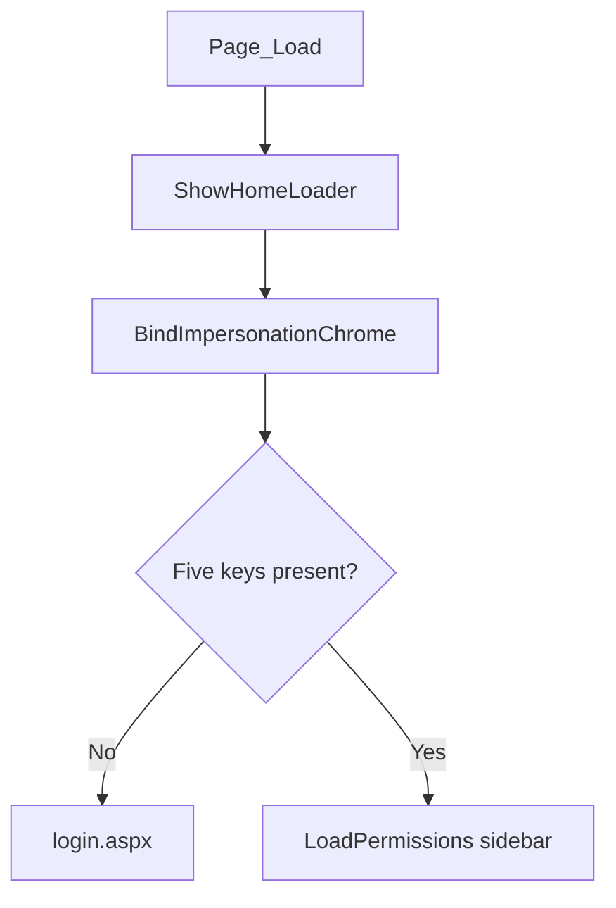

# Master pages

**Baseline:** `v2.2.3-governance-final` (`495fc68`).  
**Purpose:** Chrome, session gate, and (on webmaster) sidebar visibility.  
**Evidence:** four `.Master` files; `docs/ROLE_PERMISSION_ARCHITECTURE_AUDIT.md`.

## Sequence (`webmaster.Master`)

1. Consume one-shot `ATS_SHOW_HOME_LOADER`.
2. `BindImpersonationChrome` (`CanAccess(SWITCH_USER)` / banner).
3. On `!IsPostBack`, if `USERID`, `RolePermissionDB`, `UserRoleDB`, `USERNAME`, or `WORKMAN` missing → `~/login.aspx`.
4. `LoadPermissions(RolePermissionDB)` → `tlb_EmployeePermissions` → `Visible` on menu panels.

## Masters (Verified)

| File | Session gate | Menus |
| --- | --- | --- |
| `webmaster.Master` | Five keys | `tlb_EmployeePermissions` |
| `aminrup.Master` | Presence only | No menu table |
| `atsSite.Master` | Empty `Page_Load` | Public site |
| `Admin.Master` | Empty `Page_Load` | Legacy `atsweb.Admin` |

## Dependencies

ERP pages under `bussiness/production/` typically use `webmaster.Master`.

## Security notes

Sidebar hide is **not** page authorization. URLs remain reachable. `aminrup` / `Admin` masters are weaker gates (**Verified** audit).

## Related PRs

#91 chrome, #102 `CanAccess` on switch link, homepage loader from default-branch work kept in squash.

## See also

- [Authentication](authentication-flow.md)
- [Authorization](authorization-flow.md)
- [Switch User](switch-user.md)
- [Permission overlay](permission-overlay.md)
- [Session](session-architecture.md)
- [Administration](../administration/README.md)
- [Troubleshooting](../troubleshooting/README.md)
