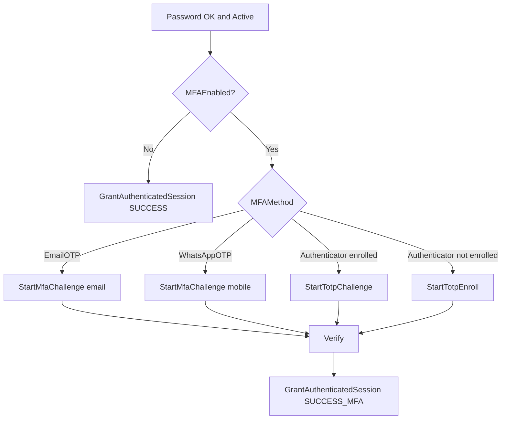

# MFA

**Baseline:** `v2.2-security-foundation` (`1f6c147`) / program root `v2.2.3-governance-final`.  
**Purpose:** Second factor after password, **before** identity Session keys.  
**Evidence:** `Login.aspx.cs`, `MfaAuthHelper.cs`, `MfaTotpHelper.cs`, `scripts/add_employee_mfa_columns.sql`, `scripts/add_employee_mfa_totp_columns.sql`, [authentication-flow.md](authentication-flow.md).

## Sequence (Verified)

1. Password succeeds and `WorkStatus = Active`.
2. `TryReadMfaSettings` reads `MFAEnabled`, `MFAMethod`, `MFATotpEnrolled` from `tbl_Employee_Mustertable` (missing columns fail open to “MFA off” via `IsMissingColumnException` — **Verified** in login).
3. If disabled → `GrantAuthenticatedSession` (`SUCCESS`).
4. If enabled:
   - `EmailOTP` → email required or `MFA_NO_EMAIL`
   - `WhatsAppOTP` → mobile required or `MFA_NO_MOBILE`
   - `Authenticator` → enroll (`StartTotpEnroll`) or challenge (`StartTotpChallenge`)
5. Challenge keys use `SessionKeys.Mfa*` **without** `USERID`.
6. Success → `GrantAuthenticatedSession(..., "SUCCESS_MFA", true)` which may set `MFALastVerified`.

Constants (**Verified** `MfaAuthHelper`): OTP lifetime 5 minutes, max 3 attempts, resend cooldown 60 seconds.

## Dependencies

- SMTP AppSettings for email OTP; MSG91 keys for WhatsApp.
- TOTP secret columns from TOTP SQL script.
- Switch User does **not** run MFA (**Verified** — no `GrantAuthenticatedSession`).

## Security notes

- Do not write `USERID` / `WORKMAN` during challenge.
- Preserve sequencing (`CONTRIBUTING.md`).
- **Recommendation:** rotate any AppSettings secrets committed in examples; `SmtpPass` / `Msg91AuthKey` are empty in `Web.config.example`.

## Related PRs / tags

Login MFA predates Security Foundation squash (#89–#104). Documented as part of identity at `v2.2-security-foundation`. Scripts: `add_employee_mfa_*.sql`.

## See also

- [Authentication](authentication-flow.md)
- [Authorization](authorization-flow.md)
- [Switch User](switch-user.md)
- [Permission overlay](permission-overlay.md)
- [Session](session-architecture.md)
- [Administration](../administration/README.md)
- [Troubleshooting](../troubleshooting/README.md)
