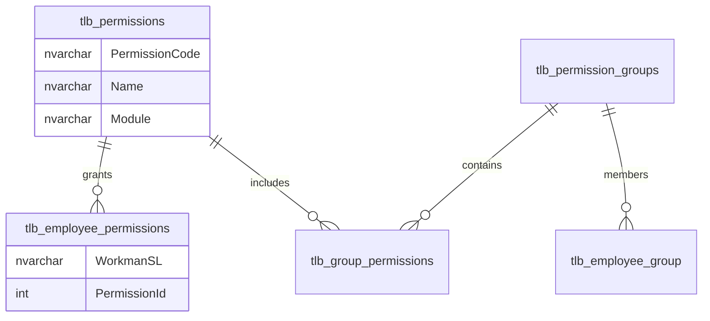
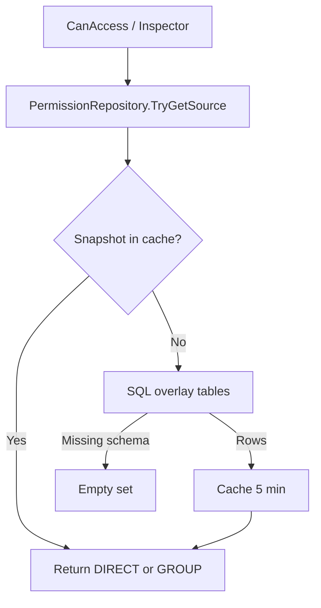
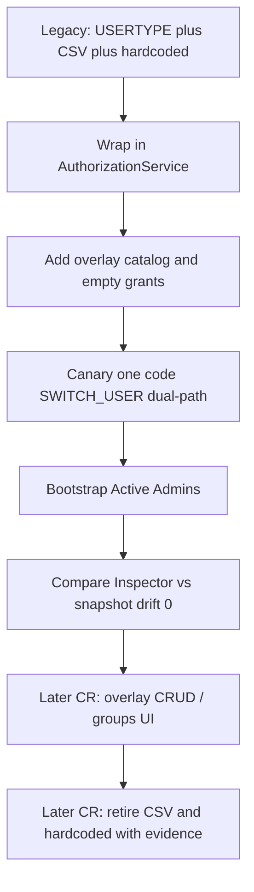

# Permission overlay

**Baseline:** Security Foundation v2.2 (`v2.2-security-foundation`, `1f6c147`).  
**API:** `WebApplication1/App_Code/PermissionRepository.cs`.  
**Schema script:** `scripts/create_permission_overlay.sql`.  
**Consumer:** `AuthorizationService` (never the sidebar).

The overlay is an **additive** permission model. It does not replace `tlb_EmployeePermissions` (menu chrome) or `tlb_emp_roles` / `tlb_emp_roles_permission` (registration dropdowns).

## Tables

Case matters. These are different objects.

| Object | Purpose |
| --- | --- |
| `tlb_permissions` | Catalog: `PermissionCode`, Name, Module, Description, IsActive |
| `tlb_permission_groups` | Named groups |
| `tlb_group_permissions` | Group → permission |
| `tlb_employee_group` | WorkmanSL → group |
| `tlb_employee_permissions` | Direct grant `(WorkmanSL, PermissionId)` |
| `tlb_EmployeePermissions` | **Legacy sidebar** `ParentKey` / `ChildKey` / `IsVisible` — not overlay |

`create_permission_overlay.sql` is additive and idempotent. It does **not** assign grants to employees.

Direct vs group: `PermissionRepository` records source `DIRECT` or `GROUP` per code. Direct wins in the snapshot dictionary when both exist.

## `PermissionRepository`

- Resolves grants for a **WorkmanSL**, not a LoginID.
- Missing tables or SQL errors → empty grant set (**fail closed**).
- Does not read `tlb_EmployeePermissions`.
- Inspector and Analyzer are read-only; they do not write grants.
- `Invalidate(workman)` / `InvalidateAll()` bump cache after operators change SQL.

### Cache

| Fact | Value |
| --- | --- |
| Store | `HttpRuntime.Cache` |
| TTL | 5 minutes (`CacheTtlMinutes`) |
| Keys | version + per-WorkmanSL snapshot + catalog |
| After grant SQL | Recycle IIS **or** wait 5 minutes before Inspector/Analyzer/CanAccess reflect the change |

## Canary (`SWITCH_USER`)

v2.2 did **not** cut the whole ERP over to overlay. Only `SWITCH_USER` is dual-path:

1. Admin required.
2. Overlay Direct/Group → allow (`OVERLAY_DIRECT` / `OVERLAY_GROUP`).
3. Else `SwitchUserAuthorizedUsers` → allow (`USERTYPE+LEGACY_CONFIG`).
4. Else deny.

Telemetry (`DescribeIdentity` / Access Analyzer canary panel):

| Field | Meaning |
| --- | --- |
| `Granted` | Dual-path result |
| `OverlayWouldAllow` | Overlay row exists |
| `LegacyWouldAllow` | Workman is on the CSV |

UAT SQL: `scripts/uat_switch_user_canary.sql` — `(WorkmanSL, PermissionId)`, not a code string. Recycle IIS after apply. Divergences after **Validate canary** must stay 0.

See `docs/SWITCH_USER_CANARY_VALIDATION.md`.

## Bootstrap (Platform Admin pack)

`scripts/bootstrap_platform_admin.sql` (#104):

- Default `@ApplyChanges = 0` (dry-run).
- Ensures catalog rows for `SWITCH_USER`, `USER_ADMIN`, `PAYROLL_OVERRIDE`, `EXPORT_PAYROLL`.
- Grants those four codes as **Direct** overlay to every Active `User_RoleType = 'Admin'`.
- Does not invent an Admin catalog role, does not touch passwords, `UserRoleDB`, `RolePermissionDB`, or Office Staff.
- Last result set is `BOOTSTRAP_SUMMARY`. Verify with `scripts/bootstrap_platform_admin_verify.sql`.

Dual-path SWITCH_USER still requires `IsAdmin()` first. Overlay on an Office Staff row does not unlock impersonation.

## Migration strategy

Keep both paths until a release pack proves overlay-only.

Rules during migration:

1. New platform permissions belong in `tlb_permissions`.
2. Employee grants belong in `tlb_employee_permissions` (or a group).
3. Pages call `AuthorizationService.CanAccess`, never a new WorkmanSL list.
4. Do not use sidebar `tlb_EmployeePermissions` as a substitute grant table.
5. Preserve dual-path: overlay first, then config/hardcoded, then deny.
6. Empty overlay must not lock out operators who still rely on CSV (SWITCH_USER) or hardcoded lists (export / attach / expenses) until those codes are granted and signed off.

v2.3 (after this baseline) is overlay CRUD and groups on this engine — not a replacement Session or Forms model.

## See also

- [Authentication](authentication-flow.md)
- [Authorization](authorization-flow.md)
- [Switch User](switch-user.md)
- [Permission overlay](permission-overlay.md) (this page)
- [Session](session-architecture.md)
- [Administration](../administration/README.md)
- [Troubleshooting](../troubleshooting/README.md)
