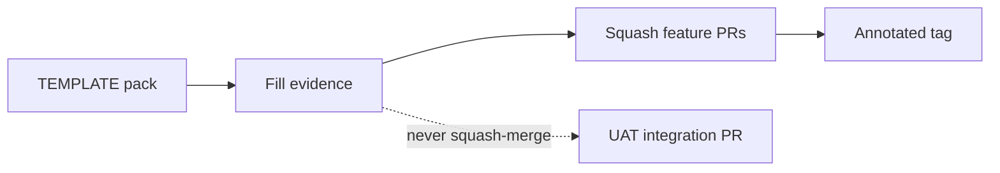

# Release architecture

**Baseline:** `v2.2.3-governance-final` (`495fc68`).  
**Purpose:** How ERP releases are evidenced and how Security Foundation / JOBID version lines stay distinct.  
**Evidence:** `docs/RELEASE_GOVERNANCE.md`, `docs/release/TEMPLATE/`, `docs/governance/branch_protection_runbook.md`, tags.

## Sequence (Verified)

1. Copy `docs/release/TEMPLATE/` → `docs/release/<version>/`.
2. Fill build, IIS, SQL, canary, final signoff. Do not invent results.
3. Squash reviewed PRs onto `Jul_to_Sep_2026_Suport_N_Dev_Works` (linear history).
4. Archive UAT integration PRs; **do not** merge them (#103 pattern).
5. Tag the squash tip.

## Two “v2.2” lines

| Line | Tags | Meaning |
| --- | --- | --- |
| Security Foundation | `v2.2-security-foundation` … `v2.2.3-governance-final` | Identity / authz / governance |
| JOBID | `v2.1.0-jobid-remediation`, GitHub label `jobid-v2.2` | JOB lifecycle / wizard |

Do not mix labels (`CONTRIBUTING.md`, `JOBID_V2.2_ROADMAP.md`).

## Dependencies

CODEOWNERS on `docs/release/`. Branch protection runbook is **recommended**, not claimed enabled.

## Security notes

Release packs may contain UAT operator names (e.g. J8). Treat as evidence, not as a license to add Workman gates.

## Related PRs

#104 TEMPLATE on default; #105 architecture; #107 CODEOWNERS; #67 JOBID roadmap.

## See also

- [Authentication](authentication-flow.md)
- [Authorization](authorization-flow.md)
- [Switch User](switch-user.md)
- [Permission overlay](permission-overlay.md)
- [Session](session-architecture.md)
- [Administration](../administration/README.md)
- [Troubleshooting](../troubleshooting/README.md)
