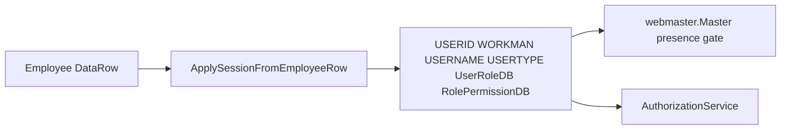

# Session architecture

**Baseline:** `v2.2-security-foundation` (`1f6c147`).  
**Purpose:** ASP.NET InProc Session is ERP identity. Cookie `ASP.NET_SessionId`.  
**Evidence:** `SessionKeys.cs`, `login.ApplySessionFromEmployeeRow`, [authentication-flow.md](authentication-flow.md), `SECURITY_FOUNDATION_BASELINE.md`.

## Sequence

1. MFA/password complete → `ApplySessionFromEmployeeRow` writes identity keys from `tbl_Employee_Mustertable`.
2. Login-only: `GrantAuthenticatedSession` also writes audit, LastLogin, `ATS_SavedID`, `ATS_SHOW_HOME_LOADER`.
3. `webmaster.Master` requires five keys **present** on `!IsPostBack`.
4. Impersonation adds `IS_IMPERSONATING` + `ORIGINAL_*` + `IMPERSONATION_CORR` ([impersonation-lifecycle.md](impersonation-lifecycle.md)).

## Key groups (Verified)

Full table is in authentication-flow.md. `PERMISSION` is declared and unused.

`UserRoleDB` / `RolePermissionDB` values are **not** compared for privilege.

## Dependencies

- InProc Session (process recycle drops identity).
- Single builder: `ApplySessionFromEmployeeRow`.

## Security notes

Never introduce Forms tickets. Never a second Session builder. New privilege checks go through `AuthorizationService`.

## Related PRs

#87 (extract builder, landed in #89), #89 impersonation keys, #91 Switch User, #93 homepage loader (`ATS_SHOW_HOME_LOADER`) kept during squash.

## See also

- [Authentication](authentication-flow.md)
- [Authorization](authorization-flow.md)
- [Switch User](switch-user.md)
- [Permission overlay](permission-overlay.md)
- [Session](session-architecture.md) (this page)
- [Administration](../administration/README.md)
- [Troubleshooting](../troubleshooting/README.md)
