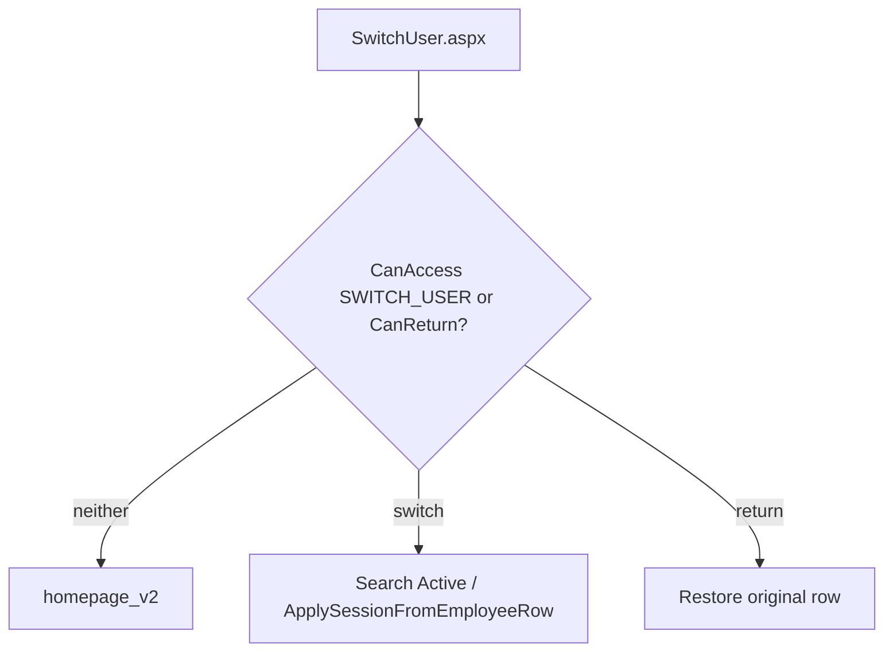

# Switch User

**Baseline:** `v2.2-security-foundation` (`1f6c147`). Dual-path: PR #102.  
**Purpose:** Admin views the ERP as another Active employee without that employee’s password.  
**Canonical lifecycle:** [impersonation-lifecycle.md](impersonation-lifecycle.md) — **do not fork**.  
**Evidence:** `SwitchUser.aspx.cs`, `AuthorizationService.DescribeSwitchUser`, `ImpersonationAudit`.

## Sequence

See impersonation-lifecycle.md. Gate is `CanAccess("SWITCH_USER")`, not `ImpersonationAudit.CanImpersonate` (legacy Admin+CSV only).

## Dependencies

- `login.ApplySessionFromEmployeeRow` and `FetchEmployeeRowByLoginId`
- Overlay and/or `SwitchUserAuthorizedUsers`
- `USERTYPE == Admin`

## Security notes

Office Staff cannot Switch User. Nested switch denied. Logout while impersonating updates the **target** LastLogout (**Verified** homepage logout). Related: [authorization-flow.md](authorization-flow.md).

## Related PRs

#89 foundation, #91 page + chrome, #102 dual-path canary, #104 Active Admin overlay pack. UAT pack: `docs/release/v2.2-security-foundation/`.

## See also

- [Authentication](authentication-flow.md)
- [Authorization](authorization-flow.md)
- [Switch User](switch-user.md) (this page)
- [Permission overlay](permission-overlay.md)
- [Session](session-architecture.md)
- [Administration](../administration/README.md)
- [Troubleshooting](../troubleshooting/README.md)
