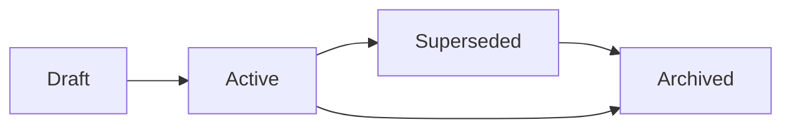

# Documentation governance

**Baseline:** `v2.2.3-governance-final` (`495fc68`)  
**Prerequisite:** ERP Documentation Baseline (PR #108)  
**Kind:** Process. Does not change application behavior.  
**Charter:** [`ERP_DOCUMENTATION_CHARTER.md`](../ERP_DOCUMENTATION_CHARTER.md)

This file makes the documentation baseline a **living** process. Future implementation PRs (including `feature/security-admin-v2.3`) must carry documentation impact. It does **not** replace `CONTRIBUTING.md`, `SECURITY_FOUNDATION_BASELINE.md`, or [`security_change_matrix.md`](security_change_matrix.md).

## Ownership

| Artifact | Owner | Reviewer |
| --- | --- | --- |
| `docs/architecture/` | Security core (CODEOWNERS) | `@Aminrup-Technologies` until a dedicated team is named |
| `docs/governance/` | Security / platform | Same CODEOWNERS path |
| `docs/modules/`, `docs/database/` | Feature author | Module reviewer + docs checklist on the PR |
| `docs/security/`, `docs/administration/` | Security / ops author | CODEOWNERS when architecture or release paths also change |
| `docs/release/` | Release captain | CODEOWNERS on `docs/release/` |
| Charter, index, coverage dashboard, evidence gap register | Documentation steward (author of the PR that changes them) | Same as `docs/governance/` |

CODEOWNERS already request review on `/docs/architecture/`, `/docs/governance/`, and `/docs/release/` (`.github/CODEOWNERS`). This file does not add runtime owners.

## Review responsibilities

Every PR that touches ERP pages, App_Code, SQL scripts, or AppSettings **must**:

1. Fill the **Documentation Impact** checklist in `.github/pull_request_template.md`.
2. Apply [`documentation_impact_matrix.md`](documentation_impact_matrix.md) (which docs to update).
3. Link new documents from [`ERP_DOCUMENTATION_INDEX.md`](../ERP_DOCUMENTATION_INDEX.md).
4. Record unknowns in [`EVIDENCE_GAP_REGISTER.md`](../EVIDENCE_GAP_REGISTER.md) instead of inventing schema or workflows.
5. Leave existing Verified facts unchanged unless the PR’s evidence supersedes them.

Documentation-only PRs still follow the charter: evidence first, no `.cs` / `.aspx` / `.sql` unless explicitly requested.

## Evidence-first policy

Normative rules stay in the [charter](../ERP_DOCUMENTATION_CHARTER.md):

- Prefer repo files, existing docs, commits, PRs, tags, and `scripts/*.sql`.
- Never invent tables, permissions, WorkmanSL gates, or SP bodies.
- Mark **Verified**, **Inferred**, and **Recommendation**.
- Preserve ATS names (`WorkmanSL`, `User_RoleType`, `tlb_EmployeePermissions` vs `tlb_employee_permissions`).

If evidence is missing, add a gap-register row and stop.

## Versioning rules

| Kind | How it is versioned |
| --- | --- |
| Security runtime | Tags `v2.2-security-foundation` …; do not move those tags |
| JOBID predicates | Tag `v2.1.0-jobid-remediation`; label `jobid-v2.2` |
| Documentation baseline | PR #108 on `feature/erp-documentation-program`; program root tag `v2.2.3-governance-final` |
| This governance layer | PR on `feature/documentation-governance-v2.2` |
| New ERP release | Copy `docs/release/TEMPLATE/` including the module/SQL/security/hotfix templates |

Document headers should cite the **nearest** baseline tag (or `v2.2.3-governance-final` for program docs) plus the PR that last changed the file when that is known.

Do not cut `feature/security-admin-v2.3` from this PR. When that work starts, it branches from default / `v2.2.3-governance-final` and **must** update docs per the impact matrix.

## Document lifecycle

| Status | Meaning | What to do |
| --- | --- | --- |
| **Draft** | Work in progress on a feature branch | Not linked as canonical from the index, or marked Draft in the header |
| **Active** | Canonical for current default-line behavior | Listed on the index; evidence cited |
| **Superseded** | Replaced by a newer canonical doc | Keep the file; banner points to the replacement; do not delete |
| **Archived** | Historical only (closed CR, UAT pack, superseded PR branch README) | Banner + link from timeline or gap register; **do not delete** feature branches (see [`branch_cleanup_runbook.md`](branch_cleanup_runbook.md)) |

Default for PR #108 module/architecture docs: **Active** (first pass). Call-contract database pages are **Active** with evidence gaps tracked separately — they are not Draft.

## Deprecation policy

1. Do not delete documentation to “clean up.” Supercede or archive.
2. Do not rewrite Security Foundation flow docs; extend or link.
3. When runtime behavior changes, update the Active doc in the same PR (impact matrix). If the old narrative must stay for a tagged baseline, leave it and add a Superseded banner.
4. Duplicate docs are forbidden: one canonical path; others link.
5. Invented pages or permission codes must not be documented as if they exist. Record “not in repo” (see exit-process, gate-pass).

## Mandatory PR artifacts

| Change class | Minimum docs |
| --- | --- |
| Feature / bugfix with page or App_Code impact | Impact matrix rows + module or architecture update |
| SQL script | Database call contract and/or `SQL_CHANGE_TEMPLATE.md` in the release pack if this is a release |
| Permission / overlay | Security + appendix configuration/glossary as applicable |
| Release | `docs/release/<version>/` from TEMPLATE + timeline |

## Related

- [`documentation_impact_matrix.md`](documentation_impact_matrix.md)
- [`DOCUMENTATION_COVERAGE.md`](../DOCUMENTATION_COVERAGE.md)
- [`EVIDENCE_GAP_REGISTER.md`](../EVIDENCE_GAP_REGISTER.md)
- [`cursor_governance.md`](cursor_governance.md)
- [`.github/pull_request_template.md`](../../.github/pull_request_template.md)
