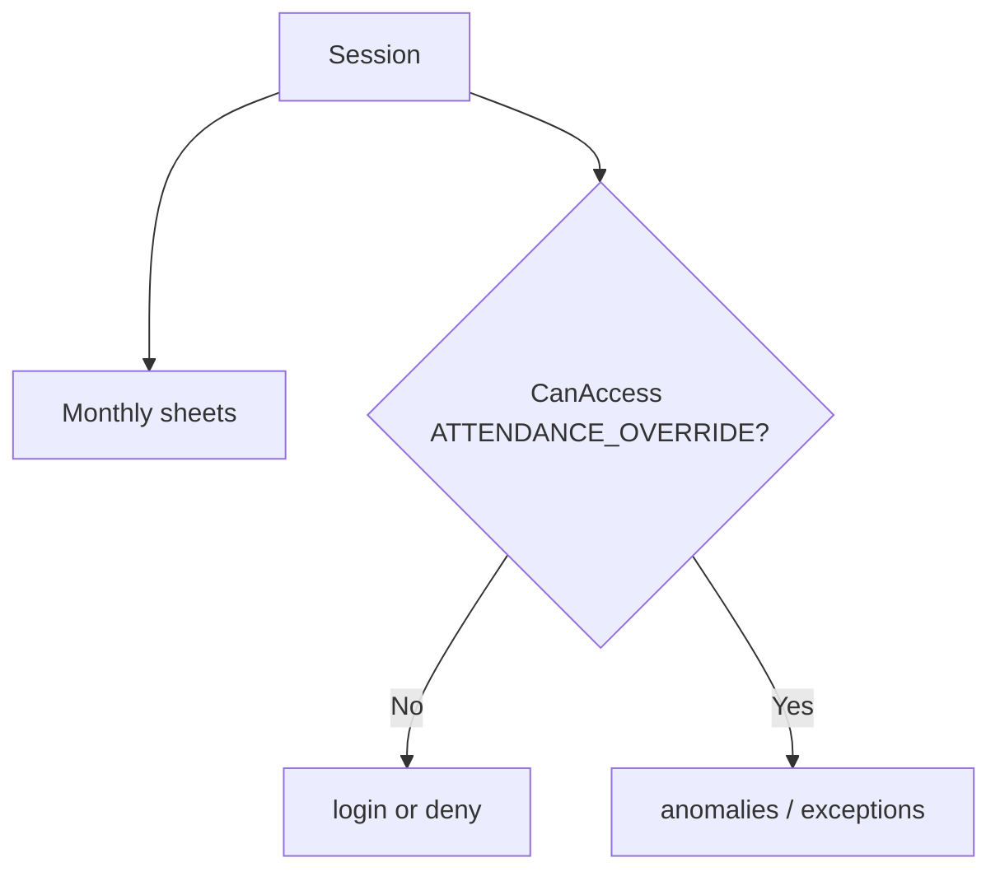

# Attendance

**Baseline:** `v2.2.3-governance-final` (`495fc68`)  
**Purpose:** Monthly attendance views, site sheets, and HR exception/anomaly dashboards. Punch **writes** for JOB shifts live on JOBID IN/OUT pages, not on these dashboards.

## Users

Supervisors/HR viewing sheets; Admin or Office Staff for override dashboards (`ATTENDANCE_OVERRIDE`).

## Navigation

| Page | Role |
| --- | --- |
| `view_empmonthlyatt.aspx` | Monthly employee attendance; Session five keys + `REGION` |
| `generate_atdncsheet.aspx`, `generate_siteatdncsheet.aspx`, `generate_appvrsite_atdncsheet.aspx` | Attendance sheets |
| `vw_emp_attencal.aspx`, `vw_emp_attencal2.aspx`, `vw_monthlyatten.aspx` | Calendars / monthly views |
| `analyze_attendance_anomalies.aspx` | Anomaly dashboard |
| `manage_job_exceptions.aspx` | Job exceptions |

## Workflow

1. Master requires login Session.
2. Monthly view binds on region/company/date (**Verified** presence check in `view_empmonthlyatt`).
3. Anomalies / exceptions: `AuthorizationService.CanAccess(AttendanceOverride)` else redirect login (**Verified**). That code is Admin **or** Office Staff (module exception), then overlay.

Punch pipeline: JOBID IN/OUT → attendance SPs (not in repo). See [JOBID](jobid.md).

## Inputs / Outputs

Date range, region, company, Workman filters. Excel export exists on anomalies (`ClosedXML` — **Verified** usings). Sheets are reports, not new JOB states.

## Database

Attendance SPs named in JOBID audit only. Anomalies bind `tlb_work_state_region` for region dropdown (**Verified**). Do not invent punch-table schemas here.

## Security

`ATTENDANCE_OVERRIDE` is module-local Office Staff — **not** Switch User. Sheets use Session presence, not overlay, unless a page was migrated (anomalies/exceptions were).

## Dependencies

JOBID punch state; `AuthorizationService`; master Session.

## Known issues

Office Staff on these dashboards is intentional and must not be generalized.

## Change history

Security Foundation #95/#102 wrap; JOBID remediation punch eligibility separate.
