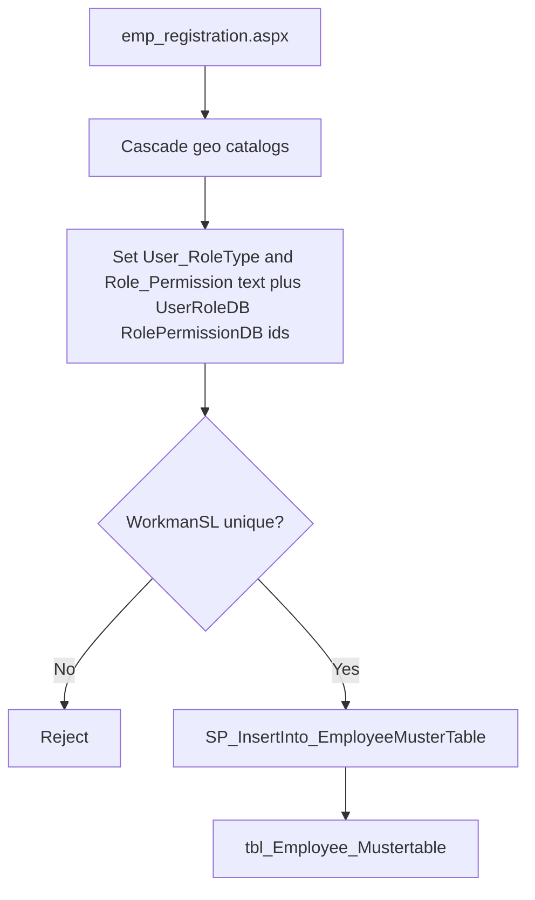

# Employee registration

**Baseline:** `v2.2.3-governance-final` (`495fc68`)  
**Pages:** `emp_registration.aspx` (+ `.cs`), related `emp_bulkregistration.aspx`, `viewupdate_empmustertabledata*.aspx`, `view_emp_mastertbldata*.aspx`  
**Master:** `webmaster.Master`

## Purpose

Create a new row in `tbl_Employee_Mustertable` so the person can log in (LoginID / password) and receive Session identity (`WorkmanSL`, `User_RoleType`, `UserRoleDB`, `RolePermissionDB`, geo/company/site).

## Users

Operators with the employee-registration menu visible (`RolePermissionDB` → `tlb_EmployeePermissions`). That is **chrome**, not a page ACL (**Verified** architecture).

## Navigation

ERP: Data mastering / employee registration (menu keys from `webmaster.Master` `ApplyPermissions`). Direct URL: `~/bussiness/production/emp_registration.aspx`.

## Workflow

1. Page load fills geography and catalogs (**Verified** SQL in `emp_registration.aspx.cs`): country → state → region → company → worksite, payroll category/designation, `tlb_emp_roles`, `tlb_emp_roles_permission` filtered by `EmpType_Value`.
2. Operator enters identity, `WorkmanSL`, LoginID, password, safety/gate pass, bank, role type + permission profile (independent dropdowns — **Verified** architecture audit).
3. Submit calls stored procedure `SP_InsertInto_EmployeeMusterTable` (parameterized). Duplicate `WorkmanSL` is counted first (`COUNT` on `tbl_Employee_Mustertable`).
4. Password is hashed into the password column; a plain copy is also sent (`LoginPassword_Plain`) — **Verified** in code-behind.

## Inputs

Work country/state/region/company/site, names, DOB/DOJ, mobile, education, skill category/designation, `User_RoleType` (dropdown **text**), `UserRoleDB` (dropdown **value**), `Role_Permission` / `RolePermissionDB`, work hours / OT, SafetyPass / GatePass numbers and expiry, LoginID / password.

Default password prefix exists in config (`DefaultPasswordPrefix`) — **Inferred** usage on this page not fully traced this pass.

## Outputs

New muster row. Login becomes possible after `WorkStatus` is Active (**Inference:** insert path must set WorkStatus; SP body is not in this repo).

## Database

| Object | Use |
| --- | --- |
| `tlb_work_country` / `tlb_work_state` / `tlb_work_state_region` / `tlb_workregion_company` / `tlb_atsworksites` | Cascading dropdowns |
| `tlb_emp_roles` | `Employee_Type`, `EmpType_Value` |
| `tlb_emp_roles_permission` | `Emp_PermissionText`, `Emp_PermissionValue` |
| `tlb_payroll_*` | Category, designation, hours, OT |
| `tlb_IndianBanks`, `tlb_education_types` | Bank / education |
| `tbl_Employee_Mustertable` | Insert via `SP_InsertInto_EmployeeMusterTable` |

**Inference:** SP column list matches the `@` parameters in `emp_registration.aspx.cs` (~LoginID through role and pass fields). Do not invent extra columns.

## Security

- Session presence via master (not `AuthorizationService` on this page — **Verified** no `CanAccess` in this file).
- Fallback `"J8"` when `Session["WORKMAN"]` is null on an audit stamp (**Verified** baseline scan) — do not copy as a gate.
- Role assignment here sets **login Session strings later**; it does not grant overlay `SWITCH_USER`.
- Stores `LoginPassword_Plain` — **Recommendation:** treat as sensitive; do not expand plaintext password use.

## Dependencies

Login (`ApplySessionFromEmployeeRow` reads the same muster columns). Menu profile `RolePermissionDB`. Overlay is separate (`tlb_employee_permissions`).

## Known issues

- Independent type vs permission-profile dropdowns can produce Office Staff + fat menu (OS-HR) without `User_RoleType=Admin` — **Verified** UAT Admin J8 pattern in Security Foundation notes (`UserRoleDB=ATS-OS`, `RolePermissionDB=OS-HR`).
- Bulk registration (`emp_bulkregistration.aspx`) is a sibling path; not fully documented this increment.

## Change History

| When | What |
| --- | --- |
| Pre-v2.2 | Registration + SP insert (this page) |
| Security Foundation | Session builder consumes these columns; overlay does not replace them |
| This program | Module doc at `v2.2.3-governance-final` |
