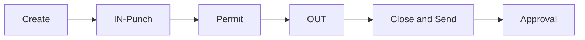

# JOBID

**Baseline:** `v2.1.0-jobid-remediation` (`a75bb1e`) operational freeze; program root `v2.2.3-governance-final`.  
**This page is a wrapper.** Canonical lifecycle evidence: [`JOBID_LIFECYCLE_FUNCTIONAL_AUDIT.md`](../JOBID_LIFECYCLE_FUNCTIONAL_AUDIT.md). Do not fork predicates here.

## Purpose

Create → IN-Punch → Permit Upload → OUT-Punch → Close & Send → Approval. V2 pages own writes. JOB360 is the admin cockpit (CR-009 closed). Supervisor wizard is presentation-only Phase A (CR-001 certified).

## Users

Supervisors (creator `WORKMAN`), Site In-Charge (approval), JOB360 Admin/Office Staff for override chrome (`CanAccess(JOB360_OVERRIDE)`).

## Navigation

| Step | Page |
| --- | --- |
| Hub | `jobs_and_manpower_v2.aspx` |
| Create | `create_jobid_v2.aspx` |
| IN | `job_inpunch_v2.aspx` |
| Permit | `job_permitupload_v2.aspx` |
| OUT / Close & Send | `job_outpunch_v2.aspx` (`btn_FinalizeShift`) |
| Approval | `view_jobsforapproval.aspx` / related |
| Admin | `job_360_view.aspx` |
| Wizard shell | `supervisor_wizard.aspx` |

## Workflow

Frozen path (**Verified** audit + `JobStatusConstants`):

`EntryExit` `Created` → `Entry` → `Exit`. Codes `1` (create) / `3` (IN) / `4` (closed) / `5` (approved). `JOB_Status` Close & Send = `Out-Punch Done`. Permit-before-IN is **not** a required gate (UAT-006).

## Inputs / Outputs

Encoded `jobid` query string on V2 hops (`JobIdCodec` / `create_jobid_v2.EncodeJobID`). JOB360 inbound `?jobid=` stays **raw**. Base64 is not authorization.

## Database

Call contracts only (SP **bodies not in repo** — audit limitation): `SP_InsertInto_JOBSTable`, attendance punch SPs. Table `tbl_jobs` is referenced throughout JOBID docs. Do not invent columns here.

## Security

- Session presence on pages; JOB360 chrome via `AuthorizationService.CanAccess(JOB360_OVERRIDE)` (Admin **or** Office Staff).
- `create_jobid.aspx.cs` / `_v2` still compare `USERTYPE` Site Staff / Office Staff for WO/region — **Verified** baseline scan; do not add more.
- Overlay does not replace inbox SQL.

## Dependencies

`JobIdCodec`, `JobStatusConstants`, `NotificationHelper` (CR-010). Security Foundation does not change JOB writes.

## Known issues

See audit UAT IDs (006, 021, 029, 040, 035, …). Cancel codes `'6'` / `'0'` declared on constants; Cancel SQL stays literal.

## Change history

| Ref | What |
| --- | --- |
| #59–#65 | Remediation; tag `v2.1.0-jobid-remediation` |
| CR-009 | JOB360 cockpit |
| CR-010 | Shared helpers |
| CR-001 Phase A | Wizard shell `238bd2f` |
| Roadmap | `JOBID_V2.2_ROADMAP.md` (label `jobid-v2.2`, not Security Foundation v2.2) |
