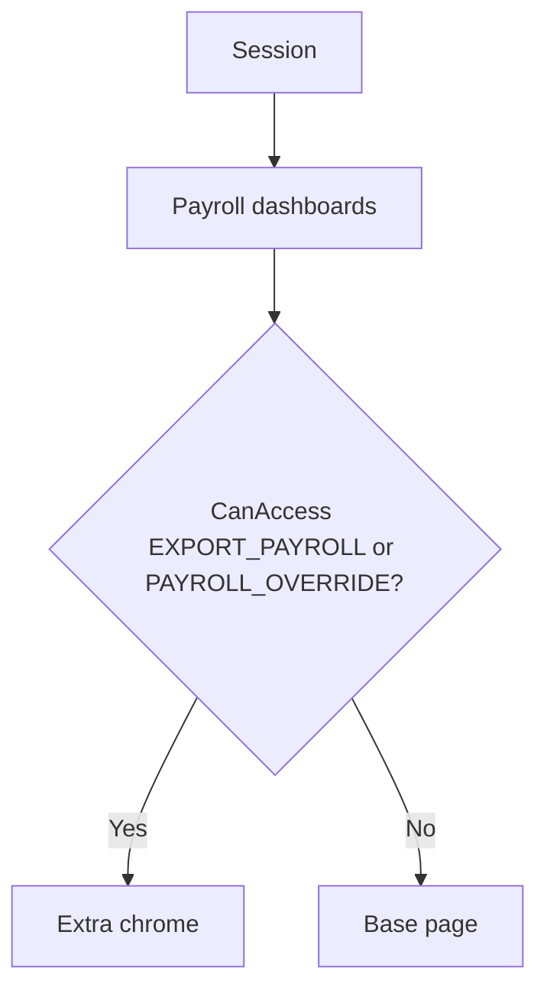

# Payroll

**Baseline:** `v2.2.3-governance-final` (`495fc68`)  
**Purpose:** Generate and manage payroll sheets, deductions, F17/F29, bank/PF/ESIC outputs.

## Users

Payroll operators. Extra chrome: `CanAccess(EXPORT_PAYROLL)` / `PAYROLL_OVERRIDE` (overlay, `PayrollAuthorizedUsers`, or hardcoded `J8` inside `AuthorizationService`).

## Navigation

| Area | Pages (filename evidence) |
| --- | --- |
| Controller / dashboards | `payroll_controller.aspx`, `pyrl_managedashbrd.aspx`, `pyrl_gnrtdashbrd.aspx`, `PayrollSummary.aspx` |
| Deductions | `pyrl_deductions.aspx`, `pyrl_deductionlist.aspx`, `pyrl_deductionsview.aspx`, `pyrl_approvedeductions.aspx`, `pyrl_upldadvc.aspx` |
| Statutory sheets | `generate_pfsheets.aspx`, `generate_esicsheets.aspx`, `generate_banksheets.aspx`, `generate_f29sheet.aspx`, `pyrl_generate_f29.aspx`, `gen_*_f17.aspx` |
| Employee payroll edit | `viewupdate_emppayrolldata.aspx`, `emp_payroll_wages.aspx`, `emp_payrollcategory.aspx`, `emp_payroll_designation.aspx` |

## Workflow

Hub pages require Session (`USERID` / `WORKMAN` / often `USERTYPE` **presence**). Export/extra buttons call `AuthorizationService.CanAccess(ExportPayroll)` (**Verified** on manage/generate dashboards and payroll data edit).

F17 gross breakers are **AppSettings** `F17_GrossBreaker_*` (**Verified** `Web.config.example`).

## Inputs / Outputs

Region/company/period; generated bank/PF/ESIC/F29 files and on-screen grids. **Inference:** sheet SQL lives in code-behind/SPs not inventoried column-by-column this pass.

## Database

Do not invent payroll tables. Employee wage fields are written on muster/edit paths (`FixedSalary_*` appears in commented SQL on some master views). Overlay codes: `PAYROLL_OVERRIDE`, `EXPORT_PAYROLL`, `LEGACY_PAYROLL_DASHBOARD`.

## Security

Never add a new `WORKMAN==J8` check on these pages. Use `CanAccess`. `PayrollAuthorizedUsers` CSV remains dual-path fallback.

## Dependencies

Muster bank/UAN/ESIC columns; attendance/JOB close state for some sheets (**Inference** — confirm per page before changing SQL).

## Known issues

Hardcoded J8 still inside `AuthorizationService` for export/legacy dashboard.

## Change history

Security Foundation wrap of allowlists; no payroll schema CR in v2.2 tags.
